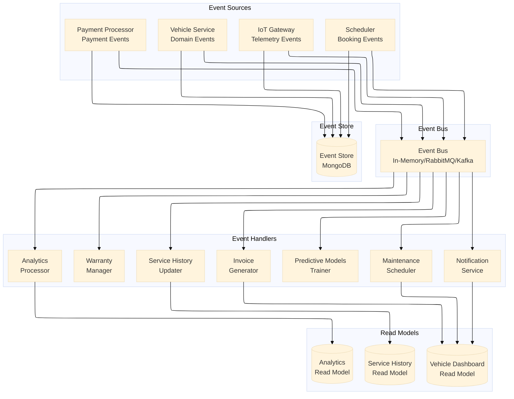

# ### Event-Driven Architecture Diagram

```mermaid
---
config:
  theme: base
  layout: elk
---

graph TB
    subgraph "Event Sources"
        A1[Vehicle Service<br/>Domain Events]
        A2[IoT Gateway<br/>Telemetry Events]
        A3[Scheduler<br/>Booking Events]
        A4[Payment Processor<br/>Payment Events]
    end
    
    subgraph "Event Bus"
        B[Event Bus<br/>In-Memory/RabbitMQ/Kafka]
    end
    
    subgraph "Event Handlers"
        C1[Service History<br/>Updater]
        C2[Notification<br/>Service]
        C3[Analytics<br/>Processor]
        C4[Maintenance<br/>Scheduler]
        C5[Invoice<br/>Generator]
        C6[Warranty<br/>Manager]
        C7[Predictive Models<br/>Trainer]
    end
    
    subgraph "Event Store"
        D[(Event Store<br/>MongoDB)]
    end
    
    subgraph "Read Models"
        E1[(Service History<br/>Read Model)]
        E2[(Vehicle Dashboard<br/>Read Model)]
        E3[(Analytics<br/>Read Model)]
    end
    
    A1 --> B
    A2 --> B
    A3 --> B
    A4 --> B
    
    B --> C1
    B --> C2
    B --> C3
    B --> C4
    B --> C5
    B --> C6
    B --> C7
    
    A1 --> D
    A2 --> D
    A3 --> D
    A4 --> D
    
    C1 --> E1
    C2 --> E2
    C3 --> E3
    C4 --> E2
    C5 --> E2
```
