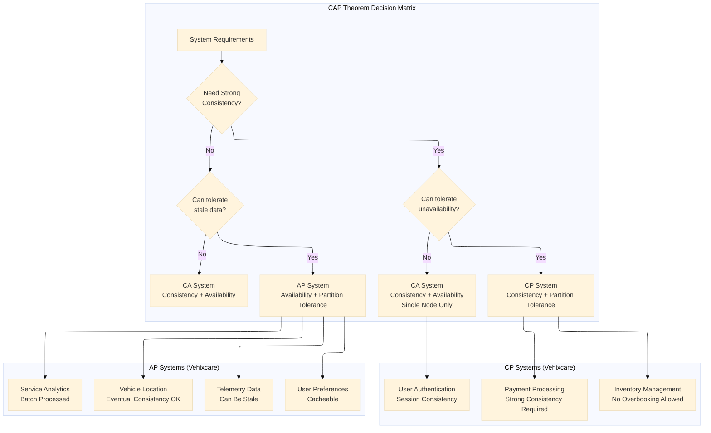

# diagram_03_cap-theorem-architecture-diagram-eed9

```mermaid
---
config:
  theme: base
  layout: elk
---

graph TB
    subgraph "CAP Theorem Decision Matrix"
        A[System Requirements]
        
        A --> B{Need Strong<br/>Consistency?}
        
        B -->|Yes| C{Can tolerate<br/>unavailability?}
        B -->|No| D{Can tolerate<br/>stale data?}
        
        C -->|Yes| E[CP System<br/>Consistency + Partition Tolerance]
        C -->|No| F[CA System<br/>Consistency + Availability<br/>Single Node Only]
        
        D -->|Yes| G[AP System<br/>Availability + Partition Tolerance]
        D -->|No| H[CA System<br/>Consistency + Availability]
    end
    
    subgraph "CP Systems (Vehixcare)"
        I1[Payment Processing<br/>Strong Consistency Required]
        I2[Inventory Management<br/>No Overbooking Allowed]
        I3[User Authentication<br/>Session Consistency]
    end
    
    subgraph "AP Systems (Vehixcare)"
        J1[Vehicle Location<br/>Eventual Consistency OK]
        J2[Telemetry Data<br/>Can Be Stale]
        J3[Service Analytics<br/>Batch Processed]
        J4[User Preferences<br/>Cacheable]
    end
    
    E --> I1
    E --> I2
    F --> I3
    
    G --> J1
    G --> J2
    G --> J3
    G --> J4
```
