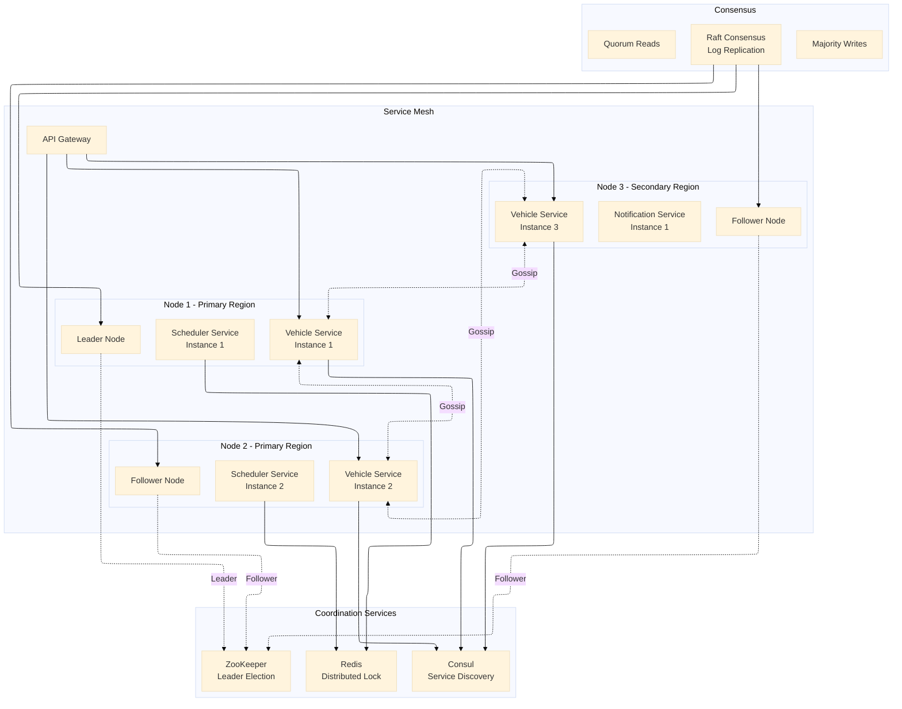

# diagram_04_distributed-systems-architecture-diagram-1fdf

```mermaid
---
config:
  theme: base
  layout: elk
---

graph TB
    subgraph "Service Mesh"
        A[API Gateway]
        
        subgraph "Node 1 - Primary Region"
            B1[Vehicle Service<br/>Instance 1]
            B2[Scheduler Service<br/>Instance 1]
            B3[Leader Node]
        end
        
        subgraph "Node 2 - Primary Region"
            C1[Vehicle Service<br/>Instance 2]
            C2[Scheduler Service<br/>Instance 2]
            C3[Follower Node]
        end
        
        subgraph "Node 3 - Secondary Region"
            D1[Vehicle Service<br/>Instance 3]
            D2[Notification Service<br/>Instance 1]
            D3[Follower Node]
        end
    end
    
    subgraph "Coordination Services"
        E1[Consul<br/>Service Discovery]
        E2[Redis<br/>Distributed Lock]
        E3[ZooKeeper<br/>Leader Election]
    end
    
    subgraph "Consensus"
        F1[Raft Consensus<br/>Log Replication]
        F2[Quorum Reads]
        F3[Majority Writes]
    end
    
    A --> B1
    A --> C1
    A --> D1
    
    B1 <-.->|Gossip| C1
    C1 <-.->|Gossip| D1
    D1 <-.->|Gossip| B1
    
    B3 -.->|Leader| E3
    C3 -.->|Follower| E3
    D3 -.->|Follower| E3
    
    B1 --> E1
    C1 --> E1
    D1 --> E1
    
    B2 --> E2
    C2 --> E2
    
    F1 --> B3
    F1 --> C3
    F1 --> D3
```
