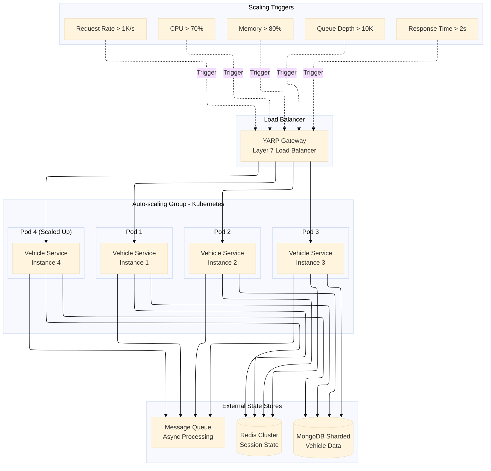

# diagram_05_horizontal-scaling-architecture-diagram-9a53

```mermaid
---
config:
  theme: base
  layout: elk
---

graph TB
    subgraph "Load Balancer"
        A[YARP Gateway<br/>Layer 7 Load Balancer]
    end
    
    subgraph "Auto-scaling Group - Kubernetes"
        subgraph "Pod 1"
            B1[Vehicle Service<br/>Instance 1]
        end
        
        subgraph "Pod 2"
            B2[Vehicle Service<br/>Instance 2]
        end
        
        subgraph "Pod 3"
            B3[Vehicle Service<br/>Instance 3]
        end
        
        subgraph "Pod 4 (Scaled Up)"
            B4[Vehicle Service<br/>Instance 4]
        end
    end
    
    subgraph "External State Stores"
        C1[(Redis Cluster<br/>Session State)]
        C2[(MongoDB Sharded<br/>Vehicle Data)]
        C3[Message Queue<br/>Async Processing]
    end
    
    subgraph "Scaling Triggers"
        D1[CPU > 70%]
        D2[Memory > 80%]
        D3[Queue Depth > 10K]
        D4[Response Time > 2s]
        D5[Request Rate > 1K/s]
    end
    
    A --> B1
    A --> B2
    A --> B3
    A --> B4
    
    B1 --> C1
    B2 --> C1
    B3 --> C1
    B4 --> C1
    
    B1 --> C2
    B2 --> C2
    B3 --> C2
    B4 --> C2
    
    B1 --> C3
    B2 --> C3
    B3 --> C3
    B4 --> C3
    
    D1 -.->|Trigger| A
    D2 -.->|Trigger| A
    D3 -.->|Trigger| A
    D4 -.->|Trigger| A
    D5 -.->|Trigger| A
```
