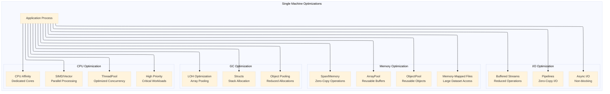

# ### Vertical Scaling Architecture Diagram

```mermaid
---
config:
  theme: base
  layout: elk
---
graph TB
    subgraph "Single Machine Optimizations"
        A[Application Process]
        
        subgraph "Memory Optimization"
            B1[ArrayPool<br/>Reusable Buffers]
            B2[ObjectPool<br/>Reusable Objects]
            B3[Span<T>/Memory<T><br/>Zero-Copy Operations]
            B4[Memory-Mapped Files<br/>Large Dataset Access]
        end
        
        subgraph "CPU Optimization"
            C1[SIMD/Vector<br/>Parallel Processing]
            C2[ThreadPool<br/>Optimized Concurrency]
            C3[CPU Affinity<br/>Dedicated Cores]
            C4[High Priority<br/>Critical Workloads]
        end
        
        subgraph "I/O Optimization"
            D1[Pipelines<br/>Zero-Copy I/O]
            D2[Async I/O<br/>Non-blocking]
            D3[Buffered Streams<br/>Reduced Operations]
        end
        
        subgraph "GC Optimization"
            E1[Structs<br/>Stack Allocation]
            E2[Object Pooling<br/>Reduced Allocations]
            E3[LOH Optimization<br/>Array Pooling]
        end
    end
    
    A --> B1
    A --> B2
    A --> B3
    A --> B4
    
    A --> C1
    A --> C2
    A --> C3
    A --> C4
    
    A --> D1
    A --> D2
    A --> D3
    
    A --> E1
    A --> E2
    A --> E3
```
