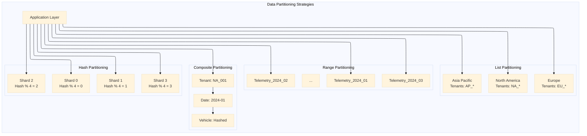

# diagram_02_data-partitioning-architecture-diagram-d708

```mermaid
---
config:
  theme: base
  layout: elk
---
graph TB
    subgraph "Data Partitioning Strategies"
        A[Application Layer]
        
        subgraph "Range Partitioning"
            B1[Telemetry_2024_01]
            B2[Telemetry_2024_02]
            B3[Telemetry_2024_03]
            B4[...]
        end
        
        subgraph "Hash Partitioning"
            C1[Shard 0<br/>Hash % 4 = 0]
            C2[Shard 1<br/>Hash % 4 = 1]
            C3[Shard 2<br/>Hash % 4 = 2]
            C4[Shard 3<br/>Hash % 4 = 3]
        end
        
        subgraph "List Partitioning"
            D1[North America<br/>Tenants: NA_*]
            D2[Europe<br/>Tenants: EU_*]
            D3[Asia Pacific<br/>Tenants: AP_*]
        end
        
        subgraph "Composite Partitioning"
            E1[Tenant: NA_001]
            E2[Date: 2024-01]
            E3[Vehicle: Hashed]
        end
    end
    
    A --> B1
    A --> B2
    A --> B3
    
    A --> C1
    A --> C2
    A --> C3
    A --> C4
    
    A --> D1
    A --> D2
    A --> D3
    
    A --> E1
    E1 --> E2
    E2 --> E3
```
