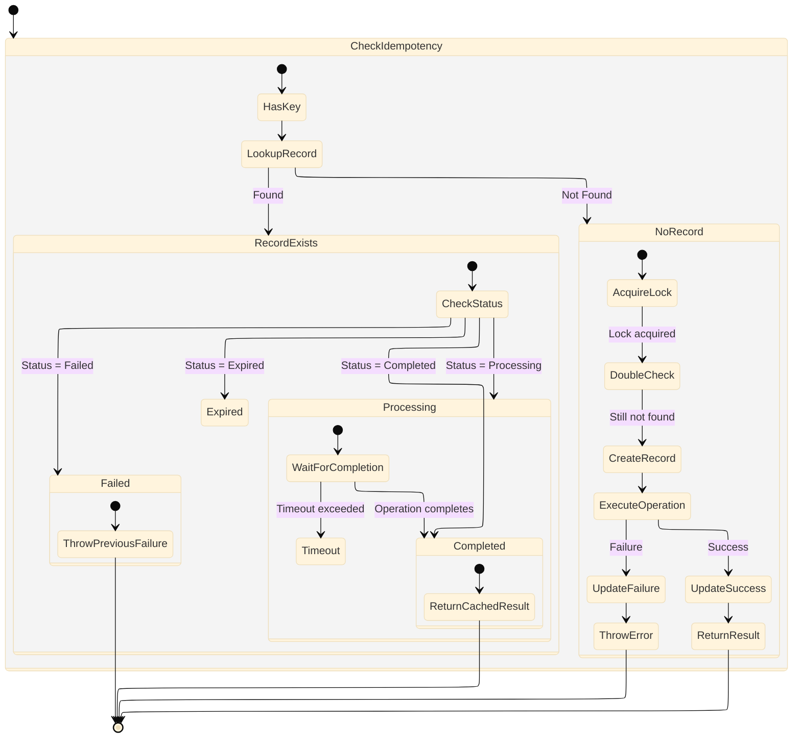

# ### Idempotency Architecture Diagram

```mermaid
---
config:
  theme: base
  layout: elk
---
stateDiagram-v2
    [*] --> CheckIdempotency
    
    state CheckIdempotency {
        [*] --> HasKey
        HasKey --> LookupRecord
        LookupRecord --> RecordExists: Found
        LookupRecord --> NoRecord: Not Found
    }
    
    state RecordExists {
        [*] --> CheckStatus
        
        CheckStatus --> Completed: Status = Completed
        CheckStatus --> Failed: Status = Failed
        CheckStatus --> Processing: Status = Processing
        CheckStatus --> Expired: Status = Expired
    }
    
    state Completed {
        [*] --> ReturnCachedResult
    }
    
    state Failed {
        [*] --> ThrowPreviousFailure
    }
    
    state Processing {
        [*] --> WaitForCompletion
        WaitForCompletion --> Completed: Operation completes
        WaitForCompletion --> Timeout: Timeout exceeded
    }
    
    state NoRecord {
        [*] --> AcquireLock
        AcquireLock --> DoubleCheck: Lock acquired
        DoubleCheck --> CreateRecord: Still not found
        CreateRecord --> ExecuteOperation
        ExecuteOperation --> UpdateSuccess: Success
        ExecuteOperation --> UpdateFailure: Failure
        UpdateSuccess --> ReturnResult
        UpdateFailure --> ThrowError
    }
    
    ReturnCachedResult --> [*]
    ThrowPreviousFailure --> [*]
    ReturnResult --> [*]
    ThrowError --> [*]
```
