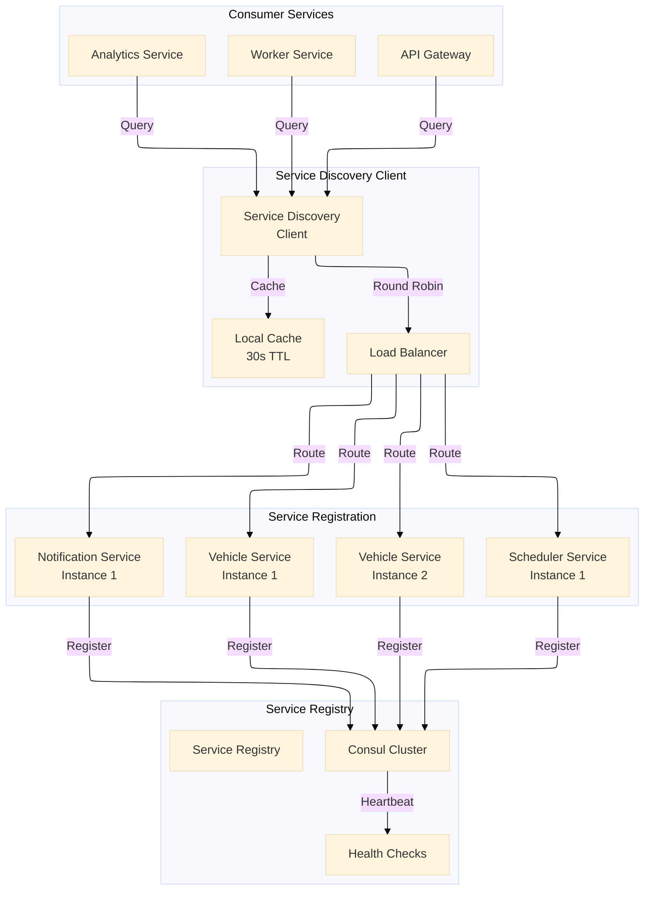

# diagram_04_service-discovery-architecture-diagram-d7c7

```mermaid
---
config:
  theme: base
  layout: elk
---
graph TB
    subgraph "Service Registry"
        A[Consul Cluster]
        B[Service Registry]
        C[Health Checks]
    end
    
    subgraph "Service Registration"
        D1[Vehicle Service<br/>Instance 1]
        D2[Vehicle Service<br/>Instance 2]
        D3[Scheduler Service<br/>Instance 1]
        D4[Notification Service<br/>Instance 1]
    end
    
    subgraph "Service Discovery Client"
        E1[Service Discovery<br/>Client]
        E2[Local Cache<br/>30s TTL]
        E3[Load Balancer]
    end
    
    subgraph "Consumer Services"
        F1[API Gateway]
        F2[Worker Service]
        F3[Analytics Service]
    end
    
    D1 -->|Register| A
    D2 -->|Register| A
    D3 -->|Register| A
    D4 -->|Register| A
    
    A -->|Heartbeat| C
    
    F1 -->|Query| E1
    F2 -->|Query| E1
    F3 -->|Query| E1
    
    E1 -->|Cache| E2
    E1 -->|Round Robin| E3
    
    E3 -->|Route| D1
    E3 -->|Route| D2
    E3 -->|Route| D3
    E3 -->|Route| D4
```
