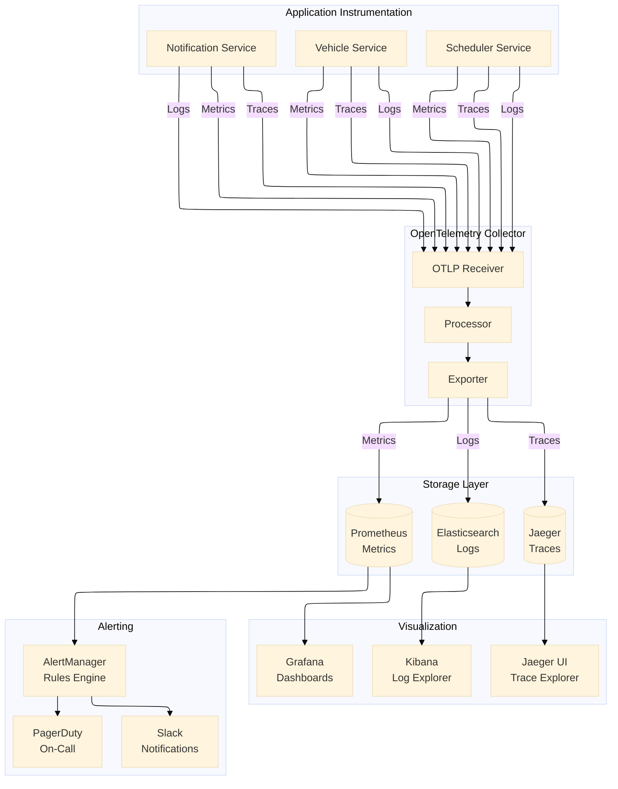

# diagram_05_observability-architecture-diagram-0b82

```mermaid
---
config:
  theme: base
  layout: elk
---
graph TB
    subgraph "Application Instrumentation"
        A1[Vehicle Service]
        A2[Scheduler Service]
        A3[Notification Service]
    end
    
    subgraph "OpenTelemetry Collector"
        B1[OTLP Receiver]
        B2[Processor]
        B3[Exporter]
    end
    
    subgraph "Storage Layer"
        C1[(Prometheus<br/>Metrics)]
        C2[(Jaeger<br/>Traces)]
        C3[(Elasticsearch<br/>Logs)]
    end
    
    subgraph "Visualization"
        D1[Grafana<br/>Dashboards]
        D2[Jaeger UI<br/>Trace Explorer]
        D3[Kibana<br/>Log Explorer]
    end
    
    subgraph "Alerting"
        E1[AlertManager<br/>Rules Engine]
        E2[PagerDuty<br/>On-Call]
        E3[Slack<br/>Notifications]
    end
    
    A1 -->|Metrics| B1
    A2 -->|Metrics| B1
    A3 -->|Metrics| B1
    
    A1 -->|Traces| B1
    A2 -->|Traces| B1
    A3 -->|Traces| B1
    
    A1 -->|Logs| B1
    A2 -->|Logs| B1
    A3 -->|Logs| B1
    
    B1 --> B2
    B2 --> B3
    
    B3 -->|Metrics| C1
    B3 -->|Traces| C2
    B3 -->|Logs| C3
    
    C1 --> D1
    C2 --> D2
    C3 --> D3
    
    C1 --> E1
    E1 --> E2
    E1 --> E3
```
