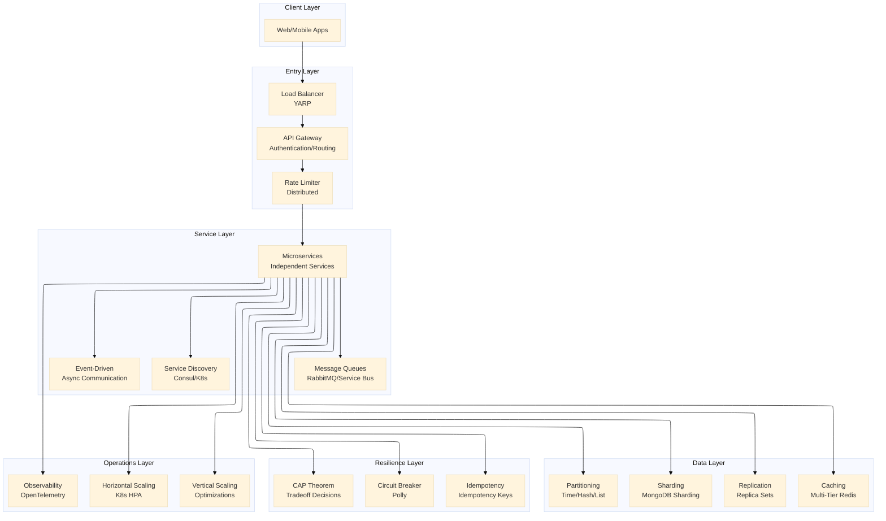

# ### The Complete Picture

```mermaid
---
config:
  theme: base
  layout: elk
---
graph TB
    subgraph "Client Layer"
        CL[Web/Mobile Apps]
    end
    
    subgraph "Entry Layer"
        LB[Load Balancer<br/>YARP]
        GW[API Gateway<br/>Authentication/Routing]
        RL[Rate Limiter<br/>Distributed]
    end
    
    subgraph "Service Layer"
        MS[Microservices<br/>Independent Services]
        EV[Event-Driven<br/>Async Communication]
        MQ[Message Queues<br/>RabbitMQ/Service Bus]
        SD[Service Discovery<br/>Consul/K8s]
    end
    
    subgraph "Data Layer"
        SH[Sharding<br/>MongoDB Sharding]
        RP[Replication<br/>Replica Sets]
        PT[Partitioning<br/>Time/Hash/List]
        CH[Caching<br/>Multi-Tier Redis]
    end
    
    subgraph "Resilience Layer"
        CB[Circuit Breaker<br/>Polly]
        ID[Idempotency<br/>Idempotency Keys]
        CAP[CAP Theorem<br/>Tradeoff Decisions]
    end
    
    subgraph "Operations Layer"
        HS[Horizontal Scaling<br/>K8s HPA]
        VS[Vertical Scaling<br/>Optimizations]
        OB[Observability<br/>OpenTelemetry]
    end
    
    CL --> LB
    LB --> GW
    GW --> RL
    RL --> MS
    
    MS --> EV
    MS --> MQ
    MS --> SD
    
    MS --> SH
    MS --> RP
    MS --> PT
    MS --> CH
    
    MS --> CB
    MS --> ID
    MS --> CAP
    
    MS --> HS
    MS --> VS
    MS --> OB
```
