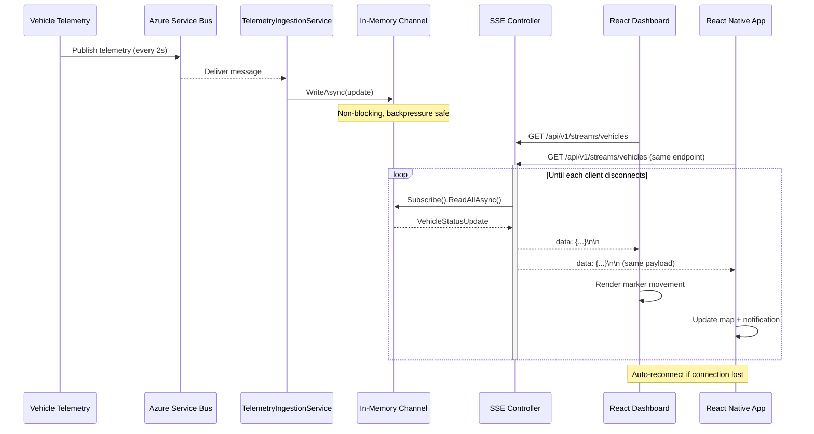

# Below is how the entire data flow works — from IoT

```mermaid
sequenceDiagram
    participant IoT as Vehicle Telemetry
    participant ASB as Azure Service Bus
    participant Ingest as TelemetryIngestionService
    participant Channel as In-Memory Channel
    participant SSE as SSE Controller
    participant Browser as React Dashboard
    participant Mobile as React Native App

    IoT->>ASB: Publish telemetry (every 2s)
    ASB-->>Ingest: Deliver message
    Ingest->>Channel: WriteAsync(update)
    Note over Channel: Non-blocking, backpressure safe
    Browser->>SSE: GET /api/v1/streams/vehicles
    Mobile->>SSE: GET /api/v1/streams/vehicles (same endpoint)
    activate SSE
    loop Until each client disconnects
        SSE->>Channel: Subscribe().ReadAllAsync()
        Channel-->>SSE: VehicleStatusUpdate
        SSE-->>Browser: data: {...}\n\n
        SSE-->>Mobile: data: {...}\n\n (same payload)
        Browser->>Browser: Render marker movement
        Mobile->>Mobile: Update map + notification
    end
    deactivate SSE
    Note over Browser,Mobile: Auto-reconnect if connection lost
```
