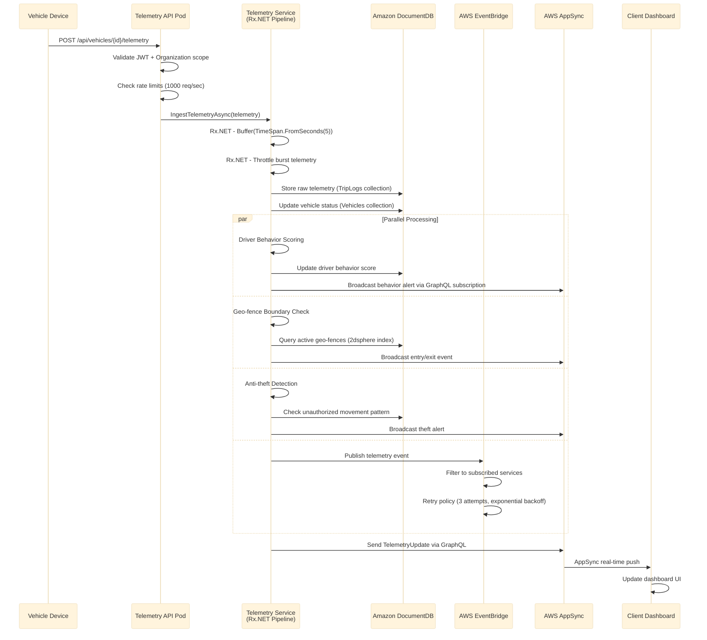

# ### 1.3 Telemetry Processing Sequence Diagram (AWS

```mermaid
---
config:
  theme: base
  layout: elk
---
sequenceDiagram
    participant V as Vehicle Device
    participant API as Telemetry API Pod
    participant TS as Telemetry Service<br/>(Rx.NET Pipeline)
    participant DB as Amazon DocumentDB
    participant EB as AWS EventBridge
    participant AS as AWS AppSync
    participant C as Client Dashboard

    V->>API: POST /api/vehicles/{id}/telemetry
    API->>API: Validate JWT + Organization scope
    API->>API: Check rate limits (1000 req/sec)
    API->>TS: IngestTelemetryAsync(telemetry)
    
    TS->>TS: Rx.NET - Buffer(TimeSpan.FromSeconds(5))
    TS->>TS: Rx.NET - Throttle burst telemetry
    TS->>DB: Store raw telemetry (TripLogs collection)
    TS->>DB: Update vehicle status (Vehicles collection)
    
    par Parallel Processing
        TS->>TS: Driver Behavior Scoring
        TS->>DB: Update driver behavior score
        TS->>AS: Broadcast behavior alert via GraphQL subscription
    and
        TS->>TS: Geo-fence Boundary Check
        TS->>DB: Query active geo-fences (2dsphere index)
        TS->>AS: Broadcast entry/exit event
    and
        TS->>TS: Anti-theft Detection
        TS->>DB: Check unauthorized movement pattern
        TS->>AS: Broadcast theft alert
    and
        TS->>EB: Publish telemetry event
        EB->>EB: Filter to subscribed services
        EB->>EB: Retry policy (3 attempts, exponential backoff)
    end
    
    TS->>AS: Send TelemetryUpdate via GraphQL
    AS->>C: AppSync real-time push
    C->>C: Update dashboard UI
```
