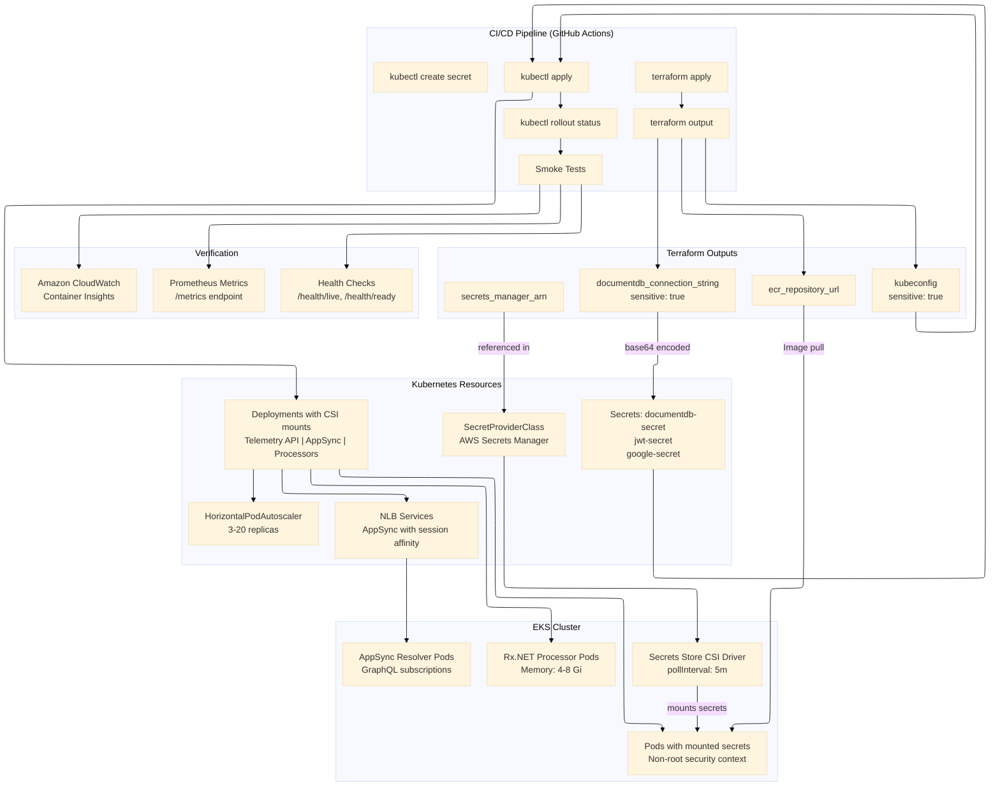

# ### 1.6 CI/CD Pipeline Flow Diagram (AWS)

```mermaid
---
config:
  theme: base
  layout: elk
---
flowchart TD
    subgraph "CI/CD Pipeline (GitHub Actions)"
        TF_APPLY["terraform apply"]
        TF_OUTPUT["terraform output"]
        K8S_SECRET["kubectl create secret"]
        K8S_APPLY["kubectl apply"]
        ROLLOUT["kubectl rollout status"]
        SMOKE["Smoke Tests"]
    end
    
    subgraph "Terraform Outputs"
        DOCDB_STR["documentdb_connection_string<br/>sensitive: true"]
        ECR_URL["ecr_repository_url"]
        KUBECONFIG["kubeconfig<br/>sensitive: true"]
        SM_ARN["secrets_manager_arn"]
    end
    
    subgraph "Kubernetes Resources"
        K8S_SECRETS["Secrets: documentdb-secret<br/>jwt-secret<br/>google-secret"]
        K8S_SPC["SecretProviderClass<br/>AWS Secrets Manager"]
        DEPLOYMENTS["Deployments with CSI mounts<br/>Telemetry API | AppSync | Processors"]
        HPA["HorizontalPodAutoscaler<br/>3-20 replicas"]
        SERVICE["NLB Services<br/>AppSync with session affinity"]
    end
    
    subgraph "EKS Cluster"
        CSI_DRIVER["Secrets Store CSI Driver<br/>pollInterval: 5m"]
        PODS["Pods with mounted secrets<br/>Non-root security context"]
        APPSYNC["AppSync Resolver Pods<br/>GraphQL subscriptions"]
        PROCESSOR["Rx.NET Processor Pods<br/>Memory: 4-8 Gi"]
    end
    
    subgraph "Verification"
        HEALTH["Health Checks<br/>/health/live, /health/ready"]
        METRICS["Prometheus Metrics<br/>/metrics endpoint"]
        LOGS["Amazon CloudWatch<br/>Container Insights"]
    end
    
    TF_APPLY --> TF_OUTPUT
    TF_OUTPUT --> DOCDB_STR
    TF_OUTPUT --> ECR_URL
    TF_OUTPUT --> KUBECONFIG
    
    DOCDB_STR -->|base64 encoded| K8S_SECRETS
    SM_ARN -->|referenced in| K8S_SPC
    K8S_SPC --> CSI_DRIVER
    CSI_DRIVER -->|mounts secrets| PODS
    
    K8S_SECRETS --> K8S_APPLY
    KUBECONFIG --> K8S_APPLY
    K8S_APPLY --> DEPLOYMENTS
    DEPLOYMENTS --> PODS
    DEPLOYMENTS --> HPA
    DEPLOYMENTS --> SERVICE
    
    SERVICE --> APPSYNC
    DEPLOYMENTS --> PROCESSOR
    
    ECR_URL -->|Image pull| PODS
    
    K8S_APPLY --> ROLLOUT
    ROLLOUT --> SMOKE
    SMOKE --> HEALTH
    SMOKE --> METRICS
    SMOKE --> LOGS
```
