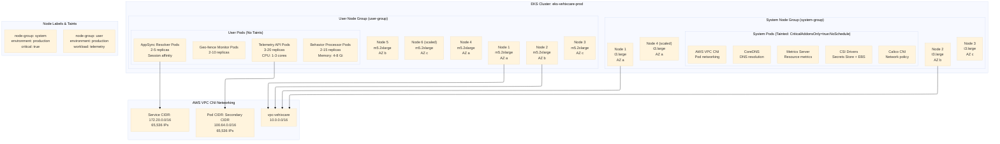

# ### 1.7 EKS Cluster Node Groups Diagram

```mermaid
---
config:
  theme: base
  layout: elk
---
graph TB
    subgraph "EKS Cluster: eks-vehixcare-prod"
        subgraph "System Node Group (system-group)"
            S1["Node 1<br/>t3.large<br/>AZ a"]
            S2["Node 2<br/>t3.large<br/>AZ b"]
            S3["Node 3<br/>t3.large<br/>AZ c"]
            S4["Node 4 (scaled)<br/>t3.large<br/>AZ a"]
            
            subgraph "System Pods (Tainted: CriticalAddonsOnly=true:NoSchedule)"
                COREDNS["CoreDNS<br/>DNS resolution"]
                METRICS["Metrics Server<br/>Resource metrics"]
                VPC_CNI["AWS VPC CNI<br/>Pod networking"]
                CSI["CSI Drivers<br/>Secrets Store + EBS"]
                CALICO["Calico CNI<br/>Network policy"]
            end
        end
        
        subgraph "User Node Group (user-group)"
            U1["Node 1<br/>m5.2xlarge<br/>AZ a"]
            U2["Node 2<br/>m5.2xlarge<br/>AZ b"]
            U3["Node 3<br/>m5.2xlarge<br/>AZ c"]
            U4["Node 4<br/>m5.2xlarge<br/>AZ a"]
            U5["Node 5<br/>m5.2xlarge<br/>AZ b"]
            U6["Node 6 (scaled)<br/>m5.2xlarge<br/>AZ c"]
            
            subgraph "User Pods (No Taints)"
                BOOKING["Telemetry API Pods<br/>3-20 replicas<br/>CPU: 1-3 cores"]
                BEHAVIOR["Behavior Processor Pods<br/>2-15 replicas<br/>Memory: 4-8 Gi"]
                GEOFENCE["Geo-fence Monitor Pods<br/>2-10 replicas"]
                APPSYNC["AppSync Resolver Pods<br/>2-5 replicas<br/>Session affinity"]
            end
        end
    end
    
    subgraph "AWS VPC CNI Networking"
        VPC["vpc-vehixcare<br/>10.0.0.0/16"]
        POD_CIDR["Pod CIDR: Secondary CIDR<br/>100.64.0.0/16<br/>65,536 IPs"]
        SVC_CIDR["Service CIDR: 172.20.0.0/16<br/>65,536 IPs"]
    end
    
    subgraph "Node Labels & Taints"
        SYS_LABEL["node-group: system<br/>environment: production<br/>critical: true"]
        USER_LABEL["node-group: user<br/>environment: production<br/>workload: telemetry"]
    end
    
    S1 --> VPC
    S2 --> VPC
    U1 --> VPC
    U2 --> VPC
    
    BOOKING --> POD_CIDR
    APPSYNC --> SVC_CIDR
```
