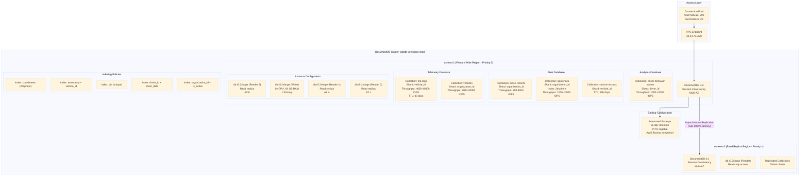

# ### 1.8 Amazon DocumentDB Architecture Diagram

```mermaid
---
config:
  theme: base
  layout: elk
---
graph TB
    subgraph "DocumentDB Cluster: docdb-vehixcare-prod"
        subgraph "us-east-1 (Primary Write Region - Priority 0)"
            DOCDB1["DocumentDB 4.2<br/>Session Consistency<br/>Multi-AZ"]
            
            subgraph "Instance Configuration"
                INSTANCE_WRITE["db.r5.2xlarge (Writer)<br/>8 vCPU, 64 GB RAM<br/>1 Primary"]
                INSTANCE_READ1["db.r5.2xlarge (Reader 1)<br/>Read replica<br/>AZ a"]
                INSTANCE_READ2["db.r5.2xlarge (Reader 2)<br/>Read replica<br/>AZ b"]
                INSTANCE_READ3["db.r5.2xlarge (Reader 3)<br/>Read replica<br/>AZ c"]
            end
            
            subgraph "Telemetry Database"
                COLL_TRIPLOGS["Collection: trip-logs<br/>Shard: vehicle_id<br/>Throughput: 4000-40000 IOPS<br/>TTL: 30 days"]
                COLL_VEHICLES["Collection: vehicles<br/>Shard: organization_id<br/>Throughput: 2000-20000 IOPS"]
            end
            
            subgraph "Fleet Database"
                COLL_GEOFENCES["Collection: geofences<br/>Shard: organization_id<br/>Index: 2dsphere<br/>Throughput: 1000-10000 IOPS"]
                COLL_SERVICE["Collection: service-records<br/>Shard: vehicle_id<br/>TTL: 180 days"]
                COLL_LEASE["Collection: lease-records<br/>Shard: organization_id<br/>Throughput: 800-8000 IOPS"]
            end
            
            subgraph "Analytics Database"
                COLL_SCORES["Collection: driver-behavior-scores<br/>Shard: driver_id<br/>Throughput: 1000-10000 IOPS"]
            end
        end
        
        subgraph "us-west-2 (Read Replica Region - Priority 1)"
            DOCDB2["DocumentDB 4.2<br/>Session Consistency<br/>Multi-AZ"]
            REPLICA_INSTANCE["db.r5.2xlarge (Reader)<br/>Read-only access"]
            REPLICA_COLL["Replicated Collections<br/>Global cluster"]
        end
        
        subgraph "Backup Configuration"
            BACKUP["Automated Backups<br/>35 day retention<br/>PITR capable<br/>AWS Backup integration"]
        end
        
        subgraph "Indexing Policies"
            IDX1["Index: timestamp + vehicle_id"]
            IDX2["Index: vin (unique)"]
            IDX3["Index: coordinates (2dsphere)"]
            IDX4["Index: driver_id + score_date"]
            IDX5["Index: organization_id + is_active"]
        end
    end
    
    subgraph "Access Layer"
        VPCE["VPC Endpoint<br/>10.0.176.0/20"]
        CONNECTION_POOL["Connection Pool<br/>maxPoolSize: 200<br/>minPoolSize: 20"]
    end
    
    VPCE --> DOCDB1
    DOCDB1 -- "Asynchronous Replication<br/>(sub-100ms latency)" --> DOCDB2
    DOCDB1 --> BACKUP
    CONNECTION_POOL --> VPCE
```
