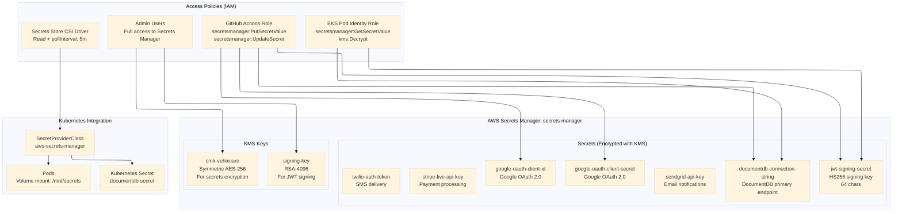

# ### 1.9 AWS Secrets Manager Architecture Diagram

```mermaid
---
config:
  theme: base
  layout: elk
---
graph TB
    subgraph "AWS Secrets Manager: secrets-manager"
        subgraph "Secrets (Encrypted with KMS)"
            S1["documentdb-connection-string<br/>DocumentDB primary endpoint"]
            S2["jwt-signing-secret<br/>HS256 signing key<br/>64 chars"]
            S3["google-oauth-client-id<br/>Google OAuth 2.0"]
            S4["google-oauth-client-secret<br/>Google OAuth 2.0"]
            S5["stripe-live-api-key<br/>Payment processing"]
            S6["sendgrid-api-key<br/>Email notifications"]
            S7["twilio-auth-token<br/>SMS delivery"]
        end
        
        subgraph "KMS Keys"
            K1["cmk-vehixcare<br/>Symmetric AES-256<br/>For secrets encryption"]
            K2["signing-key<br/>RSA-4096<br/>For JWT signing"]
        end
    end
    
    subgraph "Access Policies (IAM)"
        EKS_ROLE["EKS Pod Identity Role<br/>secretsmanager:GetSecretValue<br/>kms:Decrypt"]
        CI_ROLE["GitHub Actions Role<br/>secretsmanager:PutSecretValue<br/>secretsmanager:UpdateSecret"]
        ADMIN["Admin Users<br/>Full access to Secrets Manager"]
        CSI["Secrets Store CSI Driver<br/>Read + pollInterval: 5m"]
    end
    
    subgraph "Kubernetes Integration"
        SPC["SecretProviderClass<br/>aws-secrets-manager"]
        PODS["Pods<br/>Volume mount: /mnt/secrets"]
        K8S_SECRET["Kubernetes Secret<br/>documentdb-secret"]
    end
    
    EKS_ROLE --> S1
    EKS_ROLE --> S2
    CSI --> SPC
    SPC --> PODS
    SPC --> K8S_SECRET
    
    CI_ROLE --> S1
    CI_ROLE --> S2
    CI_ROLE --> S3
    CI_ROLE --> S4
    
    ADMIN --> K1
    ADMIN --> K2
```
