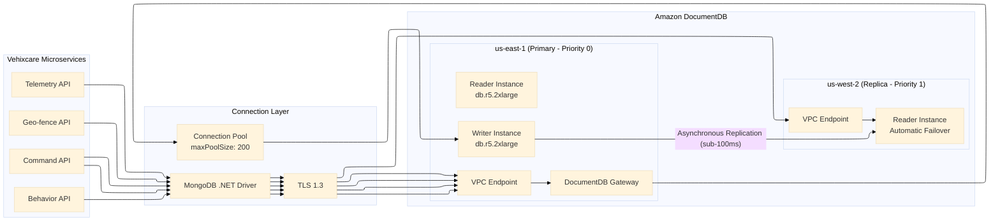

# ### 1.10 Data Flow: MongoDB Operations with Docume

```mermaid
---
config:
  theme: base
  layout: elk
---
flowchart LR
    subgraph "Vehixcare Microservices"
        TELEMETRY_API["Telemetry API"]
        BEHAVIOR_API["Behavior API"]
        GEOFENCE_API["Geo-fence API"]
        COMMAND_API["Command API"]
    end
    
    subgraph "Connection Layer"
        MC["MongoDB .NET Driver"]
        TLS["TLS 1.3"]
        POOL["Connection Pool<br/>maxPoolSize: 200"]
    end
    
    subgraph "Amazon DocumentDB"
        subgraph "us-east-1 (Primary - Priority 0)"
            VPCE1["VPC Endpoint"]
            GW1["DocumentDB Gateway"]
            INSTANCE_WRITE["Writer Instance<br/>db.r5.2xlarge"]
            INSTANCE_READ["Reader Instance<br/>db.r5.2xlarge"]
        end
        
        subgraph "us-west-2 (Replica - Priority 1)"
            VPCE2["VPC Endpoint"]
            INSTANCE_REPLICA["Reader Instance<br/>Automatic Failover"]
        end
    end
    
    TELEMETRY_API --> MC --> TLS --> VPCE1
    BEHAVIOR_API --> MC --> TLS --> VPCE1
    GEOFENCE_API --> MC --> TLS --> VPCE1
    COMMAND_API --> MC --> TLS --> VPCE1
    
    VPCE1 --> GW1
    GW1 --> POOL
    POOL --> INSTANCE_WRITE
    
    INSTANCE_WRITE -- "Asynchronous Replication (sub-100ms)" --> INSTANCE_REPLICA
    
    COMMAND_API --> MC --> TLS --> VPCE2
    VPCE2 --> INSTANCE_REPLICA
```
