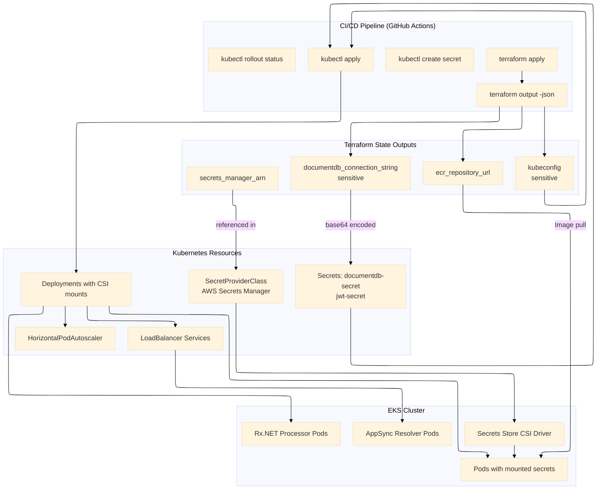

# ### 5.1 Integration Workflow (AWS)

```mermaid
---
config:
  theme: base
  layout: elk
---
flowchart TD
    subgraph "CI/CD Pipeline (GitHub Actions)"
        TF_APPLY[terraform apply]
        TF_OUTPUT[terraform output -json]
        K8S_SECRET[kubectl create secret]
        K8S_APPLY[kubectl apply]
        ROLLOUT[kubectl rollout status]
    end
    
    subgraph "Terraform State Outputs"
        DOCDB_STR[documentdb_connection_string<br/>sensitive]
        ECR_URL[ecr_repository_url]
        KUBECONFIG[kubeconfig<br/>sensitive]
        SM_ARN[secrets_manager_arn]
    end
    
    subgraph "Kubernetes Resources"
        K8S_SECRETS[Secrets: documentdb-secret<br/>jwt-secret]
        K8S_SPC[SecretProviderClass<br/>AWS Secrets Manager]
        DEPLOYMENTS[Deployments with CSI mounts]
        HPA[HorizontalPodAutoscaler]
        SERVICE[LoadBalancer Services]
    end
    
    subgraph "EKS Cluster"
        CSI_DRIVER[Secrets Store CSI Driver]
        PODS[Pods with mounted secrets]
        APPSYNC[AppSync Resolver Pods]
        PROCESSOR[Rx.NET Processor Pods]
    end
    
    TF_APPLY --> TF_OUTPUT
    TF_OUTPUT --> DOCDB_STR
    TF_OUTPUT --> ECR_URL
    TF_OUTPUT --> KUBECONFIG
    
    DOCDB_STR --> |base64 encoded| K8S_SECRETS
    SM_ARN --> |referenced in| K8S_SPC
    K8S_SPC --> CSI_DRIVER
    CSI_DRIVER --> PODS
    
    K8S_SECRETS --> K8S_APPLY
    KUBECONFIG --> K8S_APPLY
    K8S_APPLY --> DEPLOYMENTS
    DEPLOYMENTS --> PODS
    DEPLOYMENTS --> HPA
    DEPLOYMENTS --> SERVICE
    
    SERVICE --> APPSYNC
    DEPLOYMENTS --> PROCESSOR
    
    ECR_URL --> |Image pull| PODS
```
