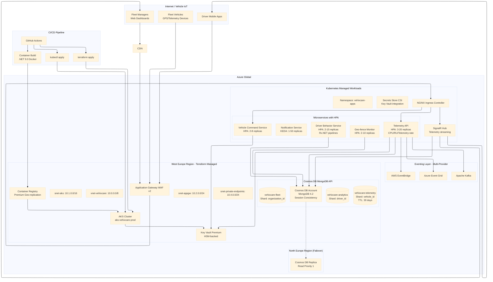

# ### 1.1 High-Level Architecture Diagram

```mermaid
---
config:
  theme: base
  layout: elk
---
graph TB
    subgraph "Internet / Vehicle IoT"
        VEHICLES[Fleet Vehicles<br/>GPS/Telemetry Devices]
        USERS[Fleet Managers<br/>Web Dashboards]
        MOBILE[Driver Mobile Apps]
    end
    
    subgraph "Azure Global"
        subgraph "West Europe Region - Terraform Managed"
            VNET[vnet-vehixcare: 10.0.0.0/8]
            SUBNET_AKS[snet-aks: 10.1.0.0/16]
            SUBNET_APPGW[snet-appgw: 10.2.0.0/24]
            SUBNET_PE[snet-private-endpoints: 10.4.0.0/24]
            
            APPGW[Application Gateway WAF v2]
            AKS[AKS Cluster<br/>aks-vehixcare-prod]
            ACR[Container Registry<br/>Premium Geo-replication]
            KV[Key Vault Premium<br/>HSM-backed]
            
            subgraph "Cosmos DB MongoDB API"
                COSMOS[Cosmos DB Account<br/>MongoDB 4.2<br/>Session Consistency]
                DB_TELEMETRY[(vehixcare-telemetry<br/>Shard: vehicle_id<br/>TTL: 30 days)]
                DB_FLEET[(vehixcare-fleet<br/>Shard: organization_id)]
                DB_ANALYTICS[(vehixcare-analytics<br/>Shard: driver_id)]
            end
        end
        
        subgraph "Kubernetes Managed Workloads"
            NS_APP[Namespace: vehixcare-apps]
            
            subgraph "Microservices with HPA"
                TELEMETRY[Telemetry API<br/>HPA: 3-20 replicas<br/>CPU/RU/Telemetry-rate]
                BEHAVIOR[Driver Behavior Service<br/>HPA: 2-15 replicas<br/>Rx.NET pipelines]
                GEOFENCE[Geo-fence Monitor<br/>HPA: 2-10 replicas]
                NOTIFY[Notification Service<br/>KEDA: 1-50 replicas]
                COMMAND[Vehicle Command Service<br/>HPA: 2-8 replicas]
            end
            
            SIGNALR[SignalR Hub<br/>Telemetry streaming]
            INGRESS[NGINX Ingress Controller]
            CSI[Secrets Store CSI<br/>Key Vault integration]
        end
        
        subgraph "Eventing Layer - Multi-Provider"
            EVENTGRID[Azure Event Grid]
            EVENTBRIDGE[AWS EventBridge]
            KAFKA[Apache Kafka]
        end
        
        subgraph "North Europe Region (Failover)"
            COSMOS_REPLICA[Cosmos DB Replica<br/>Read Priority 1]
        end
    end
    
    subgraph "CI/CD Pipeline"
        GH[GitHub Actions]
        TF_APPLY[terraform apply]
        KUBECTL[kubectl apply]
        BUILD[Container Build<br/>.NET 9.0 Docker]
    end
    
    VEHICLES --> APPGW
    USERS --> CDN --> APPGW
    MOBILE --> APPGW
    
    APPGW --> INGRESS
    INGRESS --> TELEMETRY
    INGRESS --> COMMAND
    INGRESS --> SIGNALR
    
    TELEMETRY --> COSMOS
    TELEMETRY --> EVENTGRID
    TELEMETRY --> EVENTBRIDGE
    TELEMETRY --> KAFKA
    
    SIGNALR --> COSMOS
    SIGNALR --> MOBILE
    SIGNALR --> USERS
    
    GEOFENCE --> COSMOS
    BEHAVIOR --> COSMOS
    
    TELEMETRY --> KV
    COMMAND --> KV
    
    COSMOS -.-> COSMOS_REPLICA
    
    GH --> BUILD --> ACR
    ACR --> AKS
    GH --> TF_APPLY --> AKS
    GH --> KUBECTL --> AKS
    
    AKS --> KV
```
