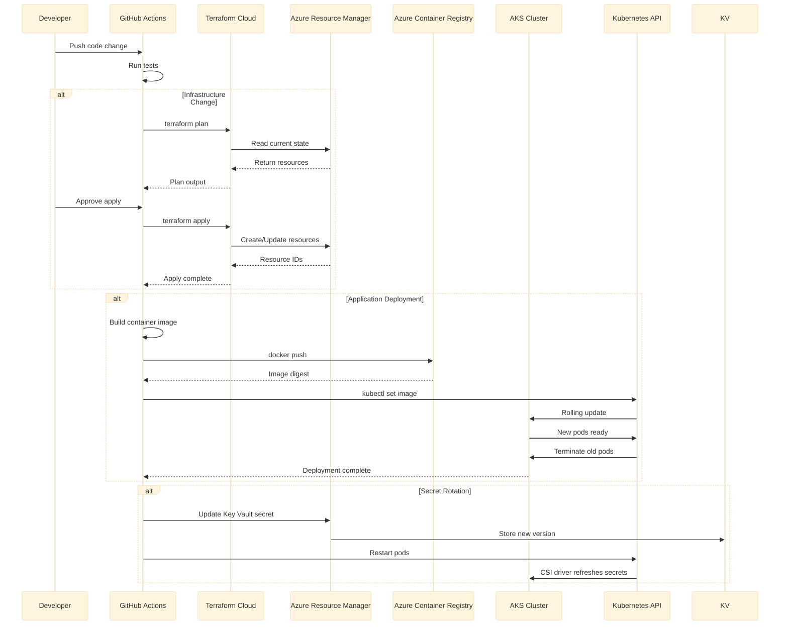

# ### 1.2 Deployment Workflow Sequence Diagram

```mermaid
---
config:
  theme: base
  layout: elk
---
sequenceDiagram
    participant Dev as Developer
    participant GH as GitHub Actions
    participant TF as Terraform Cloud
    participant AZ as Azure Resource Manager
    participant ACR as Azure Container Registry
    participant AKS as AKS Cluster
    participant K8s as Kubernetes API
    
    Dev->>GH: Push code change
    GH->>GH: Run tests
    
    alt Infrastructure Change
        GH->>TF: terraform plan
        TF->>AZ: Read current state
        AZ-->>TF: Return resources
        TF-->>GH: Plan output
        Dev->>GH: Approve apply
        GH->>TF: terraform apply
        TF->>AZ: Create/Update resources
        AZ-->>TF: Resource IDs
        TF-->>GH: Apply complete
    end
    
    alt Application Deployment
        GH->>GH: Build container image
        GH->>ACR: docker push
        ACR-->>GH: Image digest
        GH->>K8s: kubectl set image
        K8s->>AKS: Rolling update
        AKS->>K8s: New pods ready
        K8s->>AKS: Terminate old pods
        AKS-->>GH: Deployment complete
    end
    
    alt Secret Rotation
        GH->>AZ: Update Key Vault secret
        AZ->>KV: Store new version
        GH->>K8s: Restart pods
        K8s->>AKS: CSI driver refreshes secrets
    end
```
