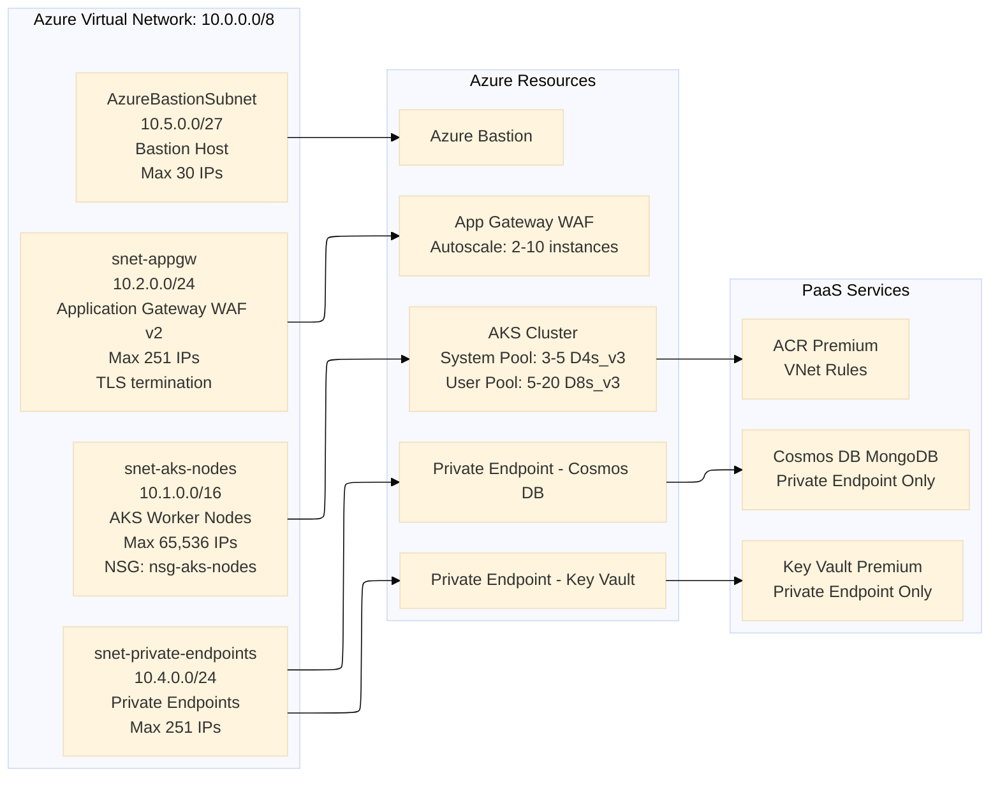

# ### 1.4 Network Topology Diagram

```mermaid
---
config:
  theme: base
  layout: elk
---
graph LR
    subgraph "Azure Virtual Network: 10.0.0.0/8"
        SUBNET1["snet-aks-nodes<br/>10.1.0.0/16<br/>AKS Worker Nodes<br/>Max 65,536 IPs<br/>NSG: nsg-aks-nodes"]
        SUBNET2["snet-appgw<br/>10.2.0.0/24<br/>Application Gateway WAF v2<br/>Max 251 IPs<br/>TLS termination"]
        SUBNET3["snet-private-endpoints<br/>10.4.0.0/24<br/>Private Endpoints<br/>Max 251 IPs"]
        SUBNET4["AzureBastionSubnet<br/>10.5.0.0/27<br/>Bastion Host<br/>Max 30 IPs"]
    end
    
    subgraph "Azure Resources"
        AKS[AKS Cluster<br/>System Pool: 3-5 D4s_v3<br/>User Pool: 5-20 D8s_v3]
        APPGW[App Gateway WAF<br/>Autoscale: 2-10 instances]
        PE1[Private Endpoint - Cosmos DB]
        PE2[Private Endpoint - Key Vault]
        BASTION[Azure Bastion]
    end
    
    subgraph "PaaS Services"
        COSMOS[Cosmos DB MongoDB<br/>Private Endpoint Only]
        KV[Key Vault Premium<br/>Private Endpoint Only]
        ACR[ACR Premium<br/>VNet Rules]
    end
    
    SUBNET1 --> AKS
    SUBNET2 --> APPGW
    SUBNET3 --> PE1
    SUBNET3 --> PE2
    SUBNET4 --> BASTION
    
    PE1 --> COSMOS
    PE2 --> KV
    AKS --> ACR
```
