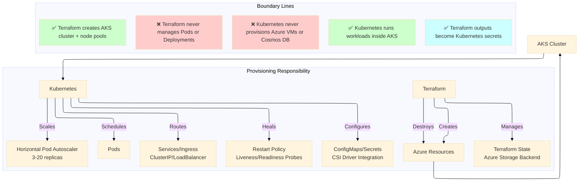

# ### 1.5 Responsibility Matrix Diagram

```mermaid
---
config:
  theme: base
  layout: elk
---
graph TD
    subgraph "Provisioning Responsibility"
        direction TB
        T[Terraform] --> |Creates| AZR[Azure Resources]
        T --> |Manages| STATE[Terraform State<br/>Azure Storage Backend]
        T --> |Destroys| AZR
        
        K[Kubernetes] --> |Schedules| PODS[Pods]
        K --> |Scales| HPA[Horizontal Pod Autoscaler<br/>3-20 replicas]
        K --> |Routes| SVC[Services/Ingress<br/>ClusterIP/LoadBalancer]
        K --> |Heals| RESTART[Restart Policy<br/>Liveness/Readiness Probes]
        K --> |Configures| CM[ConfigMaps/Secrets<br/>CSI Driver Integration]
    end
    
    subgraph "Boundary Lines"
        LINE1[❌ Terraform never manages Pods or Deployments]
        LINE2[❌ Kubernetes never provisions Azure VMs or Cosmos DB]
        LINE3[✅ Terraform creates AKS cluster + node pools]
        LINE4[✅ Kubernetes runs workloads inside AKS]
        LINE5[✅ Terraform outputs become Kubernetes secrets]
    end
    
    AZR --> AKS[AKS Cluster]
    AKS --> K
    
    style LINE1 fill:#ffcccc
    style LINE2 fill:#ffcccc
    style LINE3 fill:#ccffcc
    style LINE4 fill:#ccffcc
    style LINE5 fill:#ccffff
```
