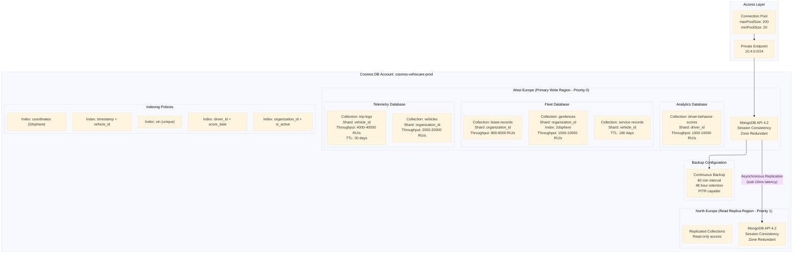

# ### 1.8 Cosmos DB MongoDB Architecture Diagram

```mermaid
---
config:
  theme: base
  layout: elk
---
graph TB
    subgraph "Cosmos DB Account: cosmos-vehixcare-prod"
        subgraph "West Europe (Primary Write Region - Priority 0)"
            MONGODB1["MongoDB API 4.2<br/>Session Consistency<br/>Zone Redundant"]
            
            subgraph "Telemetry Database"
                COLL_TRIPLOGS["Collection: trip-logs<br/>Shard: vehicle_id<br/>Throughput: 4000-40000 RU/s<br/>TTL: 30 days"]
                COLL_VEHICLES["Collection: vehicles<br/>Shard: organization_id<br/>Throughput: 2000-20000 RU/s"]
            end
            
            subgraph "Fleet Database"
                COLL_GEOFENCES["Collection: geofences<br/>Shard: organization_id<br/>Index: 2dsphere<br/>Throughput: 1000-10000 RU/s"]
                COLL_SERVICE["Collection: service-records<br/>Shard: vehicle_id<br/>TTL: 180 days"]
                COLL_LEASE["Collection: lease-records<br/>Shard: organization_id<br/>Throughput: 800-8000 RU/s"]
            end
            
            subgraph "Analytics Database"
                COLL_SCORES["Collection: driver-behavior-scores<br/>Shard: driver_id<br/>Throughput: 1000-10000 RU/s"]
            end
        end
        
        subgraph "North Europe (Read Replica Region - Priority 1)"
            MONGODB2["MongoDB API 4.2<br/>Session Consistency<br/>Zone Redundant"]
            REPLICA_COLL["Replicated Collections<br/>Read-only access"]
        end
        
        subgraph "Backup Configuration"
            BACKUP["Continuous Backup<br/>60 min interval<br/>48 hour retention<br/>PITR capable"]
        end
        
        subgraph "Indexing Policies"
            IDX1["Index: timestamp + vehicle_id"]
            IDX2["Index: vin (unique)"]
            IDX3["Index: coordinates (2dsphere)"]
            IDX4["Index: driver_id + score_date"]
            IDX5["Index: organization_id + is_active"]
        end
    end
    
    subgraph "Access Layer"
        PRIVATE_ENDPOINT["Private Endpoint<br/>10.4.0.0/24"]
        CONNECTION_POOL["Connection Pool<br/>maxPoolSize: 200<br/>minPoolSize: 20"]
    end
    
    PRIVATE_ENDPOINT --> MONGODB1
    MONGODB1 -- "Asynchronous Replication<br/>(sub-10ms latency)" --> MONGODB2
    MONGODB1 --> BACKUP
    CONNECTION_POOL --> PRIVATE_ENDPOINT
```
