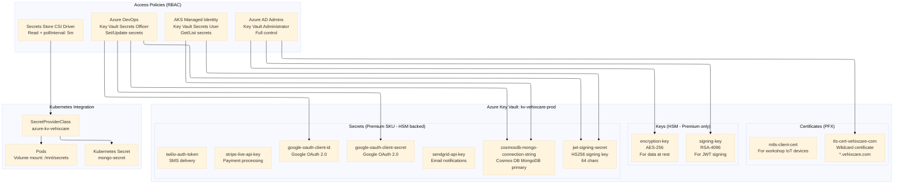

# ### 1.9 Azure Key Vault Secrets Architecture Diagr

```mermaid
---
config:
  theme: base
  layout: elk
---
graph TB
    subgraph "Azure Key Vault: kv-vehixcare-prod"
        subgraph "Secrets (Premium SKU - HSM backed)"
            S1["cosmosdb-mongo-connection-string<br/>Cosmos DB MongoDB primary"]
            S2["jwt-signing-secret<br/>HS256 signing key<br/>64 chars"]
            S3["google-oauth-client-id<br/>Google OAuth 2.0"]
            S4["google-oauth-client-secret<br/>Google OAuth 2.0"]
            S5["stripe-live-api-key<br/>Payment processing"]
            S6["sendgrid-api-key<br/>Email notifications"]
            S7["twilio-auth-token<br/>SMS delivery"]
        end
        
        subgraph "Certificates (PFX)"
            C1["tls-cert-vehixcare-com<br/>Wildcard certificate<br/>*.vehixcare.com"]
            C2["mtls-client-cert<br/>For workshop IoT devices"]
        end
        
        subgraph "Keys (HSM - Premium only)"
            K1["encryption-key<br/>AES-256<br/>For data at rest"]
            K2["signing-key<br/>RSA-4096<br/>For JWT signing"]
        end
    end
    
    subgraph "Access Policies (RBAC)"
        AKS["AKS Managed Identity<br/>Key Vault Secrets User<br/>Get/List secrets"]
        ADO["Azure DevOps<br/>Key Vault Secrets Officer<br/>Set/Update secrets"]
        AD["Azure AD Admins<br/>Key Vault Administrator<br/>Full control"]
        CSI["Secrets Store CSI Driver<br/>Read + pollInterval: 5m"]
    end
    
    subgraph "Kubernetes Integration"
        SPC["SecretProviderClass<br/>azure-kv-vehixcare"]
        PODS["Pods<br/>Volume mount: /mnt/secrets"]
        K8S_SECRET["Kubernetes Secret<br/>mongo-secret"]
    end
    
    AKS --> S1
    AKS --> S2
    CSI --> SPC
    SPC --> PODS
    SPC --> K8S_SECRET
    
    ADO --> S1
    ADO --> S2
    ADO --> S3
    ADO --> S4
    
    AD --> K1
    AD --> K2
    AD --> C1
```
