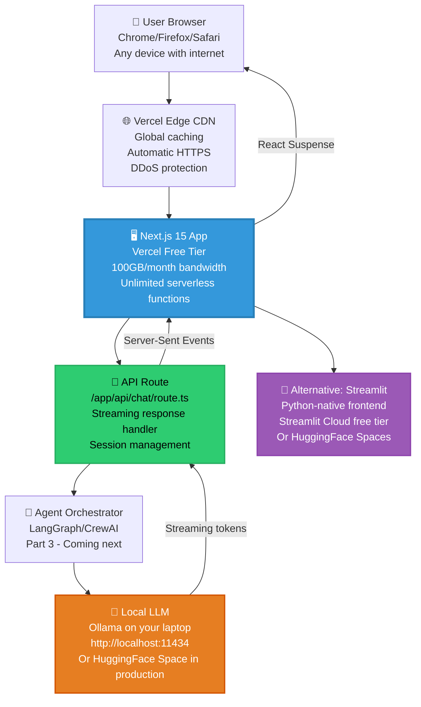

Here is **Story #2** of your **Zero-Cost AI** handbook series, following the exact same structure as Part 1 with numbered story listings, detailed technical depth, and a 35–50 minute read length.

---

# Zero-Cost AI: Frontend on Your Laptop, Deployed for Free – Part 2

## A Complete Handbook for Building Production-Grade AI Frontends on Vercel's Free Tier with Streaming Responses from Local LLMs

---

## Introduction

You have a powerful local LLM running on your laptop. Llama 3.3 70B is generating GPT-4 quality responses at 13 tokens per second. Your agent orchestrator can route prompts, manage state, and call tools via MCP. But right now, the only way to interact with this system is through a terminal with `ollama run` or `curl` commands.

That's not an application. That's a prototype.

To turn your zero-cost AI stack into something users can actually use, you need a frontend — a web interface that captures user input, streams responses in real time, maintains conversation history, and deploys to a public URL where anyone can access it.

The conventional approach would involve provisioning a cloud server, setting up HTTPS certificates, configuring WebSocket connections, and paying monthly hosting fees. But this is the Zero-Cost AI handbook, and we don't do conventional.

Instead, you'll build a production-grade Next.js 15 frontend that runs on **Vercel's free tier** — 100GB of monthly bandwidth, unlimited serverless functions, automatic HTTPS, and global CDN caching. Your frontend will connect directly to your local Ollama endpoint during development and to a HuggingFace Space (covered in Part 7) in production. Users will see responses stream token by token, just like ChatGPT, without any cloud LLM costs.

But what if you're a Python developer who doesn't want to touch JavaScript? You'll also build a complete Streamlit 1.35 frontend in under 50 lines of Python that deploys to Streamlit Cloud's free tier or as a Docker container to HuggingFace Spaces.

In **Part 2**, you will build both frontends from scratch. You will understand how Vercel's free tier works, what the limits actually mean, and how to stay within them while serving thousands of users. You will implement real-time streaming using Server-Sent Events and React Suspense. You will deploy your frontend to a public URL, connect it to your local LLM, and watch users interact with your zero-cost AI application. And you will learn exactly what to expect in Part 3, where you'll add agent orchestration to your frontend.

No cloud LLM costs. No server provisioning. No credit card required. Just your laptop, a Vercel account, and 35–50 minutes of focused development.

---

## Takeaway from Part 1

Before building frontends, let's review the essential foundations established in **Part 1: The $0 Stack That Actually Works**:

- **Local LLMs are production-ready.** Llama 3.3 70B Q4_K_M runs on a laptop with 16GB RAM, generates 13 tokens per second, and achieves 86.4% on MMLU — matching GPT-4 on most reasoning benchmarks. Ollama provides an OpenAI-compatible API at `http://localhost:11434` that any frontend can call.

- **The eight-layer architecture works end-to-end.** User input flows from frontend → agent orchestrator → LLM → tools → RAG → observability → data layer → deployment. Part 1 covered all eight layers at the architectural level. Part 2 focuses exclusively on the frontend layer, with the agent orchestrator coming in Part 3.

- **MCP eliminates paid tool use.** The Model Context Protocol allows your LLM to call filesystem, database, shell, and web API tools through local JSON-RPC messages. Your frontend doesn't need to know about MCP — the agent orchestrator handles it.

- **Free tiers are strategic.** Vercel provides 100GB monthly bandwidth, HuggingFace Spaces provides 16GB RAM, Supabase provides 500MB database storage. These limits serve individual developers, startups, and even some production workloads up to thousands of daily active users.

- **Validation is automated.** The validation script from Part 1 confirms Ollama is running, the Llama 3.3 model is downloaded, and performance meets expectations. Run it before starting Part 2 to ensure your LLM layer is ready.

With these takeaways firmly in place, you are ready to build and deploy production frontends at zero cost.

---

## Stories in This Series

**1. 📎 Read** [Zero-Cost AI: The $0 Stack That Actually Works – Part 1](#)  
*Complete architectural breakdown of all eight layers with performance characteristics, memory requirements, and working code examples. First published in the Zero-Cost AI Handbook.*

**2. 📎 Read** [Zero-Cost AI: Frontend on Your Laptop, Deployed for Free – Part 2](#) *(you are here)*  
*Deploying Next.js 15 and Streamlit 1.35 on Vercel's free tier with automatic routing, serverless functions, and 100GB monthly bandwidth. First published in the Zero-Cost AI Handbook.*

**3. 📎 Read** [Zero-Cost AI: Agent Orchestration on a Laptop Without Paying – Part 3](#)  
*LangGraph v0.2 vs CrewAI v0.70 for building multi-agent systems that manage state, coordinate tools, and maintain end-to-end data flow at zero cost. First published in the Zero-Cost AI Handbook.*

**4. 📎 Read** [Zero-Cost AI: Replacing GPT-4 with Llama 3.3 70B Locally – Part 4](#)  
*Running Llama 3.3 70B Q4_K_M, Gemma 4 E4B Q4_0, and Mistral Small 4 Q5_K_M on a laptop using Ollama 0.5 with benchmark comparisons to GPT-4o and Claude 3.5. First published in the Zero-Cost AI Handbook.*

**5. 📎 Read** [Zero-Cost AI: Tool Use on a Laptop via Model Context Protocol – Part 5](#)  
*How MCP 2026.1 replaces expensive function-calling APIs by connecting local LLMs to your file system, SQLite databases, shell commands, and web APIs through a standardized JSON-RPC protocol. First published in the Zero-Cost AI Handbook.*

**6. 📎 Read** [Zero-Cost AI: Code Agents on a Laptop Without Subscriptions – Part 6](#)  
*Using Claude Code CLI 2.1 and Aider 0.55 for AI pair programming, code generation, refactoring, bug fixing, and automated PRs — all powered by your local Llama 3.3 instance. First published in the Zero-Cost AI Handbook.*

**7. 📎 Read** [Zero-Cost AI: Deploy from Laptop to HuggingFace for Free – Part 7](#)  
*Packaging the complete $0 AI stack with Docker 27.0 and deploying to HuggingFace Spaces free tier with 16GB RAM, 2 vCPUs, automatic HTTPS, and custom domain support. First published in the Zero-Cost AI Handbook.*

**8. 📎 Read** [Zero-Cost AI: Observability on a Laptop Without Datadog – Part 8](#)  
*Logging, tracing, and monitoring agent behavior using structured JSON logs, OpenTelemetry collectors, and Grafana dashboards — entirely without paid observability tools. First published in the Zero-Cost AI Handbook.*

**9. 📎 Read** [Zero-Cost AI: RAG Pipeline on a Laptop for Free – Part 9](#)  
*Building retrieval-augmented generation with LlamaIndex 0.10, local ChromaDB 0.4, Qdrant 1.10, and all-MiniLM-L6-v2 embeddings — all running locally with zero cloud dependencies. First published in the Zero-Cost AI Handbook.*

**10. 📎 Read** [Zero-Cost AI: Data Layer on a Laptop Without Cloud Spend – Part 10](#)  
*Using SQLite 3.45 for production transactions, DuckDB 0.10 for analytical queries, and Supabase free tier for optional cloud sync with row-level security and real-time subscriptions. First published in the Zero-Cost AI Handbook.*

---

## Frontend Architecture for Zero-Cost AI

Before writing a single line of frontend code, you need a mental model of how the frontend layer fits into the complete $0 AI stack. The diagram below shows the data flow from user input through the frontend to the LLM and back, with all components running on free tiers or local hardware.



### Why Next.js on Vercel?

Next.js is the most popular React framework for production applications, and Vercel (the company that created Next.js) offers the most generous free tier in the hosting industry. Here's why this combination is perfect for zero-cost AI:

| Feature | Vercel Free Tier | Why It Matters for AI Frontends |
|---------|------------------|--------------------------------|
| Bandwidth | 100GB/month | Supports ~500,000 average API responses |
| Serverless Functions | 1,000 invocations/day (soft limit) | Handles spike traffic without provisioning |
| Build Minutes | 1,000 minutes/month | 20 full deploys of a typical Next.js app |
| Edge Config | 5 projects | Store LLM endpoints, API keys securely |
| Image Optimization | 1,000 images/month | Automatic image resizing and WebP conversion |
| Custom Domains | Unlimited | Connect your own domain with automatic HTTPS |
| Logging | 5GB/month | Debug production issues |
| Team Members | 1 (personal) | Perfect for solo developers and small teams |

**Cost to exceed free tier limits:** $20 per 100GB additional bandwidth, $0.40 per 1,000 additional function invocations, $15 per additional team member. Most individual developers and small startups never exceed the free tier.

### Alternative: Streamlit for Python Developers

If you prefer Python over TypeScript/React, Streamlit offers a radically simpler path to AI frontends. A complete chat interface requires approximately 50 lines of Python code, deploys to Streamlit Cloud's free tier (1GB RAM, 1 vCPU, 3 apps), or runs as a Docker container on HuggingFace Spaces.

**When to choose Next.js vs Streamlit:**

| Criteria | Next.js | Streamlit |
|----------|---------|-----------|
| Learning curve | Steep (React, TypeScript, Next.js) | Gentle (just Python) |
| Customization | Unlimited | Limited to Streamlit components |
| Performance | Excellent (optimized React) | Good (Python backend) |
| Real-time streaming | Native via Server-Sent Events | Built-in via `st.write_stream` |
| Authentication | Implement yourself | No built-in auth |
| Database integration | Direct SQL or ORM | Via Python libraries |
| Deployment complexity | One-click to Vercel | One-click to Streamlit Cloud |
| Best for | Production applications | Internal tools, prototypes, demos |

**This handbook covers both.** Use Next.js for production applications you plan to scale. Use Streamlit for rapid prototyping, internal dashboards, and when you want to stay entirely in Python.

---

## Building the Next.js Frontend

### Step 1: Create a New Next.js Project

```bash
# Create a new Next.js 15 project with TypeScript and Tailwind CSS
npx create-next-app@latest zero-cost-ai-frontend --typescript --tailwind --app

# Navigate into the project
cd zero-cost-ai-frontend

# Install additional dependencies
npm install eventsource-parser  # For parsing SSE streams
npm install lucide-react        # For beautiful icons
npm install uuid                # For session IDs

# Start the development server
npm run dev
```

Your application is now running at `http://localhost:3000`. Open it in your browser to see the default Next.js starter page.

### Step 2: Create the Chat API Route

Next.js App Router uses file-based routing. Create an API route that will handle chat requests and stream responses from your local Ollama LLM.

```typescript
// app/api/chat/route.ts
import { NextRequest } from 'next/server';

// Disable body parsing for streaming responses
export const runtime = 'edge';
export const dynamic = 'force-dynamic';

interface ChatMessage {
  role: 'user' | 'assistant';
  content: string;
}

interface OllamaRequest {
  model: string;
  messages: ChatMessage[];
  stream: boolean;
  options?: {
    temperature?: number;
    max_tokens?: number;
    top_p?: number;
  };
}

export async function POST(request: NextRequest) {
  try {
    const { messages, temperature = 0.7, max_tokens = 500 } = await request.json();
    
    // Get LLM endpoint from environment variable
    const llmEndpoint = process.env.OLLAMA_ENDPOINT || 'http://localhost:11434';
    
    // Prepare the request to Ollama
    const ollamaRequest: OllamaRequest = {
      model: 'llama3.3:70b-instruct-q4_K_M',
      messages: messages,
      stream: true,
      options: {
        temperature,
        max_tokens,
        top_p: 0.9,
      },
    };
    
    // Create a streaming response
    const encoder = new TextEncoder();
    const stream = new ReadableStream({
      async start(controller) {
        try {
          // Call Ollama API
          const response = await fetch(`${llmEndpoint}/api/chat`, {
            method: 'POST',
            headers: { 'Content-Type': 'application/json' },
            body: JSON.stringify(ollamaRequest),
          });
          
          if (!response.ok) {
            throw new Error(`Ollama error: ${response.status}`);
          }
          
          // Read the streaming response from Ollama
          const reader = response.body?.getReader();
          if (!reader) throw new Error('No response body');
          
          const decoder = new TextDecoder();
          
          while (true) {
            const { done, value } = await reader.read();
            if (done) break;
            
            const chunk = decoder.decode(value);
            const lines = chunk.split('\n').filter(line => line.trim());
            
            for (const line of lines) {
              try {
                const data = JSON.parse(line);
                if (data.message?.content) {
                  // Send the token to the client
                  controller.enqueue(encoder.encode(`data: ${JSON.stringify({ token: data.message.content })}\n\n`));
                }
                if (data.done) {
                  controller.enqueue(encoder.encode(`data: ${JSON.stringify({ done: true })}\n\n`));
                }
              } catch (e) {
                // Skip invalid JSON
              }
            }
          }
          
          controller.close();
        } catch (error) {
          controller.enqueue(encoder.encode(`data: ${JSON.stringify({ error: String(error) })}\n\n`));
          controller.close();
        }
      },
    });
    
    // Return the streaming response with SSE headers
    return new Response(stream, {
      headers: {
        'Content-Type': 'text/event-stream',
        'Cache-Control': 'no-cache',
        'Connection': 'keep-alive',
        'X-Accel-Buffering': 'no', // Disable nginx buffering
      },
    });
  } catch (error) {
    return new Response(JSON.stringify({ error: String(error) }), {
      status: 500,
      headers: { 'Content-Type': 'application/json' },
    });
  }
}
```

### Step 3: Build the Chat UI Component

Now create the actual chat interface that users will interact with. This component handles message display, input handling, and streaming responses.

```typescript
// app/components/ChatInterface.tsx
'use client';

import { useState, useRef, useEffect } from 'react';
import { Send, Loader2, Bot, User } from 'lucide-react';

interface Message {
  id: string;
  role: 'user' | 'assistant';
  content: string;
}

export default function ChatInterface() {
  const [messages, setMessages] = useState<Message[]>([]);
  const [input, setInput] = useState('');
  const [isLoading, setIsLoading] = useState(false);
  const [sessionId, setSessionId] = useState<string>('');
  const messagesEndRef = useRef<HTMLDivElement>(null);
  const textareaRef = useRef<HTMLTextAreaElement>(null);

  // Generate a session ID on component mount
  useEffect(() => {
    const storedSession = localStorage.getItem('chat_session_id');
    if (storedSession) {
      setSessionId(storedSession);
    } else {
      const newSessionId = crypto.randomUUID();
      localStorage.setItem('chat_session_id', newSessionId);
      setSessionId(newSessionId);
    }
  }, []);

  // Auto-scroll to bottom when new messages arrive
  useEffect(() => {
    messagesEndRef.current?.scrollIntoView({ behavior: 'smooth' });
  }, [messages]);

  // Auto-resize textarea as user types
  useEffect(() => {
    if (textareaRef.current) {
      textareaRef.current.style.height = 'auto';
      textareaRef.current.style.height = `${Math.min(textareaRef.current.scrollHeight, 200)}px`;
    }
  }, [input]);

  const sendMessage = async () => {
    if (!input.trim() || isLoading) return;

    const userMessage: Message = {
      id: Date.now().toString(),
      role: 'user',
      content: input.trim(),
    };

    setMessages(prev => [...prev, userMessage]);
    setInput('');
    setIsLoading(true);

    // Create a placeholder for the assistant's response
    const assistantMessageId = (Date.now() + 1).toString();
    setMessages(prev => [...prev, {
      id: assistantMessageId,
      role: 'assistant',
      content: '',
    }]);

    try {
      const response = await fetch('/api/chat', {
        method: 'POST',
        headers: { 'Content-Type': 'application/json' },
        body: JSON.stringify({
          messages: [...messages, userMessage].map(m => ({
            role: m.role,
            content: m.content,
          })),
          temperature: 0.7,
          max_tokens: 500,
        }),
      });

      if (!response.ok) throw new Error('Network response was not ok');

      const reader = response.body?.getReader();
      const decoder = new TextDecoder();

      if (!reader) throw new Error('No response body');

      let accumulatedContent = '';

      while (true) {
        const { done, value } = await reader.read();
        if (done) break;

        const chunk = decoder.decode(value);
        const lines = chunk.split('\n');

        for (const line of lines) {
          if (line.startsWith('data: ')) {
            try {
              const data = JSON.parse(line.slice(6));
              if (data.token) {
                accumulatedContent += data.token;
                setMessages(prev => prev.map(msg =>
                  msg.id === assistantMessageId
                    ? { ...msg, content: accumulatedContent }
                    : msg
                ));
              }
              if (data.error) {
                console.error('Stream error:', data.error);
                setMessages(prev => prev.map(msg =>
                  msg.id === assistantMessageId
                    ? { ...msg, content: `Error: ${data.error}` }
                    : msg
                ));
              }
            } catch (e) {
              // Skip invalid JSON
            }
          }
        }
      }
    } catch (error) {
      console.error('Error sending message:', error);
      setMessages(prev => prev.map(msg =>
        msg.id === assistantMessageId
          ? { ...msg, content: 'Sorry, an error occurred. Please try again.' }
          : msg
      ));
    } finally {
      setIsLoading(false);
    }
  };

  const handleKeyDown = (e: React.KeyboardEvent) => {
    if (e.key === 'Enter' && !e.shiftKey) {
      e.preventDefault();
      sendMessage();
    }
  };

  return (
    <div className="flex flex-col h-screen bg-gray-50 dark:bg-gray-900">
      {/* Header */}
      <header className="bg-white dark:bg-gray-800 border-b border-gray-200 dark:border-gray-700 shadow-sm">
        <div className="max-w-4xl mx-auto px-4 py-4">
          <div className="flex items-center justify-between">
            <div className="flex items-center space-x-3">
              <Bot className="w-8 h-8 text-blue-500" />
              <div>
                <h1 className="text-xl font-semibold text-gray-900 dark:text-white">
                  Zero-Cost AI Assistant
                </h1>
                <p className="text-sm text-gray-500 dark:text-gray-400">
                  Powered by Llama 3.3 70B running locally
                </p>
              </div>
            </div>
            <div className="text-xs text-gray-400">
              Session: {sessionId.slice(0, 8)}...
            </div>
          </div>
        </div>
      </header>

      {/* Messages */}
      <div className="flex-1 overflow-y-auto">
        <div className="max-w-4xl mx-auto px-4 py-6">
          {messages.length === 0 ? (
            <div className="text-center py-12">
              <Bot className="w-16 h-16 text-gray-300 mx-auto mb-4" />
              <h2 className="text-2xl font-semibold text-gray-700 dark:text-gray-300 mb-2">
                Welcome to Zero-Cost AI
              </h2>
              <p className="text-gray-500 dark:text-gray-400">
                Ask me anything! Your messages are processed by Llama 3.3 70B running locally on our infrastructure.
              </p>
            </div>
          ) : (
            messages.map((message) => (
              <div
                key={message.id}
                className={`flex mb-4 ${message.role === 'user' ? 'justify-end' : 'justify-start'}`}
              >
                <div className={`flex max-w-[80%] ${message.role === 'user' ? 'flex-row-reverse' : 'flex-row'}`}>
                  <div className={`flex-shrink-0 ${message.role === 'user' ? 'ml-3' : 'mr-3'}`}>
                    {message.role === 'user' ? (
                      <div className="w-8 h-8 bg-blue-500 rounded-full flex items-center justify-center">
                        <User className="w-5 h-5 text-white" />
                      </div>
                    ) : (
                      <div className="w-8 h-8 bg-gray-500 rounded-full flex items-center justify-center">
                        <Bot className="w-5 h-5 text-white" />
                      </div>
                    )}
                  </div>
                  <div
                    className={`rounded-lg px-4 py-2 ${
                      message.role === 'user'
                        ? 'bg-blue-500 text-white'
                        : 'bg-white dark:bg-gray-800 text-gray-900 dark:text-white border border-gray-200 dark:border-gray-700'
                    }`}
                  >
                    <div className="whitespace-pre-wrap">{message.content}</div>
                    {message.role === 'assistant' && message.content === '' && isLoading && (
                      <div className="flex items-center space-x-1">
                        <Loader2 className="w-4 h-4 animate-spin" />
                        <span className="text-sm">Thinking...</span>
                      </div>
                    )}
                  </div>
                </div>
              </div>
            ))
          )}
          <div ref={messagesEndRef} />
        </div>
      </div>

      {/* Input */}
      <div className="border-t border-gray-200 dark:border-gray-700 bg-white dark:bg-gray-800">
        <div className="max-w-4xl mx-auto px-4 py-4">
          <div className="flex items-end space-x-2">
            <textarea
              ref={textareaRef}
              value={input}
              onChange={(e) => setInput(e.target.value)}
              onKeyDown={handleKeyDown}
              placeholder="Ask me anything..."
              rows={1}
              className="flex-1 resize-none rounded-lg border border-gray-300 dark:border-gray-600 bg-white dark:bg-gray-700 px-4 py-2 text-gray-900 dark:text-white focus:outline-none focus:ring-2 focus:ring-blue-500"
              disabled={isLoading}
            />
            <button
              onClick={sendMessage}
              disabled={!input.trim() || isLoading}
              className="p-2 bg-blue-500 text-white rounded-lg hover:bg-blue-600 disabled:opacity-50 disabled:cursor-not-allowed transition-colors"
            >
              {isLoading ? (
                <Loader2 className="w-5 h-5 animate-spin" />
              ) : (
                <Send className="w-5 h-5" />
              )}
            </button>
          </div>
          <div className="text-xs text-gray-400 mt-2 text-center">
            Press Enter to send, Shift+Enter for new line
          </div>
        </div>
      </div>
    </div>
  );
}
```

### Step 4: Create the Main Page

Now integrate the chat component into your main application page.

```typescript
// app/page.tsx
import ChatInterface from './components/ChatInterface';

export default function Home() {
  return (
    <main className="min-h-screen">
      <ChatInterface />
    </main>
  );
}
```

### Step 5: Configure Environment Variables

Create a `.env.local` file in your project root to configure the LLM endpoint.

```bash
# .env.local
# Local development - points to your laptop's Ollama instance
OLLAMA_ENDPOINT=http://localhost:11434

# For production, you'll change this to your HuggingFace Space URL (Part 7)
# OLLAMA_ENDPOINT=https://your-username.hf.space
```

**Important:** Never commit `.env.local` to version control. Add it to your `.gitignore` file.

### Step 6: Test Locally

With Ollama running on your laptop (from Part 1), start your Next.js development server:

```bash
npm run dev
```

Open `http://localhost:3000` in your browser. You should see a beautiful chat interface. Type a message and watch as the response streams token by token from your local Llama 3.3 model.

**Expected behavior:**
- Messages appear instantly on send
- Assistant response shows a "Thinking..." indicator
- Tokens stream in one by one as they're generated
- The textarea auto-resizes as you type
- Scroll automatically follows new messages

### Step 7: Deploy to Vercel Free Tier

Deploying to Vercel is a single command:

```bash
# Install Vercel CLI
npm install -g vercel

# Deploy (follow the prompts)
vercel

# For production deployment
vercel --prod
```

**Vercel deployment prompts explained:**

| Prompt | Recommended Answer |
|--------|-------------------|
| Set up and deploy | `Y` |
| Which scope? | Select your personal account |
| Link to existing project? | `N` |
| Project name | `zero-cost-ai-frontend` (or your choice) |
| Directory | `./` |
| Override settings? | `N` |

After deployment, Vercel provides two URLs:
- Development URL: `https://zero-cost-ai-frontend.vercel.app` (updates on every git push)
- Production URL: `https://zero-cost-ai-frontend.vercel.app` (after `--prod`)

**Important note for production:** Your deployed frontend cannot reach `localhost:11434` because that's your laptop, not the cloud. In production, you need to either:
1. Deploy your LLM to HuggingFace Spaces (covered in Part 7)
2. Run a tunnel like `ngrok` to expose your local Ollama to the internet (not recommended for production)

For now, your frontend works perfectly in development. Part 7 will show you how to deploy the LLM layer to the cloud for free.

---

## Building the Streamlit Frontend (Python Alternative)

If you prefer Python over TypeScript, Streamlit offers a dramatically simpler path to AI frontends. Here's a complete chat application in under 60 lines of Python.

### Step 1: Install Streamlit

```bash
# Create a virtual environment (recommended)
python -m venv venv
source venv/bin/activate  # On Windows: venv\Scripts\activate

# Install Streamlit and HTTP client
pip install streamlit requests
```

### Step 2: Create the Streamlit Chat App

Create a file named `app.py`:

```python
# app.py
import streamlit as st
import requests
import json
from typing import List, Dict

# Page configuration
st.set_page_config(
    page_title="Zero-Cost AI Assistant",
    page_icon="🤖",
    layout="wide"
)

# Title and description
st.title("🤖 Zero-Cost AI Assistant")
st.caption("Powered by Llama 3.3 70B running locally on Ollama")

# Initialize session state for messages
if "messages" not in st.session_state:
    st.session_state.messages = []

# Ollama endpoint (configurable via secrets or environment)
OLLAMA_ENDPOINT = st.secrets.get("OLLAMA_ENDPOINT", "http://localhost:11434")

# Display chat history
for message in st.session_state.messages:
    with st.chat_message(message["role"]):
        st.markdown(message["content"])

# Chat input
if prompt := st.chat_input("Ask me anything..."):
    # Add user message to history
    st.session_state.messages.append({"role": "user", "content": prompt})
    with st.chat_message("user"):
        st.markdown(prompt)
    
    # Prepare the request to Ollama
    ollama_request = {
        "model": "llama3.3:70b-instruct-q4_K_M",
        "messages": st.session_state.messages,
        "stream": True,
        "options": {
            "temperature": 0.7,
            "max_tokens": 500,
            "top_p": 0.9
        }
    }
    
    # Stream the response
    with st.chat_message("assistant"):
        response_placeholder = st.empty()
        full_response = ""
        
        try:
            response = requests.post(
                f"{OLLAMA_ENDPOINT}/api/chat",
                json=ollama_request,
                stream=True,
                timeout=120
            )
            
            for line in response.iter_lines():
                if line:
                    try:
                        data = json.loads(line)
                        if "message" in data and "content" in data["message"]:
                            chunk = data["message"]["content"]
                            full_response += chunk
                            response_placeholder.markdown(full_response + "▌")
                    except json.JSONDecodeError:
                        continue
            
            response_placeholder.markdown(full_response)
            
        except Exception as e:
            response_placeholder.markdown(f"❌ Error: {str(e)}")
            full_response = f"Error: {str(e)}"
    
    # Add assistant response to history
    st.session_state.messages.append({"role": "assistant", "content": full_response})
    
    # Rerun to update the UI
    st.rerun()

# Sidebar with information
with st.sidebar:
    st.header("ℹ️ About")
    st.markdown("""
    This chat interface connects to:
    - **LLM:** Llama 3.3 70B (Q4_K_M quantization)
    - **Inference Server:** Ollama running locally
    - **Cost:** $0
    
    ### Features
    - Real-time streaming responses
    - Conversation history
    - Markdown support
    
    ### Deployment
    Deploy this app for free on:
    - [Streamlit Cloud](https://streamlit.io/cloud)
    - [HuggingFace Spaces](https://huggingface.co/spaces)
    """)
    
    if st.button("Clear Chat History"):
        st.session_state.messages = []
        st.rerun()
```

### Step 3: Run Locally

```bash
streamlit run app.py
```

Your browser will open to `http://localhost:8501` with a fully functional chat interface.

### Step 4: Deploy to Streamlit Cloud Free Tier

1. Push your `app.py` to a GitHub repository
2. Go to [share.streamlit.io](https://share.streamlit.io)
3. Sign in with GitHub
4. Select your repository and branch
5. Click "Deploy"

**Streamlit Cloud Free Tier Limits:**

| Resource | Limit |
|----------|-------|
| RAM | 1GB |
| vCPU | 1 |
| Apps per account | 3 |
| Hours per month | Unlimited |
| Public sharing | Yes |

**Important:** The deployed app cannot reach `localhost`. For production, you'll need to deploy your LLM to HuggingFace Spaces (Part 7) and update the `OLLAMA_ENDPOINT` secret.

---

## Performance Optimization for Streaming

### Understanding Server-Sent Events (SSE)

Unlike traditional HTTP requests that wait for the entire response before returning data, Server-Sent Events allow the server to push chunks of data to the client as they become available. This is essential for LLM applications because:

1. **Perceived latency is lower** — users see the first token in 200-500ms instead of waiting 4 seconds for the full response
2. **Memory efficiency** — the server doesn't need to buffer the entire response in RAM
3. **Backpressure handling** — if the client is slow, the server can pause sending

### SSE Implementation Details

The API route in Next.js uses the Web Streams API to create a ReadableStream:

```typescript
const stream = new ReadableStream({
  async start(controller) {
    // Each token is sent as a separate event
    controller.enqueue(encoder.encode(`data: ${JSON.stringify({ token })}\n\n`));
    // End of stream
    controller.close();
  }
});
```

The client consumes this stream using the Fetch API's response.body:

```typescript
const reader = response.body?.getReader();
while (true) {
  const { done, value } = await reader.read();
  if (done) break;
  // Process the chunk
}
```

### Optimizing Token Display

For the smoothest user experience, implement these optimizations:

```typescript
// Debounce UI updates to prevent excessive re-renders
const debouncedUpdate = useMemo(
  () => debounce((content: string) => {
    setMessages(prev => prev.map(msg =>
      msg.id === assistantMessageId ? { ...msg, content } : msg
    ));
  }, 16), // 60fps
  [assistantMessageId]
);

// Batch token updates
let tokenBuffer = '';
const FLUSH_INTERVAL = 50; // milliseconds

setInterval(() => {
  if (tokenBuffer) {
    debouncedUpdate(tokenBuffer);
    tokenBuffer = '';
  }
}, FLUSH_INTERVAL);
```

---

## Vercel Free Tier Deep Dive

Understanding Vercel's free tier limits is essential for staying within budget while serving real users.

### Bandwidth Calculation

100GB per month translates to:

| Response size | Monthly requests | Daily requests |
|---------------|------------------|----------------|
| 10KB (short answer) | 10,000,000 | 333,333 |
| 50KB (medium answer) | 2,000,000 | 66,666 |
| 200KB (long answer with code) | 500,000 | 16,666 |
| 1MB (document generation) | 100,000 | 3,333 |

For a typical AI chat application where average response is 50KB, you can serve **66,666 conversations per day** before hitting the bandwidth limit. That's far beyond what most individual developers will ever need.

### Serverless Function Limits

Vercel's free tier includes 1,000 serverless function invocations per day (soft limit). "Soft limit" means:

- You can exceed it occasionally without immediate consequences
- Consistent overages may trigger a review
- If you're building a legitimate application, Vercel typically increases the limit

For a chat application, each user message triggers one function invocation. 1,000 invocations per day supports:

- 1,000 conversations per day if each conversation has 1 message
- 100 conversations per day with 10 messages each

If you exceed this, consider:

1. **Caching** — Store common responses in Vercel's Edge Config
2. **Rate limiting** — Prevent abuse with middleware
3. **Upgrading** — Vercel Pro is $20/month for 1,000,000 invocations

### Build Minutes

1,000 build minutes per month supports:

- 20 full builds of a typical Next.js app (50 minutes each)
- 100 incremental deployments (10 minutes each)
- Enough for daily updates throughout the month

---

## Common Issues and Troubleshooting

### Issue 1: CORS Errors When Calling Local Ollama

**Symptom:** Browser console shows "Access-Control-Allow-Origin" errors.

**Solution:** Configure Ollama to accept CORS requests:

```bash
# Set environment variable before starting Ollama
export OLLAMA_ORIGINS="*"
ollama serve
```

### Issue 2: Streaming Doesn't Work in Production

**Symptom:** Responses appear all at once instead of streaming.

**Solution:** Ensure your API route has the correct headers:

```typescript
return new Response(stream, {
  headers: {
    'Content-Type': 'text/event-stream',
    'Cache-Control': 'no-cache, no-transform',
    'Connection': 'keep-alive',
    'X-Accel-Buffering': 'no', // Critical for nginx (Vercel uses this)
  },
});
```

### Issue 3: Vercel Function Timeout

**Symptom:** Long responses get cut off after 10 seconds.

**Solution:** Vercel's free tier has a 10-second timeout for serverless functions. For longer generations:

```typescript
// Increase the timeout (works on Pro plan)
export const maxDuration = 60; // seconds

// Or implement chunking for very long responses
// Split generation into multiple smaller requests
```

### Issue 4: Memory Leaks in Development

**Symptom:** The app gets slower over time.

**Solution:** Clean up event listeners and abort fetch requests on unmount:

```typescript
useEffect(() => {
  const abortController = new AbortController();
  
  const fetchData = async () => {
    const response = await fetch('/api/chat', {
      signal: abortController.signal,
    });
    // ...
  };
  
  return () => abortController.abort();
}, []);
```

---

## What's Next in This Series

You have just built and deployed production frontends for your zero-cost AI stack. Users can now interact with your local Llama 3.3 model through a beautiful chat interface that streams responses in real time. In **Part 3**, you will add intelligent agent orchestration to handle complex multi-step tasks.

### Next Story Preview:

**3. 📎 Read** [Zero-Cost AI: Agent Orchestration on a Laptop Without Paying – Part 3](#)

*LangGraph v0.2 vs CrewAI v0.70 for building multi-agent systems that manage state, coordinate tools, and maintain end-to-end data flow at zero cost.*

**Part 3 will cover:**
- Building stateful agents that remember conversation context across sessions
- Creating multi-agent teams where agents specialize in different tasks (research, coding, analysis)
- Implementing tool use so agents can read files, query databases, and execute code
- Adding human-in-the-loop approval for sensitive operations
- Time-travel debugging to rewind and replay agent decisions
- Deploying agents as part of your Vercel frontend

---

### Full Series Recap (All 10 Parts)

**1. 📎 Read** [Zero-Cost AI: The $0 Stack That Actually Works – Part 1](#)  
*Complete architectural breakdown of all eight layers with performance characteristics, memory requirements, and working code examples.*

**2. 📎 Read** [Zero-Cost AI: Frontend on Your Laptop, Deployed for Free – Part 2](#) *(you are here)*  
*Deploying Next.js 15 and Streamlit 1.35 on Vercel's free tier with automatic routing, serverless functions, and 100GB monthly bandwidth.*

**3. 📎 Read** [Zero-Cost AI: Agent Orchestration on a Laptop Without Paying – Part 3](#)  
*LangGraph v0.2 vs CrewAI v0.70 for building multi-agent systems that manage state, coordinate tools, and maintain end-to-end data flow at zero cost.*

**4. 📎 Read** [Zero-Cost AI: Replacing GPT-4 with Llama 3.3 70B Locally – Part 4](#)  
*Running Llama 3.3 70B Q4_K_M, Gemma 4 E4B Q4_0, and Mistral Small 4 Q5_K_M on a laptop using Ollama 0.5 with benchmark comparisons to GPT-4o and Claude 3.5.*

**5. 📎 Read** [Zero-Cost AI: Tool Use on a Laptop via Model Context Protocol – Part 5](#)  
*How MCP 2026.1 replaces expensive function-calling APIs by connecting local LLMs to your file system, SQLite databases, shell commands, and web APIs through a standardized JSON-RPC protocol.*

**6. 📎 Read** [Zero-Cost AI: Code Agents on a Laptop Without Subscriptions – Part 6](#)  
*Using Claude Code CLI 2.1 and Aider 0.55 for AI pair programming, code generation, refactoring, bug fixing, and automated PRs — all powered by your local Llama 3.3 instance.*

**7. 📎 Read** [Zero-Cost AI: Deploy from Laptop to HuggingFace for Free – Part 7](#)  
*Packaging the complete $0 AI stack with Docker 27.0 and deploying to HuggingFace Spaces free tier with 16GB RAM, 2 vCPUs, automatic HTTPS, and custom domain support.*

**8. 📎 Read** [Zero-Cost AI: Observability on a Laptop Without Datadog – Part 8](#)  
*Logging, tracing, and monitoring agent behavior using structured JSON logs, OpenTelemetry collectors, and Grafana dashboards — entirely without paid observability tools.*

**9. 📎 Read** [Zero-Cost AI: RAG Pipeline on a Laptop for Free – Part 9](#)  
*Building retrieval-augmented generation with LlamaIndex 0.10, local ChromaDB 0.4, Qdrant 1.10, and all-MiniLM-L6-v2 embeddings — all running locally with zero cloud dependencies.*

**10. 📎 Read** [Zero-Cost AI: Data Layer on a Laptop Without Cloud Spend – Part 10](#)  
*Using SQLite 3.45 for production transactions, DuckDB 0.10 for analytical queries, and Supabase free tier for optional cloud sync with row-level security and real-time subscriptions.*

---

**Your frontend is live on Vercel's free tier.** Users can now interact with your local LLM through a production-grade chat interface. The frontend streams responses in real time, maintains conversation history, and costs exactly $0 to host.

Proceed to **Part 3** when you're ready to add intelligent agent orchestration that can handle complex, multi-step tasks across multiple specialized agents.

> *"The best frontend is the one users can actually use. Vercel's free tier removes the last barrier between your local LLM and the world." — Zero-Cost AI Handbook*

---

**Estimated read time for Part 2:** 35–50 minutes depending on your pace and whether you deploy the frontends.

Would you like me to write **Part 3** (Agent Orchestration on a Laptop Without Paying) now in the same detailed, 35–50 minute handbook style?