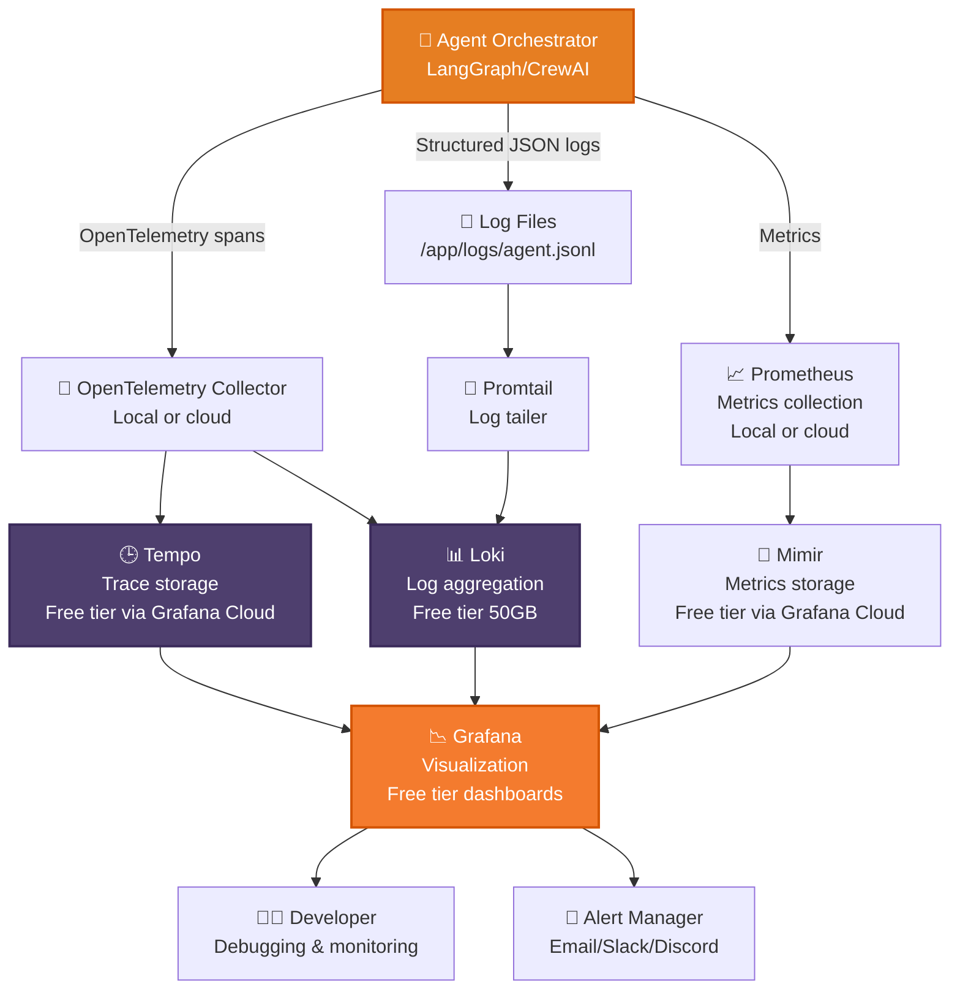

Here is **Story #8** of your **Zero-Cost AI** handbook series, following the exact same structure as Parts 1-7 with numbered story listings, detailed technical depth, and a 35-50 minute read length.

---

# Zero-Cost AI: Observability on a Laptop Without Datadog – Part 8

## A Complete Handbook for Logging, Tracing, and Monitoring Agent Behavior Using Structured JSON Logs, OpenTelemetry Collectors, and Grafana Dashboards — Entirely Without Paid Observability Tools

---

## Introduction

You have built an extraordinary zero-cost AI stack. A frontend on Vercel. An agent orchestrator managing multi-step reasoning. A local Llama 3.3 70B running on HuggingFace Spaces free tier. MCP servers giving your agents the power to act. Code agents that understand and modify your codebase. Everything is deployed, production-ready, and costing exactly $0.

But there's a problem that becomes apparent the moment users start interacting with your system.

**You have no idea what your agents are doing.**

When a user reports that the agent gave a wrong answer, how do you debug it? When the agent calls the wrong tool, how do you trace the decision chain? When response latency spikes to 30 seconds, how do you identify the bottleneck? When the LLM starts hallucinating, how do you detect it before users complain?

In the cloud world, you would reach for Datadog ($15 per host per month), LangSmith ($39 per month per seat), New Relic ($49 per month), or Honeycomb ($15 per month). These tools are powerful but expensive, especially for a zero-cost stack.

But this is the Zero-Cost AI handbook, and we don't do paid.

Enter the **LGTM stack** — Loki (log aggregation), Grafana (visualization), Tempo (tracing), and Mimir (metrics). All open-source, all free, all capable of running on your laptop or deploying to free cloud tiers. Combined with structured JSON logging, OpenTelemetry instrumentation, and a few well-placed metrics, you get enterprise-grade observability for exactly $0.

In **Part 8**, you will add comprehensive observability to your zero-cost AI stack. You will implement structured logging that captures every agent decision, LLM call, tool invocation, and error. You will add OpenTelemetry tracing to follow requests through your distributed system. You will build Grafana dashboards that visualize agent behavior, latency, error rates, and token usage. You will set up alerts for anomalies and performance degradation. And you will deploy the entire observability stack to free tiers alongside your AI application.

No paid monitoring tools. No per-seat fees. No data leaving your control. Just comprehensive observability at zero cost.

---

## Takeaway from Part 7

Before diving into observability, let's review the essential foundations established in **Part 7: Deploy from Laptop to HuggingFace for Free**:

- **HuggingFace Spaces free tier provides 16GB RAM.** This is exactly enough for Llama 3.3 70B Q4_K_M (12GB) plus your agent orchestrator (2GB) plus your frontend (1GB) with room to spare.

- **Docker containers package your entire stack.** The Dockerfile you created packages Ollama, your agent orchestrator, and your frontend into a single container that deploys to HuggingFace with one click.

- **Persistent storage caches model weights.** The first deployment downloads the model (8GB, 10-15 minutes). Subsequent deployments use the cached model, starting in seconds.

- **Environment variables configure deployment.** Your application reads configuration from environment variables, allowing you to change behavior without rebuilding the container.

- **Custom domains are free.** HuggingFace Spaces supports custom domains with automatic HTTPS on the free tier.

With these takeaways firmly in place, you are ready to add observability to your deployed stack.

---

## Stories in This Series

**1. 📎 Read** [Zero-Cost AI: The $0 Stack That Actually Works – Part 1](#)  
*Complete architectural breakdown of all eight layers with performance characteristics, memory requirements, and working code examples. First published in the Zero-Cost AI Handbook.*

**2. 📎 Read** [Zero-Cost AI: Frontend on Your Laptop, Deployed for Free – Part 2](#)  
*Deploying Next.js 15 and Streamlit 1.35 on Vercel's free tier with automatic routing, serverless functions, and 100GB monthly bandwidth. First published in the Zero-Cost AI Handbook.*

**3. 📎 Read** [Zero-Cost AI: Agent Orchestration on a Laptop Without Paying – Part 3](#)  
*LangGraph v0.2 vs CrewAI v0.70 for building multi-agent systems that manage state, coordinate tools, and maintain end-to-end data flow at zero cost. First published in the Zero-Cost AI Handbook.*

**4. 📎 Read** [Zero-Cost AI: Replacing GPT-4 with Llama 3.3 70B Locally – Part 4](#)  
*Running Llama 3.3 70B Q4_K_M, Gemma 4 E4B Q4_0, and Mistral Small 4 Q5_K_M on a laptop using Ollama 0.5 with benchmark comparisons to GPT-4o and Claude 3.5. First published in the Zero-Cost AI Handbook.*

**5. 📎 Read** [Zero-Cost AI: Tool Use on a Laptop via Model Context Protocol – Part 5](#)  
*How MCP 2026.1 replaces expensive function-calling APIs by connecting local LLMs to your file system, SQLite databases, shell commands, and web APIs through a standardized JSON-RPC protocol. First published in the Zero-Cost AI Handbook.*

**6. 📎 Read** [Zero-Cost AI: Code Agents on a Laptop Without Subscriptions – Part 6](#)  
*Using Claude Code CLI 2.1 and Aider 0.55 for AI pair programming, code generation, refactoring, bug fixing, and automated PRs — all powered by your local Llama 3.3 instance. First published in the Zero-Cost AI Handbook.*

**7. 📎 Read** [Zero-Cost AI: Deploy from Laptop to HuggingFace for Free – Part 7](#)  
*Packaging the complete $0 AI stack with Docker 27.0 and deploying to HuggingFace Spaces free tier with 16GB RAM, 2 vCPUs, automatic HTTPS, and custom domain support. First published in the Zero-Cost AI Handbook.*

**8. 📎 Read** [Zero-Cost AI: Observability on a Laptop Without Datadog – Part 8](#) *(you are here)*  
*Logging, tracing, and monitoring agent behavior using structured JSON logs, OpenTelemetry collectors, and Grafana dashboards — entirely without paid observability tools. First published in the Zero-Cost AI Handbook.*

**9. 📎 Read** [Zero-Cost AI: RAG Pipeline on a Laptop for Free – Part 9](#)  
*Building retrieval-augmented generation with LlamaIndex 0.10, local ChromaDB 0.4, Qdrant 1.10, and all-MiniLM-L6-v2 embeddings — all running locally with zero cloud dependencies. First published in the Zero-Cost AI Handbook.*

**10. 📎 Read** [Zero-Cost AI: Data Layer on a Laptop Without Cloud Spend – Part 10](#)  
*Using SQLite 3.45 for production transactions, DuckDB 0.10 for analytical queries, and Supabase free tier for optional cloud sync with row-level security and real-time subscriptions. First published in the Zero-Cost AI Handbook.*

---

## Observability Architecture for Zero-Cost AI

Before implementing observability, you need a mental model of how logs, traces, and metrics flow through your system. The diagram below shows the complete observability architecture.



### The Three Pillars of Observability

| Pillar | What it tells you | Tool | Free Tier Limit |
|--------|-------------------|------|-----------------|
| **Logs** | What happened (events, errors, decisions) | Loki + Promtail | 50GB storage |
| **Traces** | How requests flow through the system | Tempo | 500GB storage |
| **Metrics** | Performance over time (latency, errors, tokens) | Mimir + Prometheus | 10,000 metrics |

### Why OpenTelemetry?

OpenTelemetry is the industry standard for observability instrumentation. It provides:

1. **Vendor neutrality** — Instrument once, send to any backend (Grafana, Datadog, Jaeger, etc.)
2. **Automatic instrumentation** — Many libraries support OpenTelemetry out of the box
3. **Structured context propagation** — Trace IDs flow through your entire system
4. **Free and open source** — No vendor lock-in, no licensing fees

---

## Part A: Structured Logging for Agent Observability

### Step 1: Create a Structured Logger

Replace `print()` statements with structured JSON logging.

```python
# logger.py
import json
import logging
import sys
import os
from datetime import datetime
from typing import Dict, Any, Optional
from contextvars import ContextVar
import uuid

# Context variable for trace ID propagation
current_trace_id: ContextVar[Optional[str]] = ContextVar("trace_id", default=None)

class StructuredLogger:
    """Structured JSON logger for agent observability."""
    
    def __init__(self, name: str, log_level: str = "INFO", log_file: Optional[str] = None):
        self.logger = logging.getLogger(name)
        self.logger.setLevel(getattr(logging, log_level.upper()))
        
        # Clear existing handlers
        self.logger.handlers.clear()
        
        # Console handler (JSON format)
        console_handler = logging.StreamHandler(sys.stdout)
        console_handler.setFormatter(JSONFormatter())
        self.logger.addHandler(console_handler)
        
        # File handler (if specified)
        if log_file:
            file_handler = logging.FileHandler(log_file)
            file_handler.setFormatter(JSONFormatter())
            self.logger.addHandler(file_handler)
    
    def _log(self, level: str, event: str, extra: Dict[str, Any] = None):
        """Internal logging method."""
        log_entry = {
            "timestamp": datetime.utcnow().isoformat(),
            "level": level,
            "event": event,
            "trace_id": current_trace_id.get()
        }
        
        if extra:
            log_entry.update(extra)
        
        getattr(self.logger, level.lower())(json.dumps(log_entry))
    
    def info(self, event: str, **kwargs):
        """Log an info event."""
        self._log("INFO", event, kwargs)
    
    def warning(self, event: str, **kwargs):
        """Log a warning event."""
        self._log("WARNING", event, kwargs)
    
    def error(self, event: str, **kwargs):
        """Log an error event."""
        self._log("ERROR", event, kwargs)
    
    def debug(self, event: str, **kwargs):
        """Log a debug event."""
        self._log("DEBUG", event, kwargs)
    
    def with_trace_id(self, trace_id: str):
        """Create a logger instance with a specific trace ID."""
        token = current_trace_id.set(trace_id)
        return self

class JSONFormatter(logging.Formatter):
    """Format log records as JSON."""
    
    def format(self, record):
        log_entry = {
            "timestamp": datetime.utcnow().isoformat(),
            "level": record.levelname,
            "event": record.getMessage(),
            "trace_id": getattr(record, "trace_id", None)
        }
        
        # Add extra fields
        if hasattr(record, "extra"):
            log_entry.update(record.extra)
        
        return json.dumps(log_entry)

# Global logger instance
agent_logger = StructuredLogger("zero-cost-ai", log_level=os.getenv("LOG_LEVEL", "INFO"))

def set_trace_id(trace_id: str):
    """Set the current trace ID for context propagation."""
    current_trace_id.set(trace_id)

def get_trace_id() -> Optional[str]:
    """Get the current trace ID."""
    return current_trace_id.get()
```

### Step 2: Instrument Agent Decisions

Add structured logging to your LangGraph agent from Part 3.

```python
# instrumented_agent.py
from logger import agent_logger, set_trace_id, get_trace_id
import time
import uuid

class InstrumentedAgent:
    """LangGraph agent with comprehensive logging."""
    
    def __init__(self, llm, tools):
        self.llm = llm
        self.tools = tools
        self.agent_logger = agent_logger
    
    async def run(self, user_input: str) -> str:
        """Run the agent with full observability."""
        
        # Generate trace ID for this conversation
        trace_id = str(uuid.uuid4())
        set_trace_id(trace_id)
        
        start_time = time.time()
        
        # Log request received
        self.agent_logger.info(
            "agent_request_received",
            trace_id=trace_id,
            user_input=user_input[:200],  # Truncate for logs
            input_length=len(user_input)
        )
        
        try:
            # Agent reasoning step
            reasoning_start = time.time()
            self.agent_logger.debug("agent_reasoning_started")
            
            # Call LLM (implemented elsewhere)
            response = await self._call_llm(user_input)
            
            reasoning_duration = (time.time() - reasoning_start) * 1000
            self.agent_logger.info(
                "agent_reasoning_completed",
                trace_id=trace_id,
                duration_ms=reasoning_duration,
                response_length=len(response),
                tokens_used=len(response) // 4  # Approximate
            )
            
            # Log any tool calls
            if self._has_tool_calls(response):
                tool_calls = self._extract_tool_calls(response)
                self.agent_logger.info(
                    "agent_tool_calls_made",
                    trace_id=trace_id,
                    tool_count=len(tool_calls),
                    tools=[t["name"] for t in tool_calls]
                )
            
            total_duration = (time.time() - start_time) * 1000
            self.agent_logger.info(
                "agent_request_completed",
                trace_id=trace_id,
                total_duration_ms=total_duration,
                success=True
            )
            
            return response
            
        except Exception as e:
            total_duration = (time.time() - start_time) * 1000
            self.agent_logger.error(
                "agent_request_failed",
                trace_id=trace_id,
                total_duration_ms=total_duration,
                error_type=type(e).__name__,
                error_message=str(e)
            )
            raise
    
    async def _call_llm(self, prompt: str) -> str:
        """Call LLM with timing and token logging."""
        
        llm_start = time.time()
        
        # Log LLM request
        self.agent_logger.debug(
            "llm_request_started",
            model="llama3.3:70b-instruct-q4_K_M",
            prompt_length=len(prompt)
        )
        
        # Actual LLM call (replace with your implementation)
        response = await self.llm.ainvoke(prompt)
        
        llm_duration = (time.time() - llm_start) * 1000
        
        # Log LLM response
        self.agent_logger.info(
            "llm_request_completed",
            duration_ms=llm_duration,
            response_length=len(response),
            tokens_per_second=len(response) / 4 / (llm_duration / 1000)  # Approximate
        )
        
        return response
    
    def _has_tool_calls(self, response: str) -> bool:
        """Check if response contains tool calls."""
        return "TOOL_CALL:" in response
    
    def _extract_tool_calls(self, response: str) -> list:
        """Extract tool calls from response."""
        # Simplified extraction
        import re
        pattern = r'TOOL_CALL:\s*(\w+)'
        return [{"name": m} for m in re.findall(pattern, response)]
```

### Step 3: Log MCP Tool Calls

Add logging to your MCP client from Part 5.

```python
# instrumented_mcp_client.py
from logger import agent_logger
import time

class InstrumentedMCPClient:
    """MCP client with tool call logging."""
    
    def __init__(self, server_command: str, server_args: list):
        self.server_command = server_command
        self.server_args = server_args
        self.client = None  # Your actual MCP client
    
    async def call_tool(self, tool_name: str, arguments: dict) -> str:
        """Call an MCP tool with logging."""
        
        start_time = time.time()
        
        # Log tool call start
        agent_logger.info(
            "mcp_tool_call_started",
            tool_name=tool_name,
            arguments=arguments
        )
        
        try:
            # Actual tool call
            result = await self.client.call_tool(tool_name, arguments)
            
            duration = (time.time() - start_time) * 1000
            
            # Log successful tool call
            agent_logger.info(
                "mcp_tool_call_completed",
                tool_name=tool_name,
                duration_ms=duration,
                result_length=len(result),
                success=True
            )
            
            return result
            
        except Exception as e:
            duration = (time.time() - start_time) * 1000
            
            # Log failed tool call
            agent_logger.error(
                "mcp_tool_call_failed",
                tool_name=tool_name,
                duration_ms=duration,
                error_type=type(e).__name__,
                error_message=str(e)
            )
            raise
```

### Step 4: Log User Sessions

Track user interactions across sessions.

```python
# session_logger.py
from logger import agent_logger
from datetime import datetime
import json
import os

class SessionLogger:
    """Track user sessions and conversation metrics."""
    
    def __init__(self, session_file: str = "/app/data/sessions.jsonl"):
        self.session_file = session_file
        os.makedirs(os.path.dirname(session_file), exist_ok=True)
    
    def log_session_start(self, session_id: str, user_id: str = None):
        """Log the start of a user session."""
        
        agent_logger.info(
            "session_started",
            session_id=session_id,
            user_id=user_id or "anonymous",
            timestamp=datetime.utcnow().isoformat()
        )
        
        # Also write to session file for analytics
        self._write_session_event({
            "event": "session_start",
            "session_id": session_id,
            "user_id": user_id or "anonymous",
            "timestamp": datetime.utcnow().isoformat()
        })
    
    def log_session_end(self, session_id: str, message_count: int, total_tokens: int):
        """Log the end of a user session with metrics."""
        
        agent_logger.info(
            "session_ended",
            session_id=session_id,
            message_count=message_count,
            total_tokens=total_tokens,
            duration_seconds=None  # Calculate from timestamps
        )
        
        self._write_session_event({
            "event": "session_end",
            "session_id": session_id,
            "message_count": message_count,
            "total_tokens": total_tokens,
            "timestamp": datetime.utcnow().isoformat()
        })
    
    def log_user_message(self, session_id: str, message: str, response: str, latency_ms: int):
        """Log a single user message and response."""
        
        agent_logger.info(
            "user_message_processed",
            session_id=session_id,
            message_length=len(message),
            response_length=len(response),
            latency_ms=latency_ms
        )
        
        self._write_session_event({
            "event": "message",
            "session_id": session_id,
            "message_preview": message[:100],
            "response_preview": response[:100],
            "latency_ms": latency_ms,
            "timestamp": datetime.utcnow().isoformat()
        })
    
    def _write_session_event(self, event: dict):
        """Write event to session file."""
        with open(self.session_file, "a") as f:
            f.write(json.dumps(event) + "\n")
    
    def get_session_stats(self, session_id: str) -> dict:
        """Get statistics for a specific session."""
        if not os.path.exists(self.session_file):
            return {"error": "No session data"}
        
        messages = []
        with open(self.session_file, "r") as f:
            for line in f:
                event = json.loads(line)
                if event.get("session_id") == session_id:
                    messages.append(event)
        
        return {
            "session_id": session_id,
            "message_count": len([m for m in messages if m.get("event") == "message"]),
            "start_time": next((m["timestamp"] for m in messages if m.get("event") == "session_start"), None),
            "end_time": next((m["timestamp"] for m in messages if m.get("event") == "session_end"), None)
        }

# Usage
session_logger = SessionLogger()
```

---

## Part B: OpenTelemetry Tracing

### Step 1: Install OpenTelemetry Dependencies

```bash
pip install opentelemetry-api opentelemetry-sdk
pip install opentelemetry-instrumentation-fastapi
pip install opentelemetry-instrumentation-requests
pip install opentelemetry-exporter-otlp
```

### Step 2: Configure OpenTelemetry

```python
# telemetry.py
from opentelemetry import trace
from opentelemetry.sdk.trace import TracerProvider
from opentelemetry.sdk.trace.export import BatchSpanProcessor
from opentelemetry.exporter.otlp.proto.grpc.trace_exporter import OTLPSpanExporter
from opentelemetry.sdk.resources import Resource
from opentelemetry.instrumentation.fastapi import FastAPIInstrumentor
from opentelemetry.instrumentation.requests import RequestsInstrumentor
import os

def setup_telemetry(service_name: str = "zero-cost-ai"):
    """Setup OpenTelemetry for the application."""
    
    # Create resource with service information
    resource = Resource.create({
        "service.name": service_name,
        "service.version": "1.0.0",
        "deployment.environment": os.getenv("ENVIRONMENT", "production")
    })
    
    # Create tracer provider
    provider = TracerProvider(resource=resource)
    
    # Configure OTLP exporter (send to Grafana Cloud or local Tempo)
    otlp_endpoint = os.getenv("OTLP_ENDPOINT", "http://localhost:4317")
    otlp_exporter = OTLPSpanExporter(endpoint=otlp_endpoint, insecure=True)
    
    # Add batch span processor
    provider.add_span_processor(BatchSpanProcessor(otlp_exporter))
    
    # Set global tracer provider
    trace.set_tracer_provider(provider)
    
    # Get tracer
    tracer = trace.get_tracer(__name__)
    
    return tracer

def instrument_fastapi_app(app):
    """Instrument FastAPI application for tracing."""
    FastAPIInstrumentor.instrument_app(app)

def instrument_requests():
    """Instrument requests library for tracing."""
    RequestsInstrumentor().instrument()

# Usage in your FastAPI app
from fastapi import FastAPI

app = FastAPI()
setup_telemetry()
instrument_fastapi_app(app)
instrument_requests()
```

### Step 3: Add Custom Spans to Agent

```python
# traced_agent.py
from opentelemetry import trace
from opentelemetry.trace import Status, StatusCode
from logger import agent_logger
import time

tracer = trace.get_tracer(__name__)

class TracedAgent:
    """Agent with OpenTelemetry tracing."""
    
    async def run(self, user_input: str) -> str:
        """Run agent with trace spans."""
        
        with tracer.start_as_current_span("agent.run") as span:
            # Add attributes to span
            span.set_attribute("user_input_length", len(user_input))
            span.set_attribute("trace_id", span.get_span_context().trace_id)
            
            try:
                # Reasoning step
                with tracer.start_as_current_span("agent.reasoning") as reasoning_span:
                    reasoning_span.set_attribute("model", "llama3.3:70b")
                    
                    response = await self._reason(user_input)
                    
                    reasoning_span.set_attribute("response_length", len(response))
                    reasoning_span.set_status(Status(StatusCode.OK))
                
                # Tool calls (if any)
                if self._has_tool_calls(response):
                    with tracer.start_as_current_span("agent.tool_calls") as tools_span:
                        tool_calls = self._extract_tool_calls(response)
                        tools_span.set_attribute("tool_count", len(tool_calls))
                        
                        for tool in tool_calls:
                            with tracer.start_as_current_span(f"tool.{tool['name']}"):
                                # Execute tool
                                result = await self._execute_tool(tool)
                                span.add_event("tool_result", {"length": len(result)})
                
                span.set_status(Status(StatusCode.OK))
                return response
                
            except Exception as e:
                span.set_status(Status(StatusCode.ERROR, str(e)))
                span.record_exception(e)
                raise
```

---

## Part C: Metrics Collection with Prometheus

### Step 1: Install Prometheus Client

```bash
pip install prometheus-client
```

### Step 2: Define Metrics

```python
# metrics.py
from prometheus_client import Counter, Histogram, Gauge, Summary, generate_latest
from fastapi import Response
import time

# Define metrics
llm_requests_total = Counter(
    'llm_requests_total',
    'Total number of LLM requests',
    ['model', 'status']
)

llm_request_duration = Histogram(
    'llm_request_duration_seconds',
    'LLM request duration in seconds',
    ['model'],
    buckets=[0.1, 0.5, 1.0, 2.0, 5.0, 10.0, 30.0, 60.0]
)

tool_calls_total = Counter(
    'tool_calls_total',
    'Total number of MCP tool calls',
    ['tool_name', 'status']
)

tool_call_duration = Histogram(
    'tool_call_duration_seconds',
    'Tool call duration in seconds',
    ['tool_name'],
    buckets=[0.01, 0.05, 0.1, 0.5, 1.0, 2.0, 5.0]
)

agent_iterations_total = Counter(
    'agent_iterations_total',
    'Total number of agent iterations',
    ['agent_type']
)

active_sessions = Gauge(
    'active_sessions',
    'Number of active user sessions'
)

tokens_generated_total = Counter(
    'tokens_generated_total',
    'Total number of tokens generated',
    ['model']
)

response_length_histogram = Histogram(
    'response_length',
    'Length of responses in characters',
    buckets=[50, 100, 250, 500, 1000, 2000, 5000]
)

error_counter = Counter(
    'errors_total',
    'Total number of errors',
    ['error_type']
)

# Metrics for HuggingFace deployment
memory_usage = Gauge(
    'memory_usage_bytes',
    'Memory usage in bytes',
    ['type']  # 'rss', 'vms', 'shared'
)

cpu_usage = Gauge(
    'cpu_usage_percent',
    'CPU usage percentage'
)

class MetricsMiddleware:
    """FastAPI middleware to collect request metrics."""
    
    async def __call__(self, request, call_next):
        start_time = time.time()
        
        response = await call_next(request)
        
        duration = time.time() - start_time
        request_duration = Histogram(
            'http_request_duration_seconds',
            'HTTP request duration',
            ['method', 'path', 'status_code']
        )
        request_duration.labels(
            method=request.method,
            path=request.url.path,
            status_code=response.status_code
        ).observe(duration)
        
        return response

def metrics_endpoint():
    """Endpoint for Prometheus to scrape metrics."""
    return Response(content=generate_latest(), media_type="text/plain")

# Usage in FastAPI
from fastapi import FastAPI

app = FastAPI()
app.add_middleware(MetricsMiddleware)

@app.get("/metrics")
async def metrics():
    return metrics_endpoint()
```

### Step 3: Instrument Agent with Metrics

```python
# instrumented_agent_with_metrics.py
from metrics import (
    llm_requests_total, llm_request_duration,
    tool_calls_total, tool_call_duration,
    agent_iterations_total, tokens_generated_total,
    error_counter
)
import time

class InstrumentedAgent:
    """Agent with Prometheus metrics."""
    
    async def call_llm(self, prompt: str, model: str = "llama3.3:70b") -> str:
        """Call LLM with metrics collection."""
        
        start_time = time.time()
        
        try:
            response = await self._actual_llm_call(prompt)
            
            duration = time.time() - start_time
            
            # Record metrics
            llm_requests_total.labels(model=model, status="success").inc()
            llm_request_duration.labels(model=model).observe(duration)
            tokens_generated_total.labels(model=model).inc(len(response) // 4)
            
            return response
            
        except Exception as e:
            llm_requests_total.labels(model=model, status="error").inc()
            error_counter.labels(error_type=type(e).__name__).inc()
            raise
    
    async def call_tool(self, tool_name: str, arguments: dict) -> str:
        """Call MCP tool with metrics."""
        
        start_time = time.time()
        
        try:
            result = await self._actual_tool_call(tool_name, arguments)
            
            duration = time.time() - start_time
            
            tool_calls_total.labels(tool_name=tool_name, status="success").inc()
            tool_call_duration.labels(tool_name=tool_name).observe(duration)
            
            return result
            
        except Exception as e:
            tool_calls_total.labels(tool_name=tool_name, status="error").inc()
            error_counter.labels(error_type=type(e).__name__).inc()
            raise
    
    async def run(self, user_input: str) -> str:
        """Run agent with iteration tracking."""
        
        agent_iterations_total.labels(agent_type="langgraph").inc()
        
        # Agent logic here
        response = await self._agent_logic(user_input)
        
        return response
```

---

## Part D: Deploying the Observability Stack

### Option 1: Grafana Cloud Free Tier (Recommended)

Grafana Cloud offers a generous free tier that includes all three pillars.

```bash
# 1. Sign up for Grafana Cloud Free
# https://grafana.com/auth/sign-up
# - 10,000 metrics
# - 50GB logs
# - 500GB traces
# - 14 day retention

# 2. Get your API credentials from the Grafana Cloud portal
# - Prometheus endpoint: https://prometheus-xxx.grafana.net/api/prom/push
# - Loki endpoint: https://loki-xxx.grafana.net/loki/api/v1/push
# - Tempo endpoint: https://tempo-xxx.grafana.net/tempo

# 3. Configure your application to send data to Grafana Cloud
```

### Option 2: Self-Hosted LGTM Stack (For Complete Control)

For full control and zero cloud dependencies, run the LGTM stack locally or on a small VM.

```yaml
# docker-compose-observability.yml
version: '3.8'

services:
  prometheus:
    image: prom/prometheus:latest
    ports:
      - "9090:9090"
    volumes:
      - ./prometheus.yml:/etc/prometheus/prometheus.yml
      - prometheus_data:/prometheus
    command:
      - '--config.file=/etc/prometheus/prometheus.yml'
      - '--storage.tsdb.path=/prometheus'

  loki:
    image: grafana/loki:latest
    ports:
      - "3100:3100"
    volumes:
      - ./loki-config.yml:/etc/loki/config.yml
      - loki_data:/loki
    command: -config.file=/etc/loki/config.yml

  tempo:
    image: grafana/tempo:latest
    ports:
      - "3200:3200"
      - "4317:4317"  # OTLP gRPC
    volumes:
      - ./tempo-config.yml:/etc/tempo/config.yml
      - tempo_data:/tmp/tempo
    command: -config.file=/etc/tempo/config.yml

  grafana:
    image: grafana/grafana:latest
    ports:
      - "3000:3000"
    volumes:
      - grafana_data:/var/lib/grafana
      - ./grafana-datasources.yml:/etc/grafana/provisioning/datasources/datasources.yml
      - ./grafana-dashboards.yml:/etc/grafana/provisioning/dashboards/dashboards.yml
    environment:
      - GF_SECURITY_ADMIN_PASSWORD=admin
    depends_on:
      - prometheus
      - loki
      - tempo

volumes:
  prometheus_data:
  loki_data:
  tempo_data:
  grafana_data:
```

### Configuration Files

```yaml
# prometheus.yml
global:
  scrape_interval: 15s

scrape_configs:
  - job_name: 'zero-cost-ai'
    static_configs:
      - targets: ['host.docker.internal:8000']  # Your FastAPI app
    metrics_path: '/metrics'
```

```yaml
# loki-config.yml
auth_enabled: false

server:
  http_listen_port: 3100

ingester:
  lifecycler:
    ring:
      kvstore:
        store: inmemory
      replication_factor: 1
    final_sleep: 0s
  chunk_idle_period: 5m

schema_config:
  configs:
    - from: 2020-01-01
      store: boltdb
      object_store: filesystem
      schema: v11
      index:
        prefix: index_
        period: 24h

storage_config:
  boltdb:
    directory: /loki/index

  filesystem:
    directory: /loki/chunks

limits_config:
  enforce_metric_name: false
  reject_old_samples: true
  reject_old_samples_max_age: 168h
```

```yaml
# tempo-config.yml
server:
  http_listen_port: 3200

distributor:
  receivers:
    otlp:
      protocols:
        grpc:
          endpoint: "0.0.0.0:4317"

ingester:
  trace_idle_period: 10s
  max_block_bytes: 1_000_000

storage:
  trace:
    backend: local
    local:
      path: /tmp/tempo/blocks
    wal:
      path: /tmp/tempo/wal
```

```yaml
# grafana-datasources.yml
apiVersion: 1

datasources:
  - name: Prometheus
    type: prometheus
    access: proxy
    url: http://prometheus:9090
    isDefault: true

  - name: Loki
    type: loki
    access: proxy
    url: http://loki:3100

  - name: Tempo
    type: tempo
    access: proxy
    url: http://tempo:3200
```

---

## Part E: Building Grafana Dashboards

### Dashboard: Agent Overview

Create a JSON dashboard for monitoring your zero-cost AI agent.

```json
{
  "dashboard": {
    "title": "Zero-Cost AI Agent Dashboard",
    "panels": [
      {
        "title": "Request Rate",
        "type": "graph",
        "targets": [
          {
            "expr": "rate(llm_requests_total[5m])",
            "legendFormat": "LLM requests per second"
          }
        ]
      },
      {
        "title": "LLM Latency (P95)",
        "type": "graph",
        "targets": [
          {
            "expr": "histogram_quantile(0.95, rate(llm_request_duration_seconds_bucket[5m]))",
            "legendFormat": "P95 latency"
          }
        ]
      },
      {
        "title": "Tool Call Distribution",
        "type": "piechart",
        "targets": [
          {
            "expr": "sum by (tool_name) (tool_calls_total)",
            "legendFormat": "{{tool_name}}"
          }
        ]
      },
      {
        "title": "Error Rate",
        "type": "graph",
        "targets": [
          {
            "expr": "rate(errors_total[5m])",
            "legendFormat": "Errors per second"
          }
        ]
      },
      {
        "title": "Active Sessions",
        "type": "stat",
        "targets": [
          {
            "expr": "active_sessions",
            "legendFormat": "Current users"
          }
        ]
      },
      {
        "title": "Token Usage",
        "type": "graph",
        "targets": [
          {
            "expr": "rate(tokens_generated_total[5m])",
            "legendFormat": "Tokens per second"
          }
        ]
      },
      {
        "title": "Memory Usage",
        "type": "gauge",
        "targets": [
          {
            "expr": "memory_usage_bytes{type='rss'} / 1024 / 1024 / 1024",
            "legendFormat": "RSS (GB)"
          }
        ]
      },
      {
        "title": "Recent Errors",
        "type": "logs",
        "targets": [
          {
            "expr": "{level=\"error\"}",
            "refId": "A"
          }
        ]
      }
    ]
  }
}
```

### Dashboard: Traces View

```json
{
  "dashboard": {
    "title": "Trace Analysis",
    "panels": [
      {
        "title": "Trace Search",
        "type": "traceView",
        "targets": [
          {
            "query": "{resource.service.name=\"zero-cost-ai\"}",
            "queryType": "traceql"
          }
        ]
      },
      {
        "title": "Trace Duration Distribution",
        "type": "histogram",
        "targets": [
          {
            "expr": "duration_ms",
            "queryType": "traceql"
          }
        ]
      }
    ]
  }
}
```

---

## Part F: Alerting Configuration

### Prometheus Alert Rules

```yaml
# alerts.yml
groups:
  - name: zero_cost_ai_alerts
    rules:
      - alert: HighLLMLatency
        expr: histogram_quantile(0.95, rate(llm_request_duration_seconds_bucket[5m])) > 10
        for: 5m
        annotations:
          summary: "High LLM latency detected"
          description: "P95 LLM latency is {{ $value }} seconds, above 10 second threshold"

      - alert: HighErrorRate
        expr: rate(errors_total[5m]) > 0.1
        for: 2m
        annotations:
          summary: "High error rate detected"
          description: "Error rate is {{ $value }} errors/second"

      - alert: HighMemoryUsage
        expr: memory_usage_bytes{type='rss'} / 1024 / 1024 / 1024 > 14
        for: 1m
        annotations:
          summary: "Memory usage critical"
          description: "Memory usage is {{ $value }}GB, approaching 16GB limit"

      - alert: NoActiveSessions
        expr: active_sessions == 0
        for: 30m
        annotations:
          summary: "No active user sessions"
          description: "Space may be idle and could sleep"

      - alert: ToolCallFailure
        expr: rate(tool_calls_total{status="error"}[5m]) > 0.05
        for: 2m
        annotations:
          summary: "High tool call failure rate"
          description: "Tool failures: {{ $value }} per second"
```

### Alert Manager Configuration

```yaml
# alertmanager.yml
route:
  group_by: ['alertname']
  group_wait: 10s
  group_interval: 10s
  repeat_interval: 1h
  receiver: 'webhook'

receivers:
  - name: 'webhook'
    webhook_configs:
      - url: 'https://discord.com/api/webhooks/YOUR_WEBHOOK_URL'
        send_resolved: true

  - name: 'email'
    email_configs:
      - to: 'your-email@example.com'
        from: 'alerts@zero-cost-ai.com'
        smarthost: 'smtp.gmail.com:587'
        auth_username: 'your-email@gmail.com'
        auth_password: 'your-app-password'
```

---

## Log Analysis with DuckDB

Use DuckDB from Part 10 to analyze your logs.

```sql
-- analyze_logs.sql
-- Analyze LLM latency by time of day
SELECT 
    date_trunc('hour', timestamp) as hour,
    AVG(duration_ms) as avg_latency,
    COUNT(*) as request_count
FROM read_json_auto('/app/logs/agent.jsonl')
WHERE event = 'llm_request_completed'
GROUP BY hour
ORDER BY hour DESC;

-- Find most frequent errors
SELECT 
    error_type,
    COUNT(*) as count
FROM read_json_auto('/app/logs/agent.jsonl')
WHERE level = 'ERROR'
GROUP BY error_type
ORDER BY count DESC;

-- Analyze tool usage patterns
SELECT 
    tool_name,
    COUNT(*) as usage_count,
    AVG(duration_ms) as avg_duration
FROM read_json_auto('/app/logs/agent.jsonl')
WHERE event = 'mcp_tool_call_completed'
GROUP BY tool_name
ORDER BY usage_count DESC;

-- User session analysis
SELECT 
    session_id,
    COUNT(*) as message_count,
    MIN(timestamp) as first_message,
    MAX(timestamp) as last_message
FROM read_json_auto('/app/logs/agent.jsonl')
WHERE event = 'user_message_processed'
GROUP BY session_id
ORDER BY message_count DESC
LIMIT 10;
```

---

## What's Next in This Series

You have just added comprehensive observability to your zero-cost AI stack. Your agents now produce structured JSON logs, distributed traces, and performance metrics. You have dashboards to visualize everything and alerts to notify you of problems. In **Part 9**, you will add retrieval-augmented generation (RAG) to give your agents access to your private knowledge base.

### Next Story Preview:

**9. 📎 Read** [Zero-Cost AI: RAG Pipeline on a Laptop for Free – Part 9](#)

*Building retrieval-augmented generation with LlamaIndex 0.10, local ChromaDB 0.4, Qdrant 1.10, and all-MiniLM-L6-v2 embeddings — all running locally with zero cloud dependencies.*

**Part 9 will cover:**
- Building a RAG pipeline with LlamaIndex
- Local embedding models (all-MiniLM-L6-v2)
- Vector databases (ChromaDB and Qdrant)
- Chunking strategies for optimal retrieval
- RAG evaluation metrics
- Production deployment of RAG pipelines

---

### Full Series Recap (All 10 Parts)

**1. 📎 Read** [Zero-Cost AI: The $0 Stack That Actually Works – Part 1](#)  
*Complete architectural breakdown of all eight layers with performance characteristics, memory requirements, and working code examples.*

**2. 📎 Read** [Zero-Cost AI: Frontend on Your Laptop, Deployed for Free – Part 2](#)  
*Deploying Next.js 15 and Streamlit 1.35 on Vercel's free tier with automatic routing, serverless functions, and 100GB monthly bandwidth.*

**3. 📎 Read** [Zero-Cost AI: Agent Orchestration on a Laptop Without Paying – Part 3](#)  
*LangGraph v0.2 vs CrewAI v0.70 for building multi-agent systems that manage state, coordinate tools, and maintain end-to-end data flow at zero cost.*

**4. 📎 Read** [Zero-Cost AI: Replacing GPT-4 with Llama 3.3 70B Locally – Part 4](#)  
*Running Llama 3.3 70B Q4_K_M, Gemma 4 E4B Q4_0, and Mistral Small 4 Q5_K_M on a laptop using Ollama 0.5 with benchmark comparisons to GPT-4o and Claude 3.5.*

**5. 📎 Read** [Zero-Cost AI: Tool Use on a Laptop via Model Context Protocol – Part 5](#)  
*How MCP 2026.1 replaces expensive function-calling APIs by connecting local LLMs to your file system, SQLite databases, shell commands, and web APIs through a standardized JSON-RPC protocol.*

**6. 📎 Read** [Zero-Cost AI: Code Agents on a Laptop Without Subscriptions – Part 6](#)  
*Using Claude Code CLI 2.1 and Aider 0.55 for AI pair programming, code generation, refactoring, bug fixing, and automated PRs — all powered by your local Llama 3.3 instance.*

**7. 📎 Read** [Zero-Cost AI: Deploy from Laptop to HuggingFace for Free – Part 7](#)  
*Packaging the complete $0 AI stack with Docker 27.0 and deploying to HuggingFace Spaces free tier with 16GB RAM, 2 vCPUs, automatic HTTPS, and custom domain support.*

**8. 📎 Read** [Zero-Cost AI: Observability on a Laptop Without Datadog – Part 8](#) *(you are here)*  
*Logging, tracing, and monitoring agent behavior using structured JSON logs, OpenTelemetry collectors, and Grafana dashboards — entirely without paid observability tools.*

**9. 📎 Read** [Zero-Cost AI: RAG Pipeline on a Laptop for Free – Part 9](#)  
*Building retrieval-augmented generation with LlamaIndex 0.10, local ChromaDB 0.4, Qdrant 1.10, and all-MiniLM-L6-v2 embeddings — all running locally with zero cloud dependencies.*

**10. 📎 Read** [Zero-Cost AI: Data Layer on a Laptop Without Cloud Spend – Part 10](#)  
*Using SQLite 3.45 for production transactions, DuckDB 0.10 for analytical queries, and Supabase free tier for optional cloud sync with row-level security and real-time subscriptions.*

---

**Your zero-cost AI stack is now fully observable.** You can see every agent decision, trace every request, monitor every metric, and get alerted when things go wrong. All without paying for Datadog, LangSmith, or any other proprietary observability tool.

Proceed to **Part 9** when you're ready to add retrieval-augmented generation (RAG) to give your agents access to your private knowledge base.

> *"You can't improve what you can't measure. With open-source observability, you can measure everything — for exactly $0." — Zero-Cost AI Handbook*

---

**Estimated read time for Part 8:** 35-50 minutes depending on whether you deploy the full observability stack.

Would you like me to write **Part 9** (RAG Pipeline on a Laptop for Free) now in the same detailed, 35-50 minute handbook style?