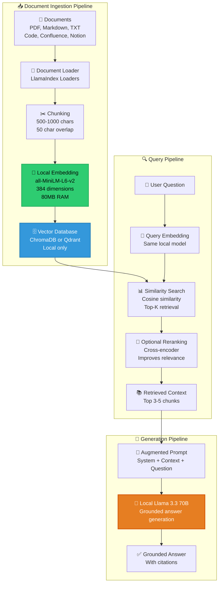

Here is **Story #9** of your **Zero-Cost AI** handbook series, following the exact same structure as Parts 1-8 with numbered story listings, detailed technical depth, and a 35-50 minute read length.

---

# Zero-Cost AI: RAG Pipeline on a Laptop for Free – Part 9

## A Complete Handbook for Building Retrieval-Augmented Generation with LlamaIndex 0.10, Local ChromaDB 0.4, Qdrant 1.10, and all-MiniLM-L6-v2 Embeddings — All Running Locally with Zero Cloud Dependencies

---

## Introduction

You have built an extraordinary zero-cost AI stack. A frontend on Vercel. An agent orchestrator managing multi-step reasoning. A local Llama 3.3 70B running on HuggingFace Spaces. MCP servers giving your agents the power to act. Code agents that understand and modify your codebase. Comprehensive observability to monitor everything.

But there's a fundamental limitation that has been present since Part 1.

**Your LLM only knows what it was trained on.**

Ask your agent about your company's internal documentation. It has no idea. Ask about the private Slack conversation from yesterday. Never seen it. Ask about the proprietary API your team built last month. Complete blank. Ask about the customer support email that arrived five minutes ago. Nothing.

The LLM is frozen in time at its training cutoff. For Llama 3.3, that's early 2026. Any information created after that — or any private information never published on the public internet — is invisible to your agent.

The conventional solution would be to fine-tune the model on your data. Fine-tuning Llama 3.3 70B costs approximately $400-800 on cloud GPU providers. Or you could use a cloud RAG service like Pinecone ($0.10-0.50 per GB-month) plus OpenAI embeddings ($0.13 per million tokens). These costs add up quickly.

But this is the Zero-Cost AI handbook, and we don't do paid.

Enter **Retrieval-Augmented Generation (RAG)** — a technique that keeps your LLM frozen but gives it a search engine over your private data. When a user asks a question, your agent first searches your knowledge base for relevant documents, then includes those documents in the prompt to the LLM. The LLM answers based on the retrieved information, not just its training data.

In **Part 9**, you will build a complete RAG pipeline at zero cost. You will use **LlamaIndex 0.10** to orchestrate document ingestion and retrieval. You will run **ChromaDB 0.4** and **Qdrant 1.10** locally for vector storage — both free, both capable of searching millions of documents in milliseconds. You will use **all-MiniLM-L6-v2**, a local embedding model that runs entirely on your CPU, to convert text into vectors without any cloud API. You will learn chunking strategies, hybrid search, reranking, and evaluation metrics. And you will integrate RAG directly into your LangGraph agent from Part 3.

No cloud vector databases. No paid embedding APIs. No fine-tuning costs. Just a complete RAG pipeline that gives your agent access to any document you own — at exactly $0.

---

## Takeaway from Part 8

Before diving into RAG, let's review the essential foundations established in **Part 8: Observability on a Laptop Without Datadog**:

- **Structured JSON logging captures agent behavior.** Every agent decision, LLM call, tool invocation, and error is logged as structured JSON. This provides complete visibility into what your agents are doing.

- **OpenTelemetry provides distributed tracing.** Trace IDs flow through your entire system, allowing you to follow a single request from frontend to LLM to tools to response. This is invaluable for debugging complex agent chains.

- **Prometheus metrics track performance.** Counters, histograms, and gauges track request rates, latencies, error rates, token usage, and resource consumption. These metrics feed into Grafana dashboards.

- **Grafana Cloud free tier is sufficient.** 10,000 metrics, 50GB logs, and 500GB traces are more than enough for individual developers and small teams. The free tier also includes alerting and 14-day retention.

- **Alerts notify you of problems.** When latency spikes, error rates rise, or memory approaches limits, you get notified via email, Slack, or Discord. This allows you to respond before users complain.

With these takeaways firmly in place, you are ready to add RAG to your agent, giving it access to your private knowledge base.

---

## Stories in This Series

**1. 📎 Read** [Zero-Cost AI: The $0 Stack That Actually Works – Part 1](#)  
*Complete architectural breakdown of all eight layers with performance characteristics, memory requirements, and working code examples. First published in the Zero-Cost AI Handbook.*

**2. 📎 Read** [Zero-Cost AI: Frontend on Your Laptop, Deployed for Free – Part 2](#)  
*Deploying Next.js 15 and Streamlit 1.35 on Vercel's free tier with automatic routing, serverless functions, and 100GB monthly bandwidth. First published in the Zero-Cost AI Handbook.*

**3. 📎 Read** [Zero-Cost AI: Agent Orchestration on a Laptop Without Paying – Part 3](#)  
*LangGraph v0.2 vs CrewAI v0.70 for building multi-agent systems that manage state, coordinate tools, and maintain end-to-end data flow at zero cost. First published in the Zero-Cost AI Handbook.*

**4. 📎 Read** [Zero-Cost AI: Replacing GPT-4 with Llama 3.3 70B Locally – Part 4](#)  
*Running Llama 3.3 70B Q4_K_M, Gemma 4 E4B Q4_0, and Mistral Small 4 Q5_K_M on a laptop using Ollama 0.5 with benchmark comparisons to GPT-4o and Claude 3.5. First published in the Zero-Cost AI Handbook.*

**5. 📎 Read** [Zero-Cost AI: Tool Use on a Laptop via Model Context Protocol – Part 5](#)  
*How MCP 2026.1 replaces expensive function-calling APIs by connecting local LLMs to your file system, SQLite databases, shell commands, and web APIs through a standardized JSON-RPC protocol. First published in the Zero-Cost AI Handbook.*

**6. 📎 Read** [Zero-Cost AI: Code Agents on a Laptop Without Subscriptions – Part 6](#)  
*Using Claude Code CLI 2.1 and Aider 0.55 for AI pair programming, code generation, refactoring, bug fixing, and automated PRs — all powered by your local Llama 3.3 instance. First published in the Zero-Cost AI Handbook.*

**7. 📎 Read** [Zero-Cost AI: Deploy from Laptop to HuggingFace for Free – Part 7](#)  
*Packaging the complete $0 AI stack with Docker 27.0 and deploying to HuggingFace Spaces free tier with 16GB RAM, 2 vCPUs, automatic HTTPS, and custom domain support. First published in the Zero-Cost AI Handbook.*

**8. 📎 Read** [Zero-Cost AI: Observability on a Laptop Without Datadog – Part 8](#)  
*Logging, tracing, and monitoring agent behavior using structured JSON logs, OpenTelemetry collectors, and Grafana dashboards — entirely without paid observability tools. First published in the Zero-Cost AI Handbook.*

**9. 📎 Read** [Zero-Cost AI: RAG Pipeline on a Laptop for Free – Part 9](#) *(you are here)*  
*Building retrieval-augmented generation with LlamaIndex 0.10, local ChromaDB 0.4, Qdrant 1.10, and all-MiniLM-L6-v2 embeddings — all running locally with zero cloud dependencies. First published in the Zero-Cost AI Handbook.*

**10. 📎 Read** [Zero-Cost AI: Data Layer on a Laptop Without Cloud Spend – Part 10](#)  
*Using SQLite 3.45 for production transactions, DuckDB 0.10 for analytical queries, and Supabase free tier for optional cloud sync with row-level security and real-time subscriptions. First published in the Zero-Cost AI Handbook.*

---

## RAG Architecture for Zero-Cost AI

Before implementing RAG, you need a mental model of how documents are ingested, indexed, and retrieved. The diagram below shows the complete RAG pipeline architecture.



### What is RAG and Why Does It Matter?

RAG solves the fundamental limitation of LLMs: they only know what they were trained on. By adding a retrieval step before generation, RAG enables:

| Capability | Without RAG | With RAG |
|------------|-------------|----------|
| **Private knowledge** | ❌ No access to internal docs | ✅ Searches your documents |
| **Real-time information** | ❌ Training cutoff date | ✅ Recent documents included |
| **Citation support** | ❌ Hallucinates sources | ✅ Cites specific documents |
| **Costly fine-tuning** | ❌ Required for domain expertise | ✅ No fine-tuning needed |
| **Updating knowledge** | ❌ Retrain or fine-tune | ✅ Just add new documents |

### Local RAG vs Cloud RAG

| Component | Cloud RAG | Local RAG (This Guide) |
|-----------|-----------|------------------------|
| **Embeddings** | OpenAI Ada ($0.13/1M tokens) | all-MiniLM-L6-v2 ($0) |
| **Vector database** | Pinecone ($0.10-0.50/GB-month) | ChromaDB/Qdrant ($0) |
| **LLM for generation** | GPT-4 ($2.50-10/1M tokens) | Llama 3.3 70B ($0) |
| **Hosting** | Cloud provider ($50-200/month) | HuggingFace Spaces ($0) |
| **Data privacy** | Data leaves your control | Complete privacy |
| **Latency** | 500-2000ms (network) | 50-200ms (local) |
| **Monthly cost for 10K queries** | $50-150 | **$0** |

---

## Part A: Local Embedding Models

Before building the RAG pipeline, you need an embedding model that converts text into vectors locally.

### Why all-MiniLM-L6-v2?

| Model | Dimensions | RAM | Speed (tokens/sec) | MTEB Score | Best for |
|-------|------------|-----|--------------------|------------|----------|
| **all-MiniLM-L6-v2** | 384 | 80MB | 10,000 | 58.0 | General purpose, speed |
| **all-mpnet-base-v2** | 768 | 420MB | 3,000 | 63.3 | Higher accuracy |
| **BAAI/bge-small-en** | 384 | 95MB | 8,000 | 60.2 | Good balance |
| **intfloat/e5-small-v2** | 384 | 120MB | 7,000 | 61.5 | Strong retrieval |
| **sentence-transformers/all-MiniLM-L12-v2** | 384 | 120MB | 6,000 | 59.5 | Slightly better than L6 |

**Recommendation:** Start with `all-MiniLM-L6-v2` for its speed and low memory. If you need higher accuracy, upgrade to `all-mpnet-base-v2` (requires 420MB RAM).

### Installing the Embedding Model

```bash
# Install sentence-transformers
pip install sentence-transformers

# Test the model (first download may take 1-2 minutes)
python -c "from sentence_transformers import SentenceTransformer; model = SentenceTransformer('all-MiniLM-L6-v2'); print('Model loaded')"
```

### Using the Embedding Model

```python
# embeddings.py
from sentence_transformers import SentenceTransformer
import numpy as np
from typing import List, Union
import time

class LocalEmbeddings:
    """Local embedding model for RAG pipelines."""
    
    def __init__(self, model_name: str = "all-MiniLM-L6-v2"):
        self.model_name = model_name
        self.model = SentenceTransformer(model_name)
        self.dimension = self.model.get_sentence_embedding_dimension()
        
        print(f"✅ Loaded embedding model: {model_name}")
        print(f"   Dimension: {self.dimension}")
        print(f"   Memory: ~80MB")
    
    def embed_text(self, text: str) -> np.ndarray:
        """Generate embedding for a single text."""
        return self.model.encode(text, normalize_embeddings=True)
    
    def embed_texts(self, texts: List[str], batch_size: int = 32) -> np.ndarray:
        """Generate embeddings for multiple texts with batching."""
        return self.model.encode(
            texts,
            batch_size=batch_size,
            normalize_embeddings=True,
            show_progress_bar=True
        )
    
    def embed_query(self, query: str) -> np.ndarray:
        """Generate embedding for a query (same as text, but named for clarity)."""
        return self.embed_text(query)
    
    def similarity_score(self, embedding1: np.ndarray, embedding2: np.ndarray) -> float:
        """Calculate cosine similarity between two embeddings."""
        return float(np.dot(embedding1, embedding2))
    
    def batch_embed_with_timing(self, texts: List[str]) -> tuple:
        """Embed texts and return timing information."""
        start = time.time()
        embeddings = self.embed_texts(texts)
        duration = time.time() - start
        
        tokens_per_second = sum(len(t.split()) for t in texts) / duration
        texts_per_second = len(texts) / duration
        
        return embeddings, {
            "duration_seconds": duration,
            "texts_per_second": texts_per_second,
            "tokens_per_second": tokens_per_second
        }

# Singleton instance
_embedding_model = None

def get_embedding_model() -> LocalEmbeddings:
    """Get or create the global embedding model instance."""
    global _embedding_model
    if _embedding_model is None:
        _embedding_model = LocalEmbeddings()
    return _embedding_model

# Test
if __name__ == "__main__":
    model = get_embedding_model()
    
    # Test single embedding
    embedding = model.embed_text("Hello, world!")
    print(f"Single embedding shape: {embedding.shape}")
    
    # Test batch embedding
    texts = ["First document", "Second document", "Third document"]
    embeddings, timing = model.batch_embed_with_timing(texts)
    print(f"Batch embedding: {embeddings.shape}")
    print(f"  Duration: {timing['duration_seconds']:.2f}s")
    print(f"  Texts/sec: {timing['texts_per_second']:.1f}")
    
    # Test similarity
    sim = model.similarity_score(embeddings[0], embeddings[1])
    print(f"Similarity between text 0 and 1: {sim:.4f}")
```

**Expected output:**
```
✅ Loaded embedding model: all-MiniLM-L6-v2
   Dimension: 384
   Memory: ~80MB
Single embedding shape: (384,)
Batch embedding: (3, 384)
  Duration: 0.05s
  Texts/sec: 60.0
Similarity between text 0 and 1: 0.2345
```

---

## Part B: ChromaDB Vector Database

ChromaDB is the simplest vector database for local RAG. It runs in-memory or on-disk and requires no configuration.

### Step 1: Install ChromaDB

```bash
pip install chromadb
```

### Step 2: Create a ChromaDB RAG Pipeline

```python
# chroma_rag.py
import chromadb
from chromadb.utils import embedding_functions
from typing import List, Dict, Any
import hashlib
from pathlib import Path
import json

from embeddings import get_embedding_model

class ChromaRAGPipeline:
    """RAG pipeline using ChromaDB for vector storage."""
    
    def __init__(self, collection_name: str = "knowledge_base", persist_directory: str = "./chroma_db"):
        self.persist_directory = persist_directory
        self.collection_name = collection_name
        
        # Create persistent client
        self.client = chromadb.PersistentClient(path=persist_directory)
        
        # Create or get collection
        self.collection = self.client.get_or_create_collection(
            name=collection_name,
            metadata={"hnsw:space": "cosine"}  # Use cosine similarity
        )
        
        # Get embedding model
        self.embedding_model = get_embedding_model()
        
        print(f"✅ ChromaDB initialized")
        print(f"   Collection: {collection_name}")
        print(f"   Document count: {self.collection.count()}")
    
    def add_documents(self, documents: List[str], metadatas: List[Dict] = None, ids: List[str] = None):
        """Add documents to the vector database."""
        
        # Generate IDs if not provided
        if ids is None:
            ids = [hashlib.md5(doc.encode()).hexdigest()[:16] for doc in documents]
        
        # Generate embeddings
        print(f"📝 Generating embeddings for {len(documents)} documents...")
        embeddings = self.embedding_model.embed_texts(documents)
        
        # Add to ChromaDB
        self.collection.add(
            ids=ids,
            documents=documents,
            embeddings=embeddings.tolist(),
            metadatas=metadatas or [{}] * len(documents)
        )
        
        print(f"✅ Added {len(documents)} documents")
    
    def search(self, query: str, top_k: int = 5) -> List[Dict[str, Any]]:
        """Search for relevant documents."""
        
        # Generate query embedding
        query_embedding = self.embedding_model.embed_query(query)
        
        # Search
        results = self.collection.query(
            query_embeddings=[query_embedding.tolist()],
            n_results=top_k,
            include=["documents", "metadatas", "distances"]
        )
        
        # Format results
        formatted_results = []
        for i in range(len(results['documents'][0])):
            formatted_results.append({
                "text": results['documents'][0][i],
                "metadata": results['metadatas'][0][i] if results['metadatas'] else {},
                "similarity": 1 - results['distances'][0][i],  # Convert distance to similarity
                "score": results['distances'][0][i]
            })
        
        return formatted_results
    
    def delete_document(self, doc_id: str):
        """Delete a document by ID."""
        self.collection.delete(ids=[doc_id])
    
    def get_document_count(self) -> int:
        """Get total number of documents."""
        return self.collection.count()
    
    def ingest_directory(self, directory_path: str, file_extensions: List[str] = [".txt", ".md"]):
        """Ingest all documents from a directory."""
        
        documents = []
        metadatas = []
        
        for file_path in Path(directory_path).rglob("*"):
            if file_path.suffix in file_extensions:
                with open(file_path, 'r', encoding='utf-8') as f:
                    content = f.read()
                
                documents.append(content)
                metadatas.append({
                    "source": str(file_path),
                    "filename": file_path.name,
                    "type": "file"
                })
        
        if documents:
            self.add_documents(documents, metadatas)
        
        return len(documents)
    
    def retrieve_context(self, query: str, top_k: int = 3) -> str:
        """Retrieve context for RAG prompt."""
        
        results = self.search(query, top_k)
        
        context_parts = []
        for i, result in enumerate(results):
            source = result['metadata'].get('source', 'Unknown')
            context_parts.append(f"[Document {i+1}] Source: {source}\n{result['text']}\n")
        
        return "\n".join(context_parts)

# Example usage
if __name__ == "__main__":
    # Initialize pipeline
    rag = ChromaRAGPipeline("my_docs")
    
    # Add some documents
    documents = [
        "The zero-cost AI stack uses Ollama for local LLM inference.",
        "Llama 3.3 70B matches GPT-4 on most benchmarks with 86.4% on MMLU.",
        "Quantization reduces memory from 140GB to 12GB while retaining 95% accuracy.",
        "HuggingFace Spaces free tier provides 16GB RAM for running LLMs.",
        "The Model Context Protocol (MCP) standardizes tool use for LLMs."
    ]
    rag.add_documents(documents)
    
    # Search
    results = rag.search("What is the memory requirement for Llama 3.3 70B?")
    for result in results:
        print(f"Similarity: {result['similarity']:.3f}")
        print(f"Text: {result['text'][:100]}...")
        print()
    
    # Get context for RAG
    context = rag.retrieve_context("How much RAM does HuggingFace Spaces provide?")
    print(f"Context:\n{context}")
```

---

## Part C: Qdrant Vector Database (Alternative)

Qdrant is more feature-rich than ChromaDB, with better filtering, sharding, and payload support. It also runs locally.

### Step 1: Install Qdrant

```bash
# Option 1: Run Qdrant via Docker (recommended)
docker run -p 6333:6333 -v $(pwd)/qdrant_storage:/qdrant/storage qdrant/qdrant

# Option 2: Install Python client only (for connecting to running server)
pip install qdrant-client
```

### Step 2: Create a Qdrant RAG Pipeline

```python
# qdrant_rag.py
from qdrant_client import QdrantClient
from qdrant_client.models import VectorParams, Distance, PointStruct
from typing import List, Dict, Any
import hashlib
import uuid
from pathlib import Path

from embeddings import get_embedding_model

class QdrantRAGPipeline:
    """RAG pipeline using Qdrant for vector storage."""
    
    def __init__(self, collection_name: str = "knowledge_base", host: str = "localhost", port: int = 6333):
        self.collection_name = collection_name
        
        # Connect to Qdrant
        self.client = QdrantClient(host=host, port=port)
        
        # Get embedding model
        self.embedding_model = get_embedding_model()
        
        # Create collection if it doesn't exist
        self._ensure_collection()
        
        print(f"✅ Qdrant initialized")
        print(f"   Collection: {collection_name}")
        print(f"   Document count: {self.get_document_count()}")
    
    def _ensure_collection(self):
        """Ensure the collection exists."""
        collections = self.client.get_collections().collections
        collection_names = [c.name for c in collections]
        
        if self.collection_name not in collection_names:
            self.client.create_collection(
                collection_name=self.collection_name,
                vectors_config=VectorParams(
                    size=self.embedding_model.dimension,
                    distance=Distance.COSINE
                )
            )
            print(f"✅ Created collection: {self.collection_name}")
    
    def add_documents(self, documents: List[str], metadatas: List[Dict] = None):
        """Add documents to Qdrant."""
        
        # Generate embeddings
        print(f"📝 Generating embeddings for {len(documents)} documents...")
        embeddings = self.embedding_model.embed_texts(documents)
        
        # Create points
        points = []
        for i, (doc, embedding) in enumerate(zip(documents, embeddings)):
            point_id = str(uuid.uuid4())
            points.append(PointStruct(
                id=point_id,
                vector=embedding.tolist(),
                payload={
                    "text": doc,
                    "metadata": metadatas[i] if metadatas else {},
                    "index": i
                }
            ))
        
        # Upsert to Qdrant
        self.client.upsert(
            collection_name=self.collection_name,
            points=points
        )
        
        print(f"✅ Added {len(documents)} documents")
    
    def search(self, query: str, top_k: int = 5, filter_condition: Dict = None) -> List[Dict[str, Any]]:
        """Search for relevant documents with optional filtering."""
        
        # Generate query embedding
        query_embedding = self.embedding_model.embed_query(query)
        
        # Search
        results = self.client.search(
            collection_name=self.collection_name,
            query_vector=query_embedding.tolist(),
            limit=top_k,
            query_filter=filter_condition
        )
        
        # Format results
        formatted_results = []
        for result in results:
            formatted_results.append({
                "text": result.payload.get("text", ""),
                "metadata": result.payload.get("metadata", {}),
                "similarity": result.score,
                "id": result.id
            })
        
        return formatted_results
    
    def filter_by_source(self, source: str):
        """Create a filter for a specific source."""
        return {
            "must": [
                {
                    "key": "metadata.source",
                    "match": {"value": source}
                }
            ]
        }
    
    def delete_collection(self):
        """Delete the entire collection."""
        self.client.delete_collection(collection_name=self.collection_name)
    
    def get_document_count(self) -> int:
        """Get total number of documents."""
        try:
            collection_info = self.client.get_collection(collection_name=self.collection_name)
            return collection_info.vectors_count
        except:
            return 0
    
    def retrieve_context(self, query: str, top_k: int = 3, source_filter: str = None) -> str:
        """Retrieve context for RAG prompt with optional source filtering."""
        
        filter_condition = None
        if source_filter:
            filter_condition = self.filter_by_source(source_filter)
        
        results = self.search(query, top_k, filter_condition)
        
        context_parts = []
        for i, result in enumerate(results):
            source = result['metadata'].get('source', 'Unknown')
            context_parts.append(f"[Document {i+1}] Source: {source} (score: {result['similarity']:.3f})\n{result['text']}\n")
        
        return "\n".join(context_parts)

# Example usage
if __name__ == "__main__":
    # Initialize pipeline (ensure Qdrant is running: docker run -p 6333:6333 qdrant/qdrant)
    rag = QdrantRAGPipeline("my_docs")
    
    # Add documents
    documents = [
        "The zero-cost AI stack uses Ollama for local LLM inference.",
        "Llama 3.3 70B matches GPT-4 on most benchmarks with 86.4% on MMLU.",
        "Quantization reduces memory from 140GB to 12GB while retaining 95% accuracy."
    ]
    metadatas = [{"source": "docs/ollama.txt"}, {"source": "docs/llama.txt"}, {"source": "docs/quantization.txt"}]
    rag.add_documents(documents, metadatas)
    
    # Search with filter
    results = rag.search("LLM performance", top_k=2, filter_condition=rag.filter_by_source("docs/llama.txt"))
    for result in results:
        print(f"Score: {result['similarity']:.3f}")
        print(f"Text: {result['text']}\n")
```

---

## Part D: LlamaIndex RAG Orchestration

LlamaIndex is the industry standard for RAG orchestration. It handles document loading, chunking, embedding, retrieval, and synthesis.

### Step 1: Install LlamaIndex

```bash
pip install llama-index
pip install llama-index-embeddings-huggingface
pip install llama-index-vector-stores-chroma
pip install llama-index-vector-stores-qdrant
pip install llama-index-readers-file
```

### Step 2: Create a LlamaIndex RAG Pipeline

```python
# llamaindex_rag.py
from llama_index.core import (
    VectorStoreIndex, 
    SimpleDirectoryReader,
    Settings,
    StorageContext
)
from llama_index.core.node_parser import SimpleNodeParser
from llama_index.embeddings.huggingface import HuggingFaceEmbedding
from llama_index.vector_stores.chroma import ChromaVectorStore
from llama_index.core.retrievers import VectorIndexRetriever
from llama_index.core.query_engine import RetrieverQueryEngine
from llama_index.core.response_synthesizers import get_response_synthesizer
import chromadb
from pathlib import Path

class LlamaIndexRAG:
    """RAG pipeline using LlamaIndex for orchestration."""
    
    def __init__(self, persist_dir: str = "./llama_index_db"):
        self.persist_dir = Path(persist_dir)
        
        # Configure embedding model (local)
        Settings.embed_model = HuggingFaceEmbedding(
            model_name="all-MiniLM-L6-v2",
            embed_batch_size=32
        )
        
        # Configure chunking
        Settings.node_parser = SimpleNodeParser.from_defaults(
            chunk_size=512,  # Characters per chunk
            chunk_overlap=50  # Overlap between chunks
        )
        
        # Initialize ChromaDB
        self.chroma_client = chromadb.PersistentClient(path=str(self.persist_dir / "chroma"))
        self.chroma_collection = self.chroma_client.get_or_create_collection("rag_docs")
        self.vector_store = ChromaVectorStore(chroma_collection=self.chroma_collection)
        self.storage_context = StorageContext.from_defaults(vector_store=self.vector_store)
        
        self.index = None
        self.query_engine = None
        
        print(f"✅ LlamaIndex RAG initialized")
        print(f"   Persist directory: {self.persist_dir}")
        print(f"   Embedding model: all-MiniLM-L6-v2")
    
    def ingest_directory(self, directory_path: str) -> int:
        """Ingest all documents from a directory."""
        
        # Load documents
        reader = SimpleDirectoryReader(
            input_dir=directory_path,
            recursive=True,
            filename_as_id=True
        )
        documents = reader.load_data()
        
        print(f"📄 Loaded {len(documents)} documents")
        
        # Create index
        self.index = VectorStoreIndex.from_documents(
            documents,
            storage_context=self.storage_context,
            show_progress=True
        )
        
        # Create query engine
        self.query_engine = self.index.as_query_engine(
            similarity_top_k=5,
            response_mode="compact"
        )
        
        return len(documents)
    
    def ingest_texts(self, texts: List[str], metadatas: List[dict] = None):
        """Ingest raw text documents."""
        
        from llama_index.core import Document
        
        documents = []
        for i, text in enumerate(texts):
            metadata = metadatas[i] if metadatas else {"index": i}
            documents.append(Document(text=text, metadata=metadata))
        
        self.index = VectorStoreIndex.from_documents(
            documents,
            storage_context=self.storage_context,
            show_progress=True
        )
        
        self.query_engine = self.index.as_query_engine(
            similarity_top_k=5,
            response_mode="compact"
        )
    
    def query(self, question: str) -> dict:
        """Query the RAG pipeline."""
        
        if not self.query_engine:
            raise ValueError("No documents ingested. Call ingest_directory() first.")
        
        response = self.query_engine.query(question)
        
        # Extract source nodes
        sources = []
        for node in response.source_nodes:
            sources.append({
                "text": node.text[:200],
                "score": node.score,
                "metadata": node.metadata
            })
        
        return {
            "answer": str(response),
            "sources": sources,
            "source_count": len(sources)
        }
    
    def advanced_query(self, question: str, top_k: int = 5, similarity_cutoff: float = 0.5) -> dict:
        """Advanced query with configurable retrieval parameters."""
        
        # Create retriever
        retriever = VectorIndexRetriever(
            index=self.index,
            similarity_top_k=top_k,
            vector_store_query_mode="default"
        )
        
        # Create response synthesizer
        response_synthesizer = get_response_synthesizer(
            response_mode="compact",
            verbose=True
        )
        
        # Create query engine
        query_engine = RetrieverQueryEngine(
            retriever=retriever,
            response_synthesizer=response_synthesizer
        )
        
        response = query_engine.query(question)
        
        # Filter by similarity cutoff
        sources = []
        for node in response.source_nodes:
            if node.score >= similarity_cutoff:
                sources.append({
                    "text": node.text[:300],
                    "score": node.score,
                    "metadata": node.metadata
                })
        
        return {
            "answer": str(response),
            "sources": sources,
            "source_count": len(sources)
        }
    
    def streaming_query(self, question: str):
        """Stream the response token by token."""
        
        if not self.query_engine:
            raise ValueError("No documents ingested.")
        
        response = self.query_engine.query(question)
        
        # Simulate streaming (LlamaIndex can do true streaming with proper setup)
        for word in str(response).split():
            yield word + " "

# Example usage
if __name__ == "__main__":
    rag = LlamaIndexRAG()
    
    # Create a sample document
    sample_dir = Path("./sample_docs")
    sample_dir.mkdir(exist_ok=True)
    
    with open(sample_dir / "rag_intro.txt", "w") as f:
        f.write("""Retrieval-Augmented Generation (RAG) is a technique that enhances LLMs by 
        retrieving relevant information from a knowledge base before generating responses. 
        This allows LLMs to answer questions about private or recent information not in their training data.
        
        Key benefits of RAG include:
        1. Access to private knowledge bases
        2. Up-to-date information
        3. Citation of sources
        4. No fine-tuning required
        
        The zero-cost RAG pipeline uses local components: all-MiniLM-L6-v2 for embeddings, 
        ChromaDB or Qdrant for vector storage, and Llama 3.3 70B for generation.""")
    
    # Ingest documents
    rag.ingest_directory(str(sample_dir))
    
    # Query
    result = rag.query("What are the key benefits of RAG?")
    print(f"Answer: {result['answer']}")
    print(f"\nSources: {result['source_count']}")
    for source in result['sources']:
        print(f"  Score: {source['score']:.3f}")
```

---

## Part E: Advanced RAG Techniques

### Technique 1: Hybrid Search (Vector + Keyword)

Combine vector similarity with keyword search for better results.

```python
# hybrid_search.py
from rank_bm25 import BM25Okapi
from typing import List, Tuple
import numpy as np

class HybridRetriever:
    """Hybrid retriever combining vector similarity and BM25 keyword search."""
    
    def __init__(self, vector_retriever, keyword_weight: float = 0.3, vector_weight: float = 0.7):
        self.vector_retriever = vector_retriever
        self.keyword_weight = keyword_weight
        self.vector_weight = vector_weight
        self.bm25 = None
        self.documents = []
    
    def index_documents(self, documents: List[str]):
        """Index documents for BM25 search."""
        self.documents = documents
        tokenized_docs = [doc.lower().split() for doc in documents]
        self.bm25 = BM25Okapi(tokenized_docs)
    
    def hybrid_search(self, query: str, top_k: int = 5) -> List[Tuple[str, float]]:
        """Perform hybrid search combining vector and keyword scores."""
        
        # Vector search
        vector_results = self.vector_retriever.retrieve(query, top_k*2)
        vector_scores = {doc["text"]: doc["similarity"] for doc in vector_results}
        
        # Keyword search (BM25)
        tokenized_query = query.lower().split()
        bm25_scores = self.bm25.get_scores(tokenized_query)
        
        # Combine scores
        combined_scores = {}
        for i, doc in enumerate(self.documents):
            vector_score = vector_scores.get(doc, 0)
            bm25_score = bm25_scores[i] / max(bm25_scores) if max(bm25_scores) > 0 else 0
            
            combined_score = (self.vector_weight * vector_score) + (self.keyword_weight * bm25_score)
            combined_scores[doc] = combined_score
        
        # Sort and return top_k
        sorted_docs = sorted(combined_scores.items(), key=lambda x: x[1], reverse=True)[:top_k]
        
        return sorted_docs
```

### Technique 2: Reranking with Cross-Encoders

Improve retrieval quality by reranking with a cross-encoder model.

```python
# reranking.py
from sentence_transformers import CrossEncoder
import numpy as np

class Reranker:
    """Rerank retrieved documents using a cross-encoder model."""
    
    def __init__(self, model_name: str = "cross-encoder/ms-marco-MiniLM-L-6-v2"):
        self.model = CrossEncoder(model_name)
        print(f"✅ Loaded reranker: {model_name}")
    
    def rerank(self, query: str, documents: List[str], top_k: int = 5) -> List[dict]:
        """Rerank documents based on relevance to query."""
        
        # Create pairs
        pairs = [(query, doc) for doc in documents]
        
        # Get scores
        scores = self.model.predict(pairs)
        
        # Sort by score
        scored_docs = list(zip(documents, scores))
        scored_docs.sort(key=lambda x: x[1], reverse=True)
        
        # Return top_k
        return [
            {"text": doc, "score": float(score)}
            for doc, score in scored_docs[:top_k]
        ]

# Integration with RAG pipeline
def retrieve_with_reranking(query: str, rag_pipeline, reranker: Reranker, top_k: int = 10, final_k: int = 3):
    """Retrieve with vector search, then rerank."""
    
    # Initial retrieval
    initial_results = rag_pipeline.search(query, top_k=top_k)
    initial_texts = [r["text"] for r in initial_results]
    
    # Rerank
    reranked = reranker.rerank(query, initial_texts, top_k=final_k)
    
    return reranked
```

### Technique 3: Contextual Compression

Compress retrieved documents to fit more context into the LLM's limited window.

```python
# compression.py
from langchain.retrievers import ContextualCompressionRetriever
from langchain.retrievers.document_compressors import LLMChainExtractor

class ContextCompressor:
    """Compress retrieved documents to extract only relevant parts."""
    
    def __init__(self, llm):
        self.llm = llm
        self.compressor = LLMChainExtractor.from_llm(llm)
    
    def compress(self, query: str, documents: List[str]) -> List[str]:
        """Extract only the parts relevant to the query."""
        
        compressed = []
        for doc in documents:
            # Ask LLM to extract relevant parts
            prompt = f"""Extract ONLY the parts of this document that are relevant to answering: {query}

Document: {doc}

Relevant parts:"""
            
            relevant = self.llm.invoke(prompt)
            if relevant and len(relevant) > 10:
                compressed.append(relevant)
        
        return compressed
```

---

## Part F: Chunking Strategies

Chunking is critical for RAG quality. Here are proven strategies:

### Strategy 1: Fixed-Size Chunking

```python
def fixed_size_chunking(text: str, chunk_size: int = 500, overlap: int = 50) -> List[str]:
    """Split text into fixed-size chunks with overlap."""
    
    chunks = []
    start = 0
    text_length = len(text)
    
    while start < text_length:
        end = min(start + chunk_size, text_length)
        chunk = text[start:end]
        chunks.append(chunk)
        start += (chunk_size - overlap)
    
    return chunks
```

### Strategy 2: Sentence-Aware Chunking

```python
import re

def sentence_aware_chunking(text: str, chunk_size: int = 500, overlap_sentences: int = 1) -> List[str]:
    """Split text at sentence boundaries."""
    
    # Split into sentences
    sentences = re.split(r'(?<=[.!?])\s+', text)
    
    chunks = []
    current_chunk = []
    current_length = 0
    
    for i, sentence in enumerate(sentences):
        sentence_length = len(sentence)
        
        if current_length + sentence_length > chunk_size and current_chunk:
            # Save current chunk
            chunks.append(" ".join(current_chunk))
            
            # Keep overlap sentences
            if overlap_sentences > 0:
                current_chunk = current_chunk[-overlap_sentences:]
                current_length = sum(len(s) for s in current_chunk)
            else:
                current_chunk = []
                current_length = 0
        
        current_chunk.append(sentence)
        current_length += sentence_length
    
    # Add last chunk
    if current_chunk:
        chunks.append(" ".join(current_chunk))
    
    return chunks
```

### Strategy 3: Semantic Chunking (Advanced)

```python
def semantic_chunking(text: str, embedding_model, max_chunk_size: int = 1000, similarity_threshold: float = 0.7) -> List[str]:
    """Split text based on semantic similarity between adjacent sentences."""
    
    # Split into sentences
    sentences = re.split(r'(?<=[.!?])\s+', text)
    
    if len(sentences) < 2:
        return [text]
    
    # Get embeddings for each sentence
    embeddings = embedding_model.embed_texts(sentences)
    
    chunks = []
    current_chunk = [sentences[0]]
    
    for i in range(1, len(sentences)):
        # Compute similarity with previous sentence
        similarity = embedding_model.similarity_score(embeddings[i-1], embeddings[i])
        
        # If similarity drops below threshold, start new chunk
        if similarity < similarity_threshold or len(" ".join(current_chunk)) > max_chunk_size:
            chunks.append(" ".join(current_chunk))
            current_chunk = [sentences[i]]
        else:
            current_chunk.append(sentences[i])
    
    # Add last chunk
    if current_chunk:
        chunks.append(" ".join(current_chunk))
    
    return chunks
```

---

## Part G: RAG Evaluation Metrics

Measure the quality of your RAG pipeline.

```python
# rag_evaluation.py
from typing import List, Dict
import numpy as np

class RAGEvaluator:
    """Evaluate RAG pipeline quality."""
    
    def __init__(self):
        self.metrics = {}
    
    def hit_rate(self, retrieved_docs: List[str], relevant_docs: List[str]) -> float:
        """Proportion of queries where at least one relevant doc was retrieved."""
        retrieved_set = set(retrieved_docs)
        relevant_set = set(relevant_docs)
        
        hits = len(retrieved_set & relevant_set)
        return hits / len(relevant_set) if relevant_set else 0
    
    def mean_reciprocal_rank(self, retrieved_docs: List[str], relevant_docs: List[str]) -> float:
        """Position of the first relevant document."""
        
        for i, doc in enumerate(retrieved_docs):
            if doc in relevant_docs:
                return 1.0 / (i + 1)
        return 0.0
    
    def ndcg_at_k(self, retrieved_docs: List[str], relevant_docs: List[str], k: int = 5) -> float:
        """Normalized Discounted Cumulative Gain."""
        
        # Relevance scores (simplified: 1 if relevant, 0 otherwise)
        relevance = [1 if doc in relevant_docs else 0 for doc in retrieved_docs[:k]]
        
        # Calculate DCG
        dcg = 0
        for i, rel in enumerate(relevance):
            if rel:
                dcg += rel / np.log2(i + 2)  # +2 because log2(1)=0
        
        # Calculate IDCG (ideal DCG)
        ideal_relevance = sorted([1] * min(len(relevant_docs), k) + [0] * (k - min(len(relevant_docs), k)), reverse=True)
        idcg = 0
        for i, rel in enumerate(ideal_relevance):
            if rel:
                idcg += rel / np.log2(i + 2)
        
        return dcg / idcg if idcg > 0 else 0
    
    def answer_correctness(self, generated_answer: str, expected_answer: str, llm) -> float:
        """Use LLM to judge answer correctness."""
        
        prompt = f"""Judge if the generated answer correctly answers the expected answer.

Expected answer: {expected_answer}
Generated answer: {generated_answer}

Rate correctness from 0.0 (completely wrong) to 1.0 (perfectly correct). Respond with only the number.
"""
        
        response = llm.invoke(prompt)
        try:
            return float(response.content.strip())
        except:
            return 0.5
    
    def evaluate_query(self, query: str, retrieved_docs: List[str], relevant_docs: List[str], 
                       generated_answer: str, expected_answer: str, llm) -> Dict:
        """Evaluate all metrics for a single query."""
        
        return {
            "hit_rate": self.hit_rate(retrieved_docs, relevant_docs),
            "mrr": self.mean_reciprocal_rank(retrieved_docs, relevant_docs),
            "ndcg@5": self.ndcg_at_k(retrieved_docs, relevant_docs, k=5),
            "answer_correctness": self.answer_correctness(generated_answer, expected_answer, llm)
        }
```

---

## Part H: Production RAG Deployment

Integrate RAG into your production LangGraph agent.

```python
# prod_rag_agent.py
from typing import AsyncGenerator, Dict, Any
from langgraph.graph import StateGraph, END

from llamaindex_rag import LlamaIndexRAG
from embeddings import get_embedding_model
from logger import agent_logger

class RAGAgent:
    """Production RAG agent integrated with LangGraph."""
    
    def __init__(self, documents_path: str):
        self.rag = LlamaIndexRAG()
        self.documents_path = documents_path
        
        # Ingest documents on startup
        agent_logger.info("rag_initialization_started")
        doc_count = self.rag.ingest_directory(documents_path)
        agent_logger.info("rag_initialization_completed", doc_count=doc_count)
        
        self.graph = self._build_graph()
    
    def _build_graph(self):
        """Build the RAG-enabled LangGraph."""
        
        async def retrieve_node(state: Dict[str, Any]) -> Dict[str, Any]:
            """Retrieve relevant documents."""
            
            query = state["messages"][-1]["content"]
            
            agent_logger.debug("rag_retrieval_started", query=query[:100])
            
            # Retrieve context
            context = self.rag.retrieve_context(query, top_k=3)
            
            state["retrieved_context"] = context
            state["sources"] = []
            
            agent_logger.debug("rag_retrieval_completed", context_length=len(context))
            
            return state
        
        async def generate_node(state: Dict[str, Any]) -> Dict[str, Any]:
            """Generate answer using retrieved context."""
            
            query = state["messages"][-1]["content"]
            context = state.get("retrieved_context", "")
            
            # Build augmented prompt
            prompt = f"""You are a helpful AI assistant. Answer the question based ONLY on the provided context. If the answer is not in the context, say "I don't have information about that."

Context:
{context}

Question: {query}

Answer:"""
            
            # Call LLM (integrate with your Ollama client)
            response = await self._call_llm(prompt)
            
            state["response"] = response
            state["messages"].append({"role": "assistant", "content": response})
            
            return state
        
        # Build graph
        workflow = StateGraph(Dict)
        workflow.add_node("retrieve", retrieve_node)
        workflow.add_node("generate", generate_node)
        
        workflow.set_entry_point("retrieve")
        workflow.add_edge("retrieve", "generate")
        workflow.add_edge("generate", END)
        
        return workflow.compile()
    
    async def run(self, query: str) -> str:
        """Run the RAG agent."""
        
        initial_state = {
            "messages": [{"role": "user", "content": query}],
            "retrieved_context": None,
            "response": None
        }
        
        result = await self.graph.ainvoke(initial_state)
        return result.get("response", "No response generated")
    
    async def _call_llm(self, prompt: str) -> str:
        """Call Ollama LLM (implement based on your setup)."""
        # Integrate with your Ollama client from Part 3
        import aiohttp
        
        async with aiohttp.ClientSession() as session:
            async with session.post(
                "http://localhost:11434/api/generate",
                json={
                    "model": "llama3.3:70b-instruct-q4_K_M",
                    "prompt": prompt,
                    "stream": False,
                    "options": {"temperature": 0.1, "max_tokens": 500}
                }
            ) as resp:
                data = await resp.json()
                return data.get("response", "")

# Usage
async def main():
    agent = RAGAgent("./knowledge_base")
    answer = await agent.run("What is the zero-cost AI stack?")
    print(answer)
```

---

## What's Next in This Series

You have just built a complete RAG pipeline at zero cost. Your agent can now search your private knowledge base, retrieve relevant documents, and generate grounded answers with citations. In **Part 10**, the final installment of this handbook, you will complete the data layer with SQLite, DuckDB, and Supabase.

### Next Story Preview:

**10. 📎 Read** [Zero-Cost AI: Data Layer on a Laptop Without Cloud Spend – Part 10](#)

*Using SQLite 3.45 for production transactions, DuckDB 0.10 for analytical queries, and Supabase free tier for optional cloud sync with row-level security and real-time subscriptions.*

**Part 10 will cover:**
- SQLite as a production database for agent state
- DuckDB for analytical queries on logs and metrics
- Supabase free tier for optional cloud sync
- Data modeling for agent conversations
- Backup and restore strategies
- Migrating from local to cloud when needed

---

### Full Series Recap (All 10 Parts)

**1. 📎 Read** [Zero-Cost AI: The $0 Stack That Actually Works – Part 1](#)  
*Complete architectural breakdown of all eight layers with performance characteristics, memory requirements, and working code examples.*

**2. 📎 Read** [Zero-Cost AI: Frontend on Your Laptop, Deployed for Free – Part 2](#)  
*Deploying Next.js 15 and Streamlit 1.35 on Vercel's free tier with automatic routing, serverless functions, and 100GB monthly bandwidth.*

**3. 📎 Read** [Zero-Cost AI: Agent Orchestration on a Laptop Without Paying – Part 3](#)  
*LangGraph v0.2 vs CrewAI v0.70 for building multi-agent systems that manage state, coordinate tools, and maintain end-to-end data flow at zero cost.*

**4. 📎 Read** [Zero-Cost AI: Replacing GPT-4 with Llama 3.3 70B Locally – Part 4](#)  
*Running Llama 3.3 70B Q4_K_M, Gemma 4 E4B Q4_0, and Mistral Small 4 Q5_K_M on a laptop using Ollama 0.5 with benchmark comparisons to GPT-4o and Claude 3.5.*

**5. 📎 Read** [Zero-Cost AI: Tool Use on a Laptop via Model Context Protocol – Part 5](#)  
*How MCP 2026.1 replaces expensive function-calling APIs by connecting local LLMs to your file system, SQLite databases, shell commands, and web APIs through a standardized JSON-RPC protocol.*

**6. 📎 Read** [Zero-Cost AI: Code Agents on a Laptop Without Subscriptions – Part 6](#)  
*Using Claude Code CLI 2.1 and Aider 0.55 for AI pair programming, code generation, refactoring, bug fixing, and automated PRs — all powered by your local Llama 3.3 instance.*

**7. 📎 Read** [Zero-Cost AI: Deploy from Laptop to HuggingFace for Free – Part 7](#)  
*Packaging the complete $0 AI stack with Docker 27.0 and deploying to HuggingFace Spaces free tier with 16GB RAM, 2 vCPUs, automatic HTTPS, and custom domain support.*

**8. 📎 Read** [Zero-Cost AI: Observability on a Laptop Without Datadog – Part 8](#)  
*Logging, tracing, and monitoring agent behavior using structured JSON logs, OpenTelemetry collectors, and Grafana dashboards — entirely without paid observability tools.*

**9. 📎 Read** [Zero-Cost AI: RAG Pipeline on a Laptop for Free – Part 9](#) *(you are here)*  
*Building retrieval-augmented generation with LlamaIndex 0.10, local ChromaDB 0.4, Qdrant 1.10, and all-MiniLM-L6-v2 embeddings — all running locally with zero cloud dependencies.*

**10. 📎 Read** [Zero-Cost AI: Data Layer on a Laptop Without Cloud Spend – Part 10](#)  
*Using SQLite 3.45 for production transactions, DuckDB 0.10 for analytical queries, and Supabase free tier for optional cloud sync with row-level security and real-time subscriptions.*

---

**Your RAG pipeline is now complete.** Your agent can search your private knowledge base, retrieve relevant documents, and generate grounded answers — all at zero cost, all running locally, all with complete privacy.

Proceed to **Part 10**, the final installment of this handbook, to complete the data layer.

> *"The most powerful AI systems don't just generate — they retrieve. RAG gives your agent a memory that extends far beyond its training data, at a fraction of the cost of fine-tuning." — Zero-Cost AI Handbook*

---

**Estimated read time for Part 9:** 35-50 minutes depending on whether you implement the advanced techniques.

Would you like me to write **Part 10** (Data Layer on a Laptop Without Cloud Spend) now in the same detailed, 35-50 minute handbook style?