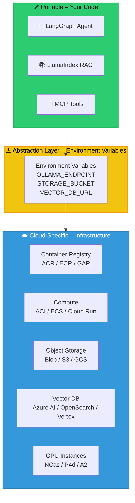

Understood. Here is the new **Story #11** – a strategic 10-minute overview of cloud portability – with **no "Part" suffix** and with the three bonus deployment stories referenced as separate, detailed follow-ups.

---

# Zero-Cost AI: Scaling AI Deployments to Azure, AWS & GCP Without Rewrites

## A Strategic Handbook for Understanding Cloud Portability, Deployment Abstraction, and When to Move Beyond Free Tiers — Without Lock-In or Rewrites

---

## Introduction

You have built a complete zero-cost AI stack that runs on your laptop and deploys to HuggingFace Spaces for free. It works beautifully. Users love it. Your costs are $0.

But then something happens.

Your application goes viral. Traffic doubles every week. The free tier of HuggingFace Spaces – 16GB RAM, 2 vCPUs – starts to feel tight. Response latency creeps up. You need GPUs for faster inference. You need more storage. You need enterprise security, compliance, and dedicated support.

It's time to move to a cloud provider – Azure, AWS, or GCP.

The conventional approach would be to rewrite your entire application using cloud-specific SDKs, proprietary APIs, and managed services. This locks you in, takes months, and costs a fortune.

But this is the Zero-Cost AI handbook, and we don't do lock-in.

In this strategic overview, you will understand exactly what is portable and what is not. You will learn a cloud-agnostic architecture that lets you deploy to Azure, AWS, or GCP without rewriting your core AI logic. You will see a layer-by-layer portability analysis. And you will get a roadmap to three detailed bonus stories that walk through each cloud provider step by step.

No lock-in. No rewrites. Just strategic abstraction that keeps your options open.

---

## Takeaway from Previous Story

This story builds directly on **Zero-Cost AI: Deploy from Laptop to HuggingFace for Free**. That story showed you how to containerize your entire stack with Docker and deploy to HuggingFace Spaces free tier (16GB RAM, 2 vCPUs, automatic HTTPS).

The key takeaways from that deployment:

- **Docker containers make your stack portable.** The same `Dockerfile` that deployed to HuggingFace can deploy to any cloud container service (Azure Container Instances, AWS ECS, GCP Cloud Run).

- **Environment variables separate configuration from code.** Your application reads `OLLAMA_ENDPOINT`, `LLM_MODEL`, and other settings from environment variables, not hardcoded values.

- **Persistent storage requires planning.** HuggingFace provides persistent volumes. Cloud providers offer block storage (Azure Disks, AWS EBS, GCP Persistent Disk) and object storage (Azure Blob, AWS S3, GCS).

- **The free tier has limits.** 16GB RAM and 2 vCPUs are generous but not infinite. When you exceed them, you need cloud scale.

With these takeaways in place, you are ready to understand cloud portability and plan your migration strategy.

---

## Stories in This Series (Updated)

**1. 📎 Read** [Zero-Cost AI: The $0 Stack That Actually Works](#)  
*Complete architectural breakdown of all eight layers with performance characteristics, memory requirements, and working code examples.*

**2. 📎 Read** [Zero-Cost AI: Frontend on Your Laptop, Deployed for Free](#)  
*Deploying Next.js 15 and Streamlit 1.35 on Vercel's free tier with automatic routing, serverless functions, and 100GB monthly bandwidth.*

**3. 📎 Read** [Zero-Cost AI: Agent Orchestration on a Laptop Without Paying](#)  
*LangGraph v0.2 vs CrewAI v0.70 for building multi-agent systems that manage state, coordinate tools, and maintain end-to-end data flow at zero cost.*

**4. 📎 Read** [Zero-Cost AI: Replacing GPT-4 with Llama 3.3 70B Locally](#)  
*Running Llama 3.3 70B Q4_K_M, Gemma 4 E4B Q4_0, and Mistral Small 4 Q5_K_M on a laptop using Ollama 0.5 with benchmark comparisons to GPT-4o and Claude 3.5.*

**5. 📎 Read** [Zero-Cost AI: Tool Use on a Laptop via Model Context Protocol](#)  
*How MCP 2026.1 replaces expensive function-calling APIs by connecting local LLMs to your file system, SQLite databases, shell commands, and web APIs through a standardized JSON-RPC protocol.*

**6. 📎 Read** [Zero-Cost AI: Code Agents on a Laptop Without Subscriptions](#)  
*Using Claude Code CLI 2.1 and Aider 0.55 for AI pair programming, code generation, refactoring, bug fixing, and automated PRs — all powered by your local Llama 3.3 instance.*

**7. 📎 Read** [Zero-Cost AI: Deploy from Laptop to HuggingFace for Free](#)  
*Packaging the complete $0 AI stack with Docker 27.0 and deploying to HuggingFace Spaces free tier with 16GB RAM, 2 vCPUs, automatic HTTPS, and custom domain support.*

**8. 📎 Read** [Zero-Cost AI: Observability on a Laptop Without Datadog](#)  
*Logging, tracing, and monitoring agent behavior using structured JSON logs, OpenTelemetry collectors, and Grafana dashboards — entirely without paid observability tools.*

**9. 📎 Read** [Zero-Cost AI: RAG Pipeline on a Laptop for Free](#)  
*Building retrieval-augmented generation with LlamaIndex 0.10, local ChromaDB 0.4, Qdrant 1.10, and all-MiniLM-L6-v2 embeddings — all running locally with zero cloud dependencies.*

**10. 📎 Read** [Zero-Cost AI: Data Layer on a Laptop Without Cloud Spend](#)  
*Using SQLite 3.45 for production transactions, DuckDB 0.10 for analytical queries, and Supabase free tier for optional cloud sync with row-level security and real-time subscriptions.*

**11. 📎 Read** [Zero-Cost AI: Scaling AI Deployments to Azure, AWS & GCP Without Rewrites](#) *(you are here)*  
*A strategic overview of cloud portability, layer-by-layer analysis, and a roadmap to detailed cloud provider deployments.*

📎 **Read** [Zero-Cost AI: Deploy from Laptop to Azure (Bonus)](#)  
*Step-by-step deployment to Azure Container Instances, Azure Blob Storage, and Azure OpenAI (optional) — keeping your core Llama 3.3 stack portable.*

📎 **Read** [Zero-Cost AI: Deploy from Laptop to AWS (Bonus)](#)  
*Step-by-step deployment to AWS ECS, S3 for model storage, and EC2 with GPU for high-performance inference.*

📎 **Read** [Zero-Cost AI: Deploy from Laptop to GCP (Bonus)](#)  
*Step-by-step deployment to Google Cloud Run, Cloud Storage, and GKE for Kubernetes-based scaling.*

---

## Cloud Portability: A Reality Check

Before you start migrating, understand what is portable and what is not.

| Layer | Portable? | Notes |
|-------|-----------|-------|
| **Core Python code (RAG logic)** | ✅ Yes | If no cloud-specific SDKs hardcoded |
| **LLM inference (local / Ollama)** | ✅ Yes | Standard HTTP API works anywhere |
| **Agent orchestration (LangGraph)** | ✅ Yes | Pure Python, no cloud dependencies |
| **MCP tool servers** | ✅ Yes | Local filesystem tools need adaptation |
| **Vector DB (ChromaDB local)** | ⚠️ Depends | Managed vs self-hosted (Qdrant Cloud, Pinecone) |
| **Object storage** | ⚠️ Minor changes | S3 vs Blob vs GCS – SDK differences |
| **Block storage (persistent volumes)** | ⚠️ Minor changes | EBS vs Disk vs Persistent Disk |
| **Auth / IAM** | ❌ No | Cloud-specific – Azure AD vs IAM vs IAM |
| **Deployment infrastructure** | ⚠️ Needs abstraction | Terraform, Pulumi, or Helm helps |
| **Secrets management** | ❌ No | Key Vault vs Secrets Manager vs Secret Manager |
| **Monitoring / logs** | ❌ No | Azure Monitor vs CloudWatch vs Operations Suite |

### The Portable Core

Your **business logic** – the RAG pipeline, agent decisions, prompt engineering, tool definitions – is 100% portable. This is the code you wrote in Parts 3, 5, 6, and 9. It runs unchanged on any cloud.

```python
# This code runs anywhere – laptop, HuggingFace, Azure, AWS, GCP
from langgraph.graph import StateGraph
from langchain_ollama import ChatOllama
import os

llm = ChatOllama(
    model=os.environ.get("LLM_MODEL", "llama3.3:70b-instruct-q4_K_M"),
    base_url=os.environ.get("OLLAMA_ENDPOINT", "http://localhost:11434")
)
```

### The Non-Portable Wrapper

What changes is the **infrastructure wrapper** – how you deploy, scale, secure, and monitor the application. This is where cloud providers differentiate themselves.

| Cloud Provider | Container Service | Object Storage | GPU Options | Managed Vector DB |
|----------------|-------------------|----------------|-------------|-------------------|
| **Azure** | Container Instances / AKS | Blob Storage | NCasv4-series | Azure AI Search |
| **AWS** | ECS / EKS | S3 | P4d / G4dn | Amazon OpenSearch |
| **GCP** | Cloud Run / GKE | Cloud Storage | A2 / G2 | Vertex AI Vector Search |

---

## Cloud-Agnostic Architecture

Design your deployment to minimize cloud-specific code.



### The Abstraction Pattern

Use environment variables and configuration files to keep cloud-specific details out of your code:

```python
# config.py – Cloud-agnostic configuration
import os

class CloudConfig:
    # LLM endpoint (could be local Ollama, cloud GPU, or managed API)
    llm_endpoint = os.environ.get("LLM_ENDPOINT", "http://localhost:11434")
    llm_model = os.environ.get("LLM_MODEL", "llama3.3:70b-instruct-q4_K_M")
    
    # Storage (object storage for models, logs, user data)
    storage_bucket = os.environ.get("STORAGE_BUCKET")
    storage_prefix = os.environ.get("STORAGE_PREFIX", "ai-app")
    
    # Vector database (local ChromaDB or cloud managed)
    vector_db_url = os.environ.get("VECTOR_DB_URL", "./chroma_db")
    vector_db_type = os.environ.get("VECTOR_DB_TYPE", "chromadb")  # chromadb, qdrant, pinecone
    
    # Observability (Loki, Prometheus, or cloud-native)
    observability_backend = os.environ.get("OBSERVABILITY_BACKEND", "local")
    
    # Authentication (optional, cloud-specific)
    auth_provider = os.environ.get("AUTH_PROVIDER", "none")  # none, azure_ad, cognito, firebase
```

---

## Deployment Options Comparison

| Feature | HuggingFace (Free) | Azure (Bonus Story) | AWS (Bonus Story) | GCP (Bonus Story) |
|---------|-------------------|---------------------|-------------------|-------------------|
| **Cost** | $0 | Pay-as-you-go | Pay-as-you-go | Pay-as-you-go |
| **RAM limit** | 16GB | Up to 448GB | Up to 768GB | Up to 624GB |
| **GPU options** | Paid ($0.40/hr) | NCasv4 (T4) | P4d (A100), G4dn (T4) | A2 (A100), G2 (L4) |
| **Container service** | Docker Spaces | ACI / AKS | ECS / EKS | Cloud Run / GKE |
| **Object storage** | 50GB | Blob (pay per GB) | S3 (pay per GB) | GCS (pay per GB) |
| **Managed vector DB** | No | Azure AI Search | OpenSearch | Vertex AI Search |
| **Free tier** | 16GB RAM, 50GB storage | $200 credit (new users) | 12 months free (limited) | $300 credit (new users) |
| **Best for** | Prototypes, MVPs | Enterprise Azure shops | Broadest ecosystem | ML-native workloads |

---

## When to Move to Each Cloud Provider

### Choose Azure If:
- Your organization already uses Microsoft 365, Active Directory, or Power Platform
- You need compliance certifications (SOC, ISO, HIPAA, FedRAMP)
- You want to integrate with Azure OpenAI Service (GPT-4 as a fallback)
- You prefer .NET or C# alongside your Python AI code

### Choose AWS If:
- You need the broadest selection of GPU instances (A100, H100, T4, Inferentia)
- Your team already uses AWS for other services
- You want to use SageMaker for ML orchestration
- You need global footprint with the most regions

### Choose GCP If:
- Your team is ML-native (TensorFlow, JAX, Vertex AI)
- You want the best price-performance for TPUs (v5e)
- You need BigQuery for analytics on LLM logs
- You prefer Kubernetes (GKE is best-in-class)

---

## Detailed Bonus Stories (Coming Soon)

The following three bonus stories provide step-by-step deployment guides for each cloud provider. Each story assumes you have completed the HuggingFace deployment (Story 7) and focuses on the cloud-specific changes.

📎 **Read** [Zero-Cost AI: Deploy from Laptop to Azure (Bonus)]

*Step-by-step deployment to Azure Container Instances, Azure Blob Storage for model caching, Azure Files for persistent volumes, and optional integration with Azure OpenAI as a fallback LLM. Includes Terraform for infrastructure-as-code and Azure Monitor for observability.*

📎 **Read** [Zero-Cost AI: Deploy from Laptop to AWS (Bonus)]

*Step-by-step deployment to AWS ECS (Fargate), S3 for model storage and logs, EBS for persistent checkpoints, and EC2 G4dn (T4 GPU) for high-performance inference. Includes CloudFormation templates and CloudWatch dashboards.*

📎 **Read** [Zero-Cost AI: Deploy from Laptop to GCP (Bonus)]

*Step-by-step deployment to Google Cloud Run (serverless), Cloud Storage for artifacts, Filestore for persistent volumes, and GKE with A2 (A100) GPU nodes for maximum scale. Includes Deployment Manager configurations and Cloud Monitoring alerts.*

---

## Migration Strategy: Local → HuggingFace → Cloud

Follow this phased migration path to minimize risk and cost:

| Phase | Platform | Cost | When to Move |
|-------|----------|------|--------------|
| **Phase 1** | Your Laptop | $0 | Development, testing |
| **Phase 2** | HuggingFace Spaces | $0 | Production up to 2 vCPUs, 16GB RAM |
| **Phase 3** | Azure / AWS / GCP (CPU) | $5-20/month | Need >2 vCPUs, >16GB RAM, no GPU |
| **Phase 4** | Azure / AWS / GCP (GPU) | $50-200/month | Need GPU for faster inference (10-100x) |
| **Phase 5** | Managed LLM APIs | $100-1000/month | Need lowest latency, highest scale |

---

## What's Next in This Series

You now understand the cloud portability landscape – what moves easily and what requires abstraction. You have a cloud-agnostic architecture pattern that keeps your core AI logic portable. And you know when to choose Azure, AWS, or GCP based on your specific needs.

**The three bonus stories below provide the complete step-by-step deployment guides.**

📎 **Read** [Zero-Cost AI: Deploy from Laptop to Azure (Bonus)]

*Step-by-step deployment to Azure Container Instances, Azure Blob Storage, and Azure OpenAI (optional) — keeping your core Llama 3.3 stack portable.*

📎 **Read** [Zero-Cost AI: Deploy from Laptop to AWS (Bonus)]

*Step-by-step deployment to AWS ECS, S3 for model storage, and EC2 with GPU for high-performance inference.*

📎 **Read** [Zero-Cost AI: Deploy from Laptop to GCP (Bonus)]

*Step-by-step deployment to Google Cloud Run, Cloud Storage, and GKE for Kubernetes-based scaling.*

---

### Full Series Recap (All Stories)

**1.** Zero-Cost AI: The $0 Stack That Actually Works  
**2.** Zero-Cost AI: Frontend on Your Laptop, Deployed for Free  
**3.** Zero-Cost AI: Agent Orchestration on a Laptop Without Paying  
**4.** Zero-Cost AI: Replacing GPT-4 with Llama 3.3 70B Locally  
**5.** Zero-Cost AI: Tool Use on a Laptop via Model Context Protocol  
**6.** Zero-Cost AI: Code Agents on a Laptop Without Subscriptions  
**7.** Zero-Cost AI: Deploy from Laptop to HuggingFace for Free  
**8.** Zero-Cost AI: Observability on a Laptop Without Datadog  
**9.** Zero-Cost AI: RAG Pipeline on a Laptop for Free  
**10.** Zero-Cost AI: Data Layer on a Laptop Without Cloud Spend  
**11.** Zero-Cost AI: Scaling AI Deployments to Azure, AWS & GCP Without Rewrites *(you are here)*  

**📎 (Bonus)** Zero-Cost AI: Deploy from Laptop to Azure  
**📎 (Bonus)** Zero-Cost AI: Deploy from Laptop to AWS  
**📎 (Bonus)** Zero-Cost AI: Deploy from Laptop to GCP

---

**Your zero-cost AI stack is now cloud-ready.** The same Docker container that runs on your laptop and HuggingFace Spaces can deploy to Azure, AWS, or GCP with minimal changes. Environment variables abstract away cloud-specific details. Your core AI logic – the RAG pipeline, agent orchestration, and tool definitions – never needs rewriting.

Proceed to the bonus stories for step-by-step deployment guides to your cloud provider of choice.

> *"The best cloud strategy is the one that keeps your options open. Design for portability, deploy for performance, and never let a cloud provider own your intellectual property." — Zero-Cost AI Handbook*

---

**Estimated read time for this story:** 8-10 minutes.

**Would you like me to write the three bonus stories next – Azure, AWS, and GCP – in the same detailed handbook style (35-50 minutes each)?**