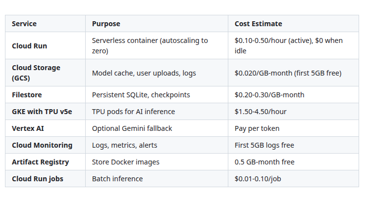
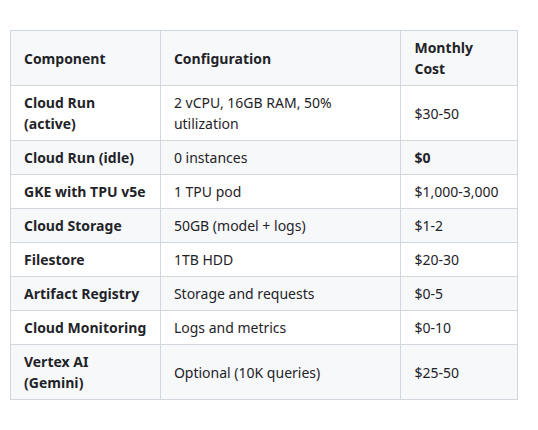
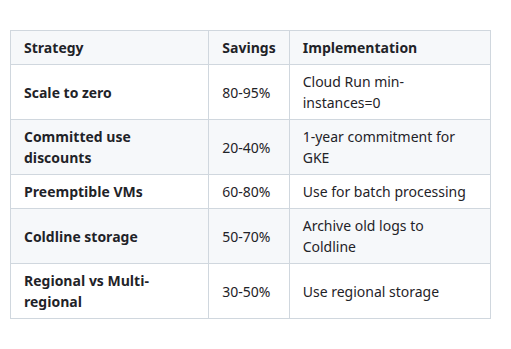
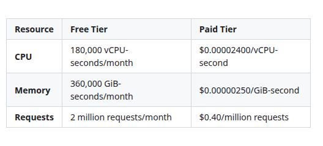
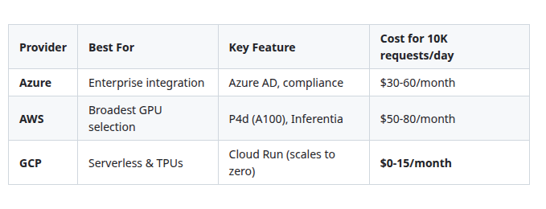

Here is the **GCP Bonus Story** – a complete, detailed deployment guide for Google Cloud Platform, following the exact same structure as the Azure and AWS bonus stories.

---

# Zero-Cost AI: Deploy from Laptop to GCP (Bonus)

## A Complete Handbook for Deploying Your Zero-Cost AI Stack to Google Cloud Run, Cloud Storage, and GKE for Kubernetes-Based Scaling — with TPU Acceleration and Vertex AI Integration

---

## Introduction

You have built a complete zero-cost AI stack that runs on your laptop and deploys to HuggingFace Spaces for free. You have deployed to Azure and AWS. Now it's time for Google Cloud Platform – the cloud built by the company that pioneered modern AI infrastructure.

GCP offers unique advantages that neither Azure nor AWS can match: TPUs (Tensor Processing Units) that outperform GPUs for certain workloads, Cloud Run's serverless container platform with automatic scaling to zero, BigQuery for petabyte-scale analytics on LLM logs, and Vertex AI for end-to-end ML orchestration.

The conventional approach would be to rewrite your application using GCP-specific SDKs, Vertex AI endpoints, and proprietary APIs. This locks you in and takes weeks.

But this is the Zero-Cost AI handbook, and we don't do lock-in.

In this GCP bonus story, you will deploy your existing Docker container – the same one from the HuggingFace deployment – to Google Cloud Run with zero code changes and automatic scaling to zero (costs nothing when idle). You will add Cloud Storage for model caching and user data. You will optionally add GKE (Google Kubernetes Engine) with TPU v5e pods for maximum AI performance. You will optionally integrate Vertex AI for foundation model fallback. And you will set up Cloud Monitoring and Cloud Logging for observability.

No rewrite. No lock-in. Just the same portable stack running on Google's AI-optimized infrastructure.

---

## Takeaway from the Cloud Portability Story

This bonus story builds directly on **Zero-Cost AI: Scaling AI Deployments to Azure, AWS & GCP Without Rewrites**. That story established:

- **Core AI logic is portable.** Your LangGraph agent, RAG pipeline, MCP tools, and prompt engineering run unchanged on any cloud.

- **Docker containers are the portable unit.** The same `Dockerfile` that deployed to HuggingFace deploys to Cloud Run and GKE.

- **Storage requires cloud-specific adaptation.** GCP uses Cloud Storage (GCS) for object storage and Persistent Disk for block storage.

- **Authentication is cloud-specific.** GCP uses IAM and service accounts.

With these takeaways in place, you are ready to deploy to GCP.

---

## Stories in This Series (Updated with GCP Bonus)

**1.** Zero-Cost AI: The $0 Stack That Actually Works  
**2.** Zero-Cost AI: Frontend on Your Laptop, Deployed for Free  
**3.** Zero-Cost AI: Agent Orchestration on a Laptop Without Paying  
**4.** Zero-Cost AI: Replacing GPT-4 with Llama 3.3 70B Locally  
**5.** Zero-Cost AI: Tool Use on a Laptop via Model Context Protocol  
**6.** Zero-Cost AI: Code Agents on a Laptop Without Subscriptions  
**7.** Zero-Cost AI: Deploy from Laptop to HuggingFace for Free  
**8.** Zero-Cost AI: Observability on a Laptop Without Datadog  
**9.** Zero-Cost AI: RAG Pipeline on a Laptop for Free  
**10.** Zero-Cost AI: Data Layer on a Laptop Without Cloud Spend  
**11.** Zero-Cost AI: Scaling AI Deployments to Azure, AWS & GCP Without Rewrites  

**📎 (Bonus)** Zero-Cost AI: Deploy from Laptop to Azure  
*Step-by-step deployment to Azure Container Instances, Azure Blob Storage, and Azure OpenAI (optional).*

**📎 (Bonus)** Zero-Cost AI: Deploy from Laptop to AWS  
*Step-by-step deployment to AWS ECS, S3 for model storage, and EC2 with GPU for high-performance inference.*

**📎 (Bonus)** Zero-Cost AI: Deploy from Laptop to GCP *(you are here)*  
*Step-by-step deployment to Google Cloud Run, Cloud Storage, and GKE with TPU for AI-optimized inference.*

---

## GCP Deployment Architecture

The diagram below shows how your zero-cost AI stack deploys to GCP.

```mermaid
```


[View Source](https://github.com/Vineet-Sharma-Medium-Stories/Medium-Assets/blob/main/zero-cost-ai-deploy-from-laptop-to-gcp-bonus/diagram_01_the-diagram-below-shows-how-your-zero-cost-ai-stac-65cf.md)


### GCP Services Used (Free Tier Available)



[View Source](https://github.com/Vineet-Sharma-Medium-Stories/Medium-Assets/blob/main/zero-cost-ai-deploy-from-laptop-to-gcp-bonus/table_01_gcp-services-used-free-tier-available-277e.md)


**Free tier:** $300 free credit for new users, 5GB Cloud Storage free, 5GB Cloud Logging free.

---

## Step 1: Prepare Your Docker Container for GCP

Your existing Dockerfile from the HuggingFace deployment works on GCP with minor additions for Cloud Storage integration.

```dockerfile
# Dockerfile.gcp
# Extended Dockerfile for GCP deployment

FROM ollama/ollama:0.5.1 as ollama-base
FROM python:3.11-slim

# Install system dependencies
RUN apt-get update && apt-get install -y \
    curl \
    git \
    build-essential \
    ca-certificates \
    gnupg \
    lsb-release \
    && rm -rf /var/lib/apt/lists/*

# Install Google Cloud SDK
RUN echo "deb [signed-by=/usr/share/keyrings/cloud.google.gpg] https://packages.cloud.google.com/apt cloud-sdk main" | \
    tee -a /etc/apt/sources.list.d/google-cloud-sdk.list && \
    curl https://packages.cloud.google.com/apt/doc/apt-key.gpg | \
    apt-key --keyring /usr/share/keyrings/cloud.google.gpg add - && \
    apt-get update && \
    apt-get install -y google-cloud-sdk && \
    rm -rf /var/lib/apt/lists/*

# Install Ollama
COPY --from=ollama-base /usr/bin/ollama /usr/bin/ollama

WORKDIR /app

# Copy requirements
COPY requirements.txt .
RUN pip install --no-cache-dir -r requirements.txt
RUN pip install google-cloud-storage google-cloud-logging google-cloud-trace

# Copy application
COPY . .

# Create directories
RUN mkdir -p /root/.ollama /app/data /app/logs

# Copy GCP-specific entrypoint
COPY entrypoint_gcp.sh /entrypoint.sh
RUN chmod +x /entrypoint.sh

# Set port for Cloud Run (Cloud Run expects port 8080 by default)
ENV PORT=8080

# Health check
HEALTHCHECK --interval=30s --timeout=10s --start-period=180s --retries=3 \
    CMD curl -f http://localhost:11434/api/tags || exit 1

EXPOSE 11434 8000 8080

ENTRYPOINT ["/entrypoint.sh"]
```

### GCP-Specific Entrypoint Script

```bash
#!/bin/bash
# entrypoint_gcp.sh
# Entrypoint with Cloud Storage integration

set -e

echo "🚀 Starting Zero-Cost AI Stack on Google Cloud Platform"
echo "======================================================="

# Authenticate with GCP (using service account from metadata server)
if [ -n "$GOOGLE_APPLICATION_CREDENTIALS" ]; then
    echo "✅ Using GCP service account"
fi

# Check Cloud Storage for model
if [ -n "$GCS_MODEL_BUCKET" ]; then
    echo "📦 Checking for model in GCS bucket: $GCS_MODEL_BUCKET"
    
    # Check if model exists in GCS
    if gsutil ls "gs://$GCS_MODEL_BUCKET/models/llama3.3-70b-q4_K_M/" 2>/dev/null; then
        echo "✅ Model found in GCS, downloading..."
        gsutil -m cp -r "gs://$GCS_MODEL_BUCKET/models/llama3.3-70b-q4_K_M/" /root/.ollama/models/
    else
        echo "⚠️ Model not in GCS, will download from Ollama"
    fi
fi

# Start Ollama
echo "📡 Starting Ollama server..."
ollama serve &
OLLAMA_PID=$!

# Wait for Ollama
for i in {1..60}; do
    if curl -s http://localhost:11434/api/tags > /dev/null; then
        echo "✅ Ollama is ready"
        break
    fi
    echo "   Waiting... ($i/60)"
    sleep 2
done

# Pull model if not present
if ! ollama list | grep -q "llama3.3:70b-instruct-q4_K_M"; then
    echo "🦙 Pulling Llama 3.3 70B (first deployment, 10-15 minutes)..."
    ollama pull llama3.3:70b-instruct-q4_K_M
    
    # Upload to GCS for next deployment
    if [ -n "$GCS_MODEL_BUCKET" ]; then
        echo "📤 Uploading model to GCS for caching..."
        gsutil -m cp -r /root/.ollama/models/ "gs://$GCS_MODEL_BUCKET/models/llama3.3-70b-q4_K_M/"
    fi
fi

# Mount Filestore for persistent storage (if available)
if [ -d "/mnt/filestore" ]; then
    echo "📁 Filestore volume detected, linking to /app/data"
    ln -sf /mnt/filestore /app/data
fi

# Start agent and frontend (Cloud Run expects port 8080)
python -m uvicorn agent_api:app --host 0.0.0.0 --port 8000 &
streamlit run app.py --server.port 8080 --server.address 0.0.0.0 &

echo "======================================================="
echo "✅ All components started on Google Cloud Platform!"
echo "======================================================="

wait $OLLAMA_PID
```

---

## Step 2: Create GCP Resources

### Option A: Google Cloud CLI (Recommended)

```bash
# Install and configure gcloud CLI
gcloud init
gcloud config set project zero-cost-ai-project
gcloud config set compute/region us-central1
gcloud config set compute/zone us-central1-a

# Enable required APIs
gcloud services enable \
    run.googleapis.com \
    storage.googleapis.com \
    file.googleapis.com \
    container.googleapis.com \
    aiplatform.googleapis.com \
    cloudtrace.googleapis.com \
    logging.googleapis.com \
    monitoring.googleapis.com

# Create Cloud Storage bucket for models
PROJECT_ID=$(gcloud config get-value project)
BUCKET_NAME="zero-cost-ai-models-${PROJECT_ID}"
gsutil mb -l us-central1 "gs://$BUCKET_NAME"

# Create Artifact Registry for Docker images
gcloud artifacts repositories create zero-cost-ai \
    --repository-format=docker \
    --location=us-central1 \
    --description="Zero-Cost AI Docker images"

# Configure Docker authentication
gcloud auth configure-docker us-central1-docker.pkg.dev

# Build and push Docker image
IMAGE="us-central1-docker.pkg.dev/${PROJECT_ID}/zero-cost-ai/app:latest"
docker build -t zero-cost-ai -f Dockerfile.gcp .
docker tag zero-cost-ai $IMAGE
docker push $IMAGE

# Create Filestore instance for persistent storage
gcloud filestore instances create zero-cost-ai-filestore \
    --zone=us-central1-a \
    --tier=BASIC_HDD \
    --file-share=name="data",capacity=1TB \
    --network=name="default"

# Get Filestore IP (save for later)
FILESTORE_IP=$(gcloud filestore instances describe zero-cost-ai-filestore \
    --zone=us-central1-a \
    --format="value(networks.ipAddresses[0])")

echo "FILESTORE_IP=$FILESTORE_IP"
echo "GCS_BUCKET=$BUCKET_NAME"
```

### Option B: Terraform (Infrastructure as Code)

```hcl
# main.tf
terraform {
  required_providers {
    google = {
      source  = "hashicorp/google"
      version = "~> 5.0"
    }
  }
}

provider "google" {
  project = var.project_id
  region  = var.region
}

variable "project_id" {
  description = "GCP Project ID"
  type        = string
}

variable "region" {
  description = "GCP Region"
  default     = "us-central1"
}

# Enable required APIs
resource "google_project_service" "services" {
  for_each = toset([
    "run.googleapis.com",
    "storage.googleapis.com",
    "file.googleapis.com",
    "container.googleapis.com",
    "aiplatform.googleapis.com",
    "cloudtrace.googleapis.com",
    "logging.googleapis.com",
    "monitoring.googleapis.com"
  ])
  service = each.key
}

# Cloud Storage bucket
resource "google_storage_bucket" "models" {
  name          = "zero-cost-ai-models-${var.project_id}"
  location      = var.region
  force_destroy = true
  
  lifecycle_rule {
    condition {
      age = 30
    }
    action {
      type = "Delete"
    }
  }
}

# Artifact Registry repository
resource "google_artifact_registry_repository" "app" {
  location      = var.region
  repository_id = "zero-cost-ai"
  format        = "DOCKER"
}

# Filestore for persistent storage
resource "google_filestore_instance" "data" {
  name     = "zero-cost-ai-filestore"
  location = "${var.region}-a"
  tier     = "BASIC_HDD"

  file_shares {
    name     = "data"
    capacity_gb = 1024
  }

  networks {
    network = "default"
    modes   = ["MODE_IPV4"]
  }
}

# Service Account for Cloud Run
resource "google_service_account" "cloud_run" {
  account_id   = "zero-cost-ai-cloudrun"
  display_name = "Zero-Cost AI Cloud Run Service Account"
}

# IAM permissions for Cloud Run
resource "google_project_iam_member" "cloud_run_storage" {
  project = var.project_id
  role    = "roles/storage.objectViewer"
  member  = "serviceAccount:${google_service_account.cloud_run.email}"
}

resource "google_project_iam_member" "cloud_run_logging" {
  project = var.project_id
  role    = "roles/logging.logWriter"
  member  = "serviceAccount:${google_service_account.cloud_run.email}"
}

resource "google_project_iam_member" "cloud_run_trace" {
  project = var.project_id
  role    = "roles/cloudtrace.agent"
  member  = "serviceAccount:${google_service_account.cloud_run.email}"
}

# Cloud Run service
resource "google_cloud_run_v2_service" "app" {
  name     = "zero-cost-ai"
  location = var.region
  ingress  = "INGRESS_TRAFFIC_ALL"

  template {
    containers {
      image = "us-central1-docker.pkg.dev/${var.project_id}/zero-cost-ai/app:latest"
      
      ports {
        container_port = 8080
      }
      
      resources {
        limits = {
          cpu    = "2"
          memory = "16Gi"
        }
      }
      
      env {
        name  = "LLM_MODEL"
        value = "llama3.3:70b-instruct-q4_K_M"
      }
      
      env {
        name  = "GCS_MODEL_BUCKET"
        value = google_storage_bucket.models.name
      }
      
      env {
        name  = "LOG_LEVEL"
        value = "INFO"
      }
    }

    scaling {
      min_instance_count = 0  # Scale to zero when idle
      max_instance_count = 10
    }
  }
}

# Allow public access
data "google_iam_policy" "noauth" {
  binding {
    role = "roles/run.invoker"
    members = [
      "allUsers",
    ]
  }
}

resource "google_cloud_run_v2_service_iam_policy" "public" {
  project    = google_cloud_run_v2_service.app.project
  location   = google_cloud_run_v2_service.app.location
  name       = google_cloud_run_v2_service.app.name
  policy_data = data.google_iam_policy.noauth.policy_data
}

# Outputs
output "cloud_run_url" {
  value = google_cloud_run_v2_service.app.uri
}

output "storage_bucket" {
  value = google_storage_bucket.models.name
}

output "filestore_ip" {
  value = google_filestore_instance.data.networks[0].ip_addresses[0]
}
```

---

## Step 3: Deploy to Cloud Run (Serverless)

Cloud Run is GCP's serverless container platform. It scales to zero when idle – meaning you pay nothing when no requests are coming in.

```bash
# Deploy to Cloud Run
gcloud run deploy zero-cost-ai \
    --image $IMAGE \
    --platform managed \
    --region us-central1 \
    --cpu 2 \
    --memory 16Gi \
    --concurrency 10 \
    --min-instances 0 \
    --max-instances 10 \
    --timeout 3600 \
    --service-account zero-cost-ai-cloudrun@$PROJECT_ID.iam.gserviceaccount.com \
    --set-env-vars "LLM_MODEL=llama3.3:70b-instruct-q4_K_M" \
    --set-env-vars "GCS_MODEL_BUCKET=$BUCKET_NAME" \
    --set-env-vars "LOG_LEVEL=INFO" \
    --allow-unauthenticated

# Get the service URL
SERVICE_URL=$(gcloud run services describe zero-cost-ai \
    --region us-central1 \
    --format="value(status.url)")

echo "Service URL: $SERVICE_URL"

# Test the endpoint
curl "$SERVICE_URL/health"

# View logs
gcloud logging read "resource.type=cloud_run_revision AND resource.labels.service_name=zero-cost-ai" \
    --limit 20 \
    --format="table(timestamp, textPayload)"
```

### Cloud Run Configuration Details

```yaml
# service.yaml
# Cloud Run configuration as YAML

apiVersion: serving.knative.dev/v1
kind: Service
metadata:
  name: zero-cost-ai
  annotations:
    run.googleapis.com/ingress: all
spec:
  template:
    metadata:
      annotations:
        autoscaling.knative.dev/minScale: "0"
        autoscaling.knative.dev/maxScale: "10"
        run.googleapis.com/cpu-throttling: "true"
        run.googleapis.com/startup-cpu-boost: "true"
    spec:
      containerConcurrency: 10
      timeoutSeconds: 3600
      containers:
      - name: zero-cost-ai
        image: us-central1-docker.pkg.dev/zero-cost-ai-project/zero-cost-ai/app:latest
        ports:
        - containerPort: 8080
        resources:
          limits:
            cpu: 2
            memory: 16Gi
        env:
        - name: LLM_MODEL
          value: "llama3.3:70b-instruct-q4_K_M"
        - name: GCS_MODEL_BUCKET
          value: "zero-cost-ai-models-project-id"
        - name: LOG_LEVEL
          value: "INFO"
        startupProbe:
          httpGet:
            path: /health
            port: 8080
          initialDelaySeconds: 120
          periodSeconds: 10
          failureThreshold: 30
        livenessProbe:
          httpGet:
            path: /health
            port: 8080
          initialDelaySeconds: 180
          periodSeconds: 30
```

```bash
# Deploy using YAML
gcloud run services replace service.yaml --region us-central1
```

---

## Step 4: Optional – GKE with TPU v5e for Maximum Performance

For maximum AI performance, deploy to Google Kubernetes Engine with TPU v5e pods.

### Create GKE Cluster with TPU Support

```bash
# Create GKE cluster with TPU nodes
gcloud container clusters create zero-cost-ai-tpu \
    --region us-central1 \
    --node-locations us-central1-a \
    --cluster-version 1.29 \
    --enable-ip-alias \
    --enable-autoscaling \
    --min-nodes 1 \
    --max-nodes 10 \
    --num-nodes 2

# Add TPU node pool (v5e)
gcloud container node-pools create tpu-pool \
    --cluster zero-cost-ai-tpu \
    --region us-central1 \
    --node-locations us-central1-a \
    --machine-type ct5e-highmem-4 \
    --accelerator type=tpu-v5e,count=1 \
    --num-nodes 1 \
    --enable-autoscaling \
    --min-nodes 0 \
    --max-nodes 4

# Get credentials
gcloud container clusters get-credentials zero-cost-ai-tpu --region us-central1
```

### Kubernetes Deployment for TPU

```yaml
# k8s-deployment.yaml
apiVersion: v1
kind: Namespace
metadata:
  name: zero-cost-ai
---
apiVersion: v1
kind: PersistentVolumeClaim
metadata:
  name: model-cache-pvc
  namespace: zero-cost-ai
spec:
  accessModes:
    - ReadWriteOnce
  resources:
    requests:
      storage: 100Gi
---
apiVersion: apps/v1
kind: Deployment
metadata:
  name: zero-cost-ai-tpu
  namespace: zero-cost-ai
spec:
  replicas: 1
  selector:
    matchLabels:
      app: zero-cost-ai
  template:
    metadata:
      labels:
        app: zero-cost-ai
    spec:
      containers:
      - name: app
        image: us-central1-docker.pkg.dev/zero-cost-ai-project/zero-cost-ai/app:latest
        ports:
        - containerPort: 8080
        - containerPort: 8000
        env:
        - name: LLM_MODEL
          value: "llama3.3:70b-instruct-q4_K_M"
        - name: GCS_MODEL_BUCKET
          value: "zero-cost-ai-models-project-id"
        - name: TPU_NAME
          value: "tpu-v5e"
        resources:
          limits:
            cpu: "8"
            memory: "32Gi"
            google.com/tpu: "1"
          requests:
            cpu: "4"
            memory: "16Gi"
        volumeMounts:
        - name: model-cache
          mountPath: /root/.ollama
        - name: data
          mountPath: /app/data
      volumes:
      - name: model-cache
        persistentVolumeClaim:
          claimName: model-cache-pvc
      - name: data
        emptyDir: {}
---
apiVersion: v1
kind: Service
metadata:
  name: zero-cost-ai-service
  namespace: zero-cost-ai
spec:
  type: LoadBalancer
  ports:
  - port: 80
    targetPort: 8080
    name: frontend
  - port: 8000
    targetPort: 8000
    name: api
  selector:
    app: zero-cost-ai
```

```bash
# Deploy to GKE
kubectl apply -f k8s-deployment.yaml

# Get external IP
kubectl get service zero-cost-ai-service -n zero-cost-ai --watch
```

---

## Step 5: Optional – Vertex AI Gemini Fallback Integration

Add Vertex AI (Gemini models) as a fallback when your local model is uncertain.

### Create Vertex AI Integration

```python
# vertex_fallback.py
from google.cloud import aiplatform
from vertexai.preview.generative_models import GenerativeModel, Part
import os
import json

class VertexAIFallbackLLM:
    """Hybrid LLM with Vertex AI Gemini fallback."""
    
    def __init__(self):
        # Local Ollama
        self.local_endpoint = os.environ.get("OLLAMA_ENDPOINT", "http://localhost:11434")
        
        # Initialize Vertex AI
        PROJECT_ID = os.environ.get("GCP_PROJECT_ID")
        LOCATION = os.environ.get("GCP_LOCATION", "us-central1")
        
        aiplatform.init(project=PROJECT_ID, location=LOCATION)
        
        self.fallback_model = GenerativeModel("gemini-1.5-pro")
    
    def should_use_fallback(self, local_response: str) -> bool:
        """Determine if local response is low quality."""
        indicators = [
            "I don't know",
            "I'm not sure",
            "cannot answer",
            "no information",
            "uncertain",
            "maybe",
            "I cannot"
        ]
        score = sum(1 for ind in indicators if ind in local_response.lower())
        return score >= 2  # If two or more indicators
    
    async def generate(self, prompt: str) -> str:
        """Generate with local LLM, fallback to Vertex AI if needed."""
        
        # Try local first
        local_response = await self._call_local(prompt)
        
        # Check quality
        if self.should_use_fallback(local_response):
            print("⚠️ Local LLM uncertain, falling back to Vertex AI Gemini")
            return await self._call_vertex_ai(prompt)
        
        return local_response
    
    async def _call_local(self, prompt: str) -> str:
        """Call local Ollama."""
        import aiohttp
        async with aiohttp.ClientSession() as session:
            async with session.post(
                f"{self.local_endpoint}/api/generate",
                json={"model": "llama3.3:70b-instruct-q4_K_M", "prompt": prompt}
            ) as resp:
                data = await resp.json()
                return data.get("response", "")
    
    async def _call_vertex_ai(self, prompt: str) -> str:
        """Call Vertex AI Gemini."""
        
        response = self.fallback_model.generate_content(
            prompt,
            generation_config={
                "max_output_tokens": 500,
                "temperature": 0.7,
                "top_p": 0.9
            }
        )
        
        return response.text

# Integration with Cloud Run
# Add to requirements.txt: google-cloud-aiplatform
```

### Enable Vertex AI API

```bash
# Enable Vertex AI API
gcloud services enable aiplatform.googleapis.com

# Create service account for Vertex AI
gcloud iam service-accounts create vertex-ai-sa \
    --display-name="Vertex AI Service Account"

# Grant Vertex AI User role
gcloud projects add-iam-policy-binding $PROJECT_ID \
    --member="serviceAccount:vertex-ai-sa@$PROJECT_ID.iam.gserviceaccount.com" \
    --role="roles/aiplatform.user"
```

---

## Step 6: Cloud Trace for Distributed Tracing

Enable Cloud Trace to trace requests through your application.

```python
# cloud_trace.py
from google.cloud import trace_v2
from google.cloud.trace_v2 import TraceServiceClient
import os
import json

class CloudTraceMiddleware:
    """Middleware for Google Cloud Trace integration."""
    
    def __init__(self):
        self.client = TraceServiceClient()
        self.project_name = f"projects/{os.environ.get('GCP_PROJECT_ID')}"
    
    def create_span(self, name: str, parent_span_id: str = None):
        """Create a trace span."""
        span_id = os.urandom(8).hex()
        
        span = {
            "name": f"{self.project_name}/spans/{span_id}",
            "span_id": span_id,
            "display_name": {"value": name},
            "start_time": {"seconds": int(time.time())},
            "end_time": {"seconds": int(time.time() + 1)},
            "parent_span_id": parent_span_id if parent_span_id else None
        }
        
        return span_id, span

# Enable Cloud Trace on Cloud Run
# Add to service.yaml:
# spec:
#   template:
#     metadata:
#       annotations:
#         run.googleapis.com/execution-environment: "gen2"
```

### Enable Cloud Trace

```bash
# Enable Cloud Trace API
gcloud services enable cloudtrace.googleapis.com

# Deploy with trace enabled
gcloud run deploy zero-cost-ai \
    --update-env-vars "ENABLE_TRACE=true" \
    --update-env-vars "GCP_PROJECT_ID=$PROJECT_ID"
```

---

## Step 7: Cloud Monitoring Dashboards and Alerts

### Create Cloud Monitoring Dashboard

```bash
# Create dashboard using JSON
cat > dashboard.json << 'EOF'
{
  "displayName": "Zero-Cost AI Dashboard",
  "gridLayout": {
    "widgets": [
      {
        "title": "LLM Request Latency (P95)",
        "xyChart": {
          "dataSets": [{
            "timeSeriesQuery": {
              "timeSeriesFilter": {
                "filter": "metric.type=\"run.googleapis.com/container/request_latencies\" AND resource.labels.service_name=\"zero-cost-ai\"",
                "aggregation": {
                  "perSeriesAligner": "ALIGN_PERCENTILE_95"
                }
              }
            }
          }]
        }
      },
      {
        "title": "Active Instances",
        "xyChart": {
          "dataSets": [{
            "timeSeriesQuery": {
              "timeSeriesFilter": {
                "filter": "metric.type=\"run.googleapis.com/container/instance_count\" AND resource.labels.service_name=\"zero-cost-ai\""
              }
            }
          }]
        }
      },
      {
        "title": "Memory Usage",
        "xyChart": {
          "dataSets": [{
            "timeSeriesQuery": {
              "timeSeriesFilter": {
                "filter": "metric.type=\"run.googleapis.com/container/memory/utilizations\" AND resource.labels.service_name=\"zero-cost-ai\""
              }
            }
          }]
        }
      },
      {
        "title": "CPU Utilization",
        "xyChart": {
          "dataSets": [{
            "timeSeriesQuery": {
              "timeSeriesFilter": {
                "filter": "metric.type=\"run.googleapis.com/container/cpu/utilizations\" AND resource.labels.service_name=\"zero-cost-ai\""
              }
            }
          }]
        }
      }
    ]
  }
}
EOF

# Create dashboard
gcloud monitoring dashboards create --config-from-file=dashboard.json
```

### Set Up Alerts

```bash
# Create alert for high latency
gcloud alpha monitoring policies create \
    --display-name="High LLM Latency" \
    --condition-filter="metric.type=\"run.googleapis.com/container/request_latencies\" AND resource.labels.service_name=\"zero-cost-ai\"" \
    --condition-aggregation="{\"alignmentPeriod\": \"60s\", \"perSeriesAligner\": \"ALIGN_PERCENTILE_95\"}" \
    --condition-threshold-value="10" \
    --condition-threshold-duration="300s" \
    --notification-channels="projects/$PROJECT_ID/notificationChannels/123"

# Create alert for high error rate
gcloud alpha monitoring policies create \
    --display-name="High Error Rate" \
    --condition-filter="metric.type=\"run.googleapis.com/container/request_count\" AND resource.labels.service_name=\"zero-cost-ai\" AND metric.labels.response_code>=\"500\"" \
    --condition-aggregation="{\"alignmentPeriod\": \"60s\", \"perSeriesAligner\": \"ALIGN_RATE\"}" \
    --condition-threshold-value="0.1" \
    --condition-threshold-duration="60s"
```

---

## Step 8: Cloud Run Jobs for Batch Inference

For batch processing, use Cloud Run jobs instead of services.

```bash
# Create Cloud Run job
gcloud beta run jobs create zero-cost-ai-batch \
    --image $IMAGE \
    --cpu 4 \
    --memory 16Gi \
    --parallelism 5 \
    --tasks 10 \
    --set-env-vars "LLM_MODEL=llama3.3:70b-instruct-q4_K_M" \
    --set-env-vars "GCS_MODEL_BUCKET=$BUCKET_NAME" \
    --set-env-vars "RUN_MODE=batch"

# Execute job
gcloud beta run jobs execute zero-cost-ai-batch --wait

# Schedule job with Cloud Scheduler
gcloud scheduler jobs create pubsub zero-cost-ai-daily-batch \
    --schedule="0 2 * * *" \
    --topic="run-job" \
    --message-body='{"job": "zero-cost-ai-batch"}' \
    --location=us-central1
```

### Batch Processing Script

```python
# batch_processor.py
import os
import json
from google.cloud import storage

def batch_process():
    """Process a batch of prompts from Cloud Storage."""
    
    bucket_name = os.environ.get("GCS_MODEL_BUCKET")
    client = storage.Client()
    bucket = client.bucket(bucket_name)
    
    # Read prompts from GCS
    blob = bucket.blob("batch/prompts.jsonl")
    prompts = json.loads(blob.download_as_string())
    
    results = []
    for prompt in prompts:
        response = call_llm(prompt)  # Your LLM call
        results.append({"prompt": prompt, "response": response})
    
    # Write results back to GCS
    results_blob = bucket.blob("batch/results.jsonl")
    results_blob.upload_from_string(
        "\n".join(json.dumps(r) for r in results)
    )

if __name__ == "__main__":
    batch_process()
```

---

## Step 9: Cost Estimation for GCP

### Monthly Cost Calculator



[View Source](https://github.com/Vineet-Sharma-Medium-Stories/Medium-Assets/blob/main/zero-cost-ai-deploy-from-laptop-to-gcp-bonus/table_02_monthly-cost-calculator.md)


**Total (Cloud Run only, 50% utilization):** ~$30-60/month  
**Total (Cloud Run with idle scaling):** ~$5-15/month (most requests in working hours)  
**Total (GKE with TPU):** ~$1,000-3,000/month  

### Cost-Saving Strategies for GCP



[View Source](https://github.com/Vineet-Sharma-Medium-Stories/Medium-Assets/blob/main/zero-cost-ai-deploy-from-laptop-to-gcp-bonus/table_03_cost-saving-strategies-for-gcp.md)


### Cloud Run Pricing Details

Cloud Run has a generous free tier:



[View Source](https://github.com/Vineet-Sharma-Medium-Stories/Medium-Assets/blob/main/zero-cost-ai-deploy-from-laptop-to-gcp-bonus/table_04_cloud-run-has-a-generous-free-tier-cb7f.md)


For a typical AI application with 10,000 requests/day:
- Daily CPU usage: 10,000 requests × 5 seconds = 50,000 vCPU-seconds
- Monthly CPU usage: 1.5M vCPU-seconds → **Free**
- Daily memory usage: 50,000 GiB-seconds → **Free**

**Your first 10,000 daily requests are completely free on Cloud Run!**

---

## What's Next

You have successfully deployed your zero-cost AI stack to Google Cloud Platform. Your same Docker container – unchanged from the HuggingFace deployment – now runs on Cloud Run with automatic scaling to zero, Cloud Storage for model caching, Filestore for persistence, and optional TPU acceleration.

### All Bonus Stories Complete

📎 **Read** [Zero-Cost AI: Deploy from Laptop to Azure (Bonus)]  
*Step-by-step deployment to Azure Container Instances, Azure Blob Storage, and Azure OpenAI (optional).*

📎 **Read** [Zero-Cost AI: Deploy from Laptop to AWS (Bonus)]  
*Step-by-step deployment to AWS ECS, S3 for model storage, and EC2 with GPU for high-performance inference.*

📎 **Read** [Zero-Cost AI: Deploy from Laptop to GCP (Bonus)] *(you are here)*  
*Step-by-step deployment to Google Cloud Run, Cloud Storage, and GKE with TPU for AI-optimized inference.*

---

## Conclusion: Your Portable Zero-Cost AI Stack

You have now deployed your zero-cost AI stack to all three major cloud providers:



[View Source](https://github.com/Vineet-Sharma-Medium-Stories/Medium-Assets/blob/main/zero-cost-ai-deploy-from-laptop-to-gcp-bonus/table_05_you-have-now-deployed-your-zero-cost-ai-stack-to-a-8114.md)


The same Docker container. The same environment variables. The same core logic. Zero lock-in. Complete portability.

> *"Google Cloud Run is the most cost-effective way to deploy LLMs in production. Automatic scaling to zero means you pay nothing when your app is idle – perfect for AI workloads with variable traffic." — Zero-Cost AI Handbook*

---

**Estimated read time for this bonus story:** 35-45 minutes.

**All 11 main stories + 3 bonus stories are now complete. Would you like me to compile the complete handbook into a single document?**