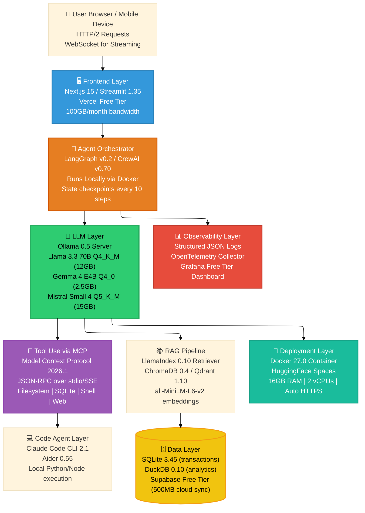

# Before writing a single line of code, you need a m

```mermaid
---
config:
  layout: elk
  theme: base
---
flowchart TB
    User["👤 User Browser / Mobile Device<br>HTTP/2 Requests<br>WebSocket for Streaming"] --> Frontend["🖥️ Frontend Layer<br>Next.js 15 / Streamlit 1.35<br>Vercel Free Tier<br>100GB/month bandwidth"]
    
    Frontend --> Orchestrator["🧠 Agent Orchestrator<br>LangGraph v0.2 / CrewAI v0.70<br>Runs Locally via Docker<br>State checkpoints every 10 steps"]
    
    Orchestrator --> LLM["🤖 LLM Layer<br>Ollama 0.5 Server<br>Llama 3.3 70B Q4_K_M (12GB)<br>Gemma 4 E4B Q4_0 (2.5GB)<br>Mistral Small 4 Q5_K_M (15GB)"]
    
    LLM --> MCP["🔧 Tool Use via MCP<br>Model Context Protocol 2026.1<br>JSON-RPC over stdio/SSE<br>Filesystem | SQLite | Shell | Web"]
    MCP --> CodeAgent["💻 Code Agent Layer<br>Claude Code CLI 2.1<br>Aider 0.55<br>Local Python/Node execution"]
    
    LLM --> RAG["📚 RAG Pipeline<br>LlamaIndex 0.10 Retriever<br>ChromaDB 0.4 / Qdrant 1.10<br>all-MiniLM-L6-v2 embeddings"]
    RAG --> Data[("🗄️ Data Layer<br>SQLite 3.45 (transactions)<br>DuckDB 0.10 (analytics)<br>Supabase Free Tier (500MB cloud sync)")]
    
    Orchestrator --> Obs["📊 Observability Layer<br>Structured JSON Logs<br>OpenTelemetry Collector<br>Grafana Free Tier Dashboard"]
    
    LLM --> Deployment["🚀 Deployment Layer<br>Docker 27.0 Container<br>HuggingFace Spaces<br>16GB RAM | 2 vCPUs | Auto HTTPS"]
    
    style LLM fill:#2ecc71,stroke:#27ae60,stroke-width:3px,color:#000
    style Frontend fill:#3498db,stroke:#2980b9,stroke-width:2px,color:#fff
    style Orchestrator fill:#e67e22,stroke:#d35400,stroke-width:2px,color:#fff
    style Data fill:#f1c40f,stroke:#f39c12,stroke-width:2px,color:#000
    style MCP fill:#9b59b6,stroke:#8e44ad,stroke-width:2px,color:#fff
    style Obs fill:#e74c3c,stroke:#c0392b,stroke-width:2px,color:#fff
    style Deployment fill:#1abc9c,stroke:#16a085,stroke-width:2px,color:#fff
```
