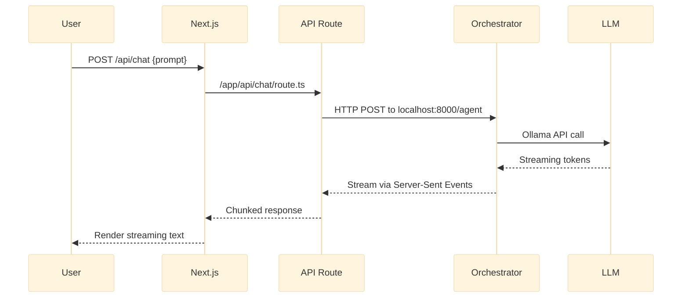

# **Routing architecture:**

```mermaid
---
config:
  layout: elk
  theme: base
---
sequenceDiagram
    participant User
    participant Next.js
    participant API Route
    participant Orchestrator
    participant LLM
    
    User->>Next.js: POST /api/chat {prompt}
    Next.js->>API Route: /app/api/chat/route.ts
    API Route->>Orchestrator: HTTP POST to localhost:8000/agent
    Orchestrator->>LLM: Ollama API call
    LLM-->>Orchestrator: Streaming tokens
    Orchestrator-->>API Route: Stream via Server-Sent Events
    API Route-->>Next.js: Chunked response
    Next.js-->>User: Render streaming text
```
