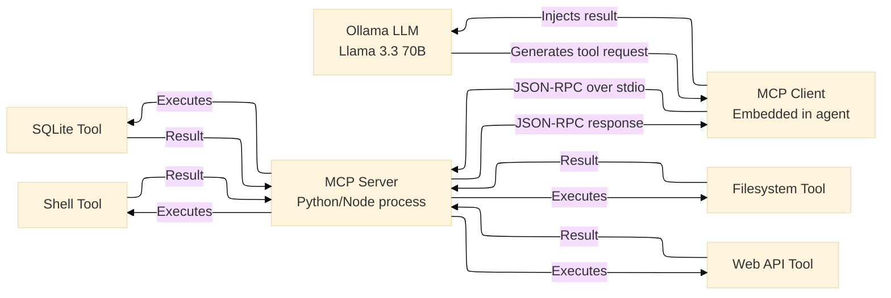

# **MCP architecture:**

```mermaid
---
config:
  layout: elk
  theme: base
---
flowchart LR
    LLM[Ollama LLM\nLlama 3.3 70B] -->|Generates tool request| MCP_Client[MCP Client\nEmbedded in agent]
    MCP_Client -->|JSON-RPC over stdio| MCP_Server[MCP Server\nPython/Node process]
    MCP_Server -->|Executes| Tool1[Filesystem Tool]
    MCP_Server -->|Executes| Tool2[SQLite Tool]
    MCP_Server -->|Executes| Tool3[Shell Tool]
    MCP_Server -->|Executes| Tool4[Web API Tool]
    Tool1 -->|Result| MCP_Server
    Tool2 -->|Result| MCP_Server
    Tool3 -->|Result| MCP_Server
    Tool4 -->|Result| MCP_Server
    MCP_Server -->|JSON-RPC response| MCP_Client
    MCP_Client -->|Injects result| LLM
```
