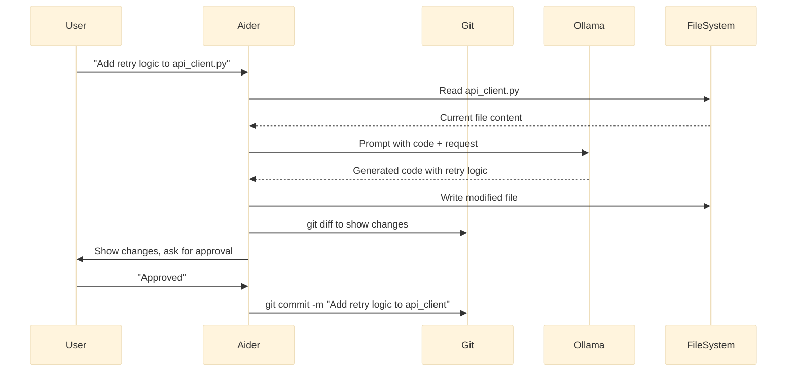

# **Code agent workflow:**

```mermaid
---
config:
  layout: elk
  theme: base
---
sequenceDiagram
    participant User
    participant Aider
    participant Git
    participant Ollama
    participant FileSystem
    
    User->>Aider: "Add retry logic to api_client.py"
    Aider->>FileSystem: Read api_client.py
    FileSystem-->>Aider: Current file content
    Aider->>Ollama: Prompt with code + request
    Ollama-->>Aider: Generated code with retry logic
    Aider->>FileSystem: Write modified file
    Aider->>Git: git diff to show changes
    Aider->>User: Show changes, ask for approval
    User->>Aider: "Approved"
    Aider->>Git: git commit -m "Add retry logic to api_client"
```
