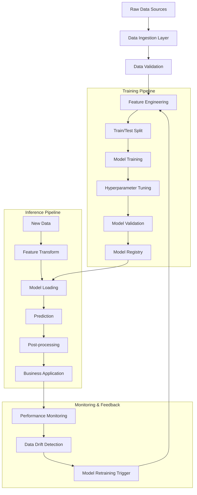
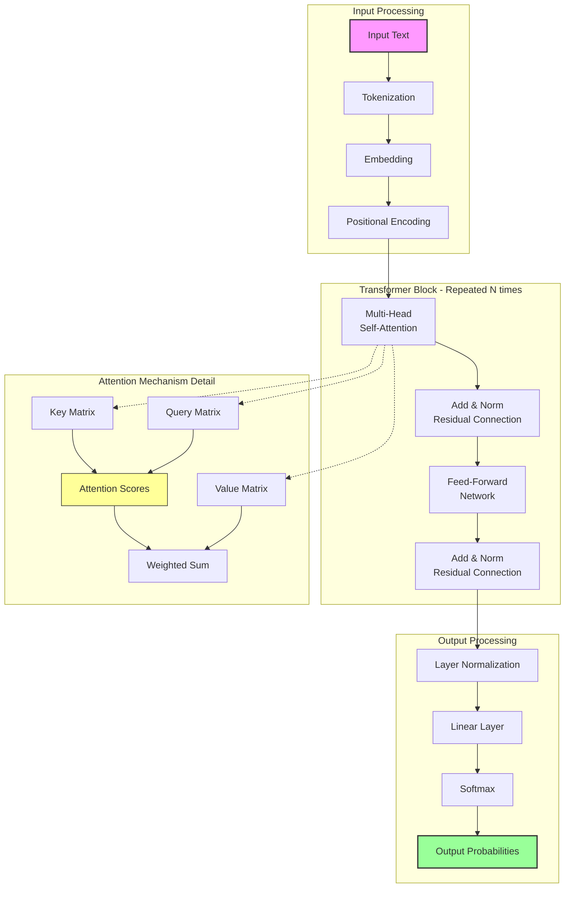
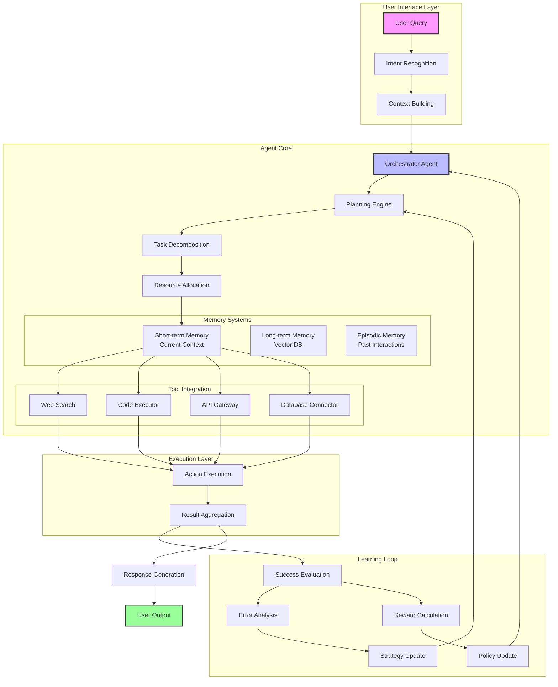

# Artificial Intelligence: From Basic Concepts to Agentic Systems — *Hands-On Implementation Guide*

## Document Information
- **File Name:** Artificial Intelligence: From Basic Concepts to Agentic Systems — Hands-On Implementation Guide.md
- **Total Words:** 5556
- **Estimated Reading Time:** 27 minutes

---

## Mermaid Diagram 1: Machine Learning Pipeline Architecture

## Mermaid Diagram 2: Neural Network Architecture Visualization

```mermaid
graph LR
    subgraph "Input Layer"
        A[Image<br/>32x32x3]
    end
    
    subgraph "Convolutional Layers - Feature Extraction"
        B[Conv2D<br/>32 filters<br/>3x3] --> C[BatchNorm<br/>+ ReLU]
        C --> D[Conv2D<br/>32 filters<br/>3x3]
        D --> E[BatchNorm<br/>+ ReLU]
        E --> F[MaxPool<br/>2x2]
        
        F --> G[Conv2D<br/>64 filters<br/>3x3]
        G --> H[BatchNorm<br/>+ ReLU]
        H --> I[Conv2D<br/>64 filters<br/>3x3]
        I --> J[BatchNorm<br/>+ ReLU]
        J --> K[MaxPool<br/>2x2]
        
        K --> L[Conv2D<br/>128 filters<br/>3x3]
        L --> M[BatchNorm<br/>+ ReLU]
        M --> N[Conv2D<br/>128 filters<br/>3x3]
        N --> O[BatchNorm<br/>+ ReLU]
        O --> P[MaxPool<br/>2x2]
    end
    
    subgraph "Fully Connected Layers - Decision Making"
        P --> Q[Flatten]
        Q --> R[Dropout<br/>0.5]
        R --> S[Dense<br/>256 + ReLU]
        S --> T[Dropout<br/>0.5]
        T --> U[Dense<br/>128 + ReLU]
        U --> V[Dense<br/>10 + Softmax]
    end
    
    subgraph "Output Layer"
        V --> W[Class Probabilities<br/>plane, car, bird, ...]
    end
    
    style A fill:#f9f,stroke:#333,stroke-width:2px
    style W fill:#9f9,stroke:#333,stroke-width:2px
```

## Mermaid Diagram 3: Transformer Architecture Visualization

## Mermaid Diagram 4: Run the agent

---
*This story was automatically generated from Artificial Intelligence: From Basic Concepts to Agentic Systems — Hands-On Implementation Guide.md on 2026-03-04 19:30:12.*