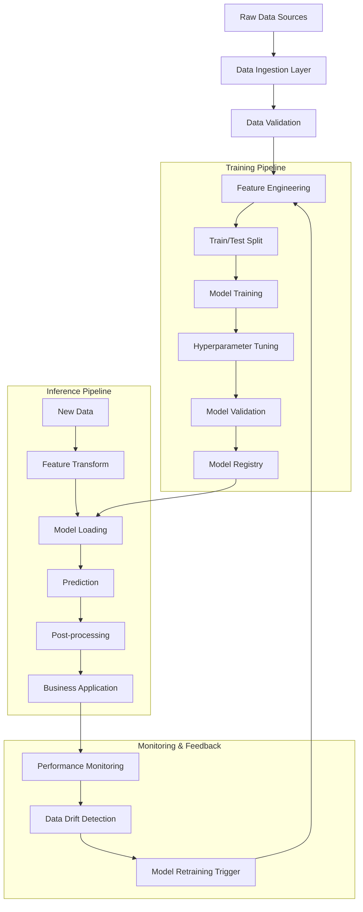

# Mermaid Diagram 1: Machine Learning Pipeline Architecture

```mermaid
graph TD
    A[Raw Data Sources] --> B[Data Ingestion Layer]
    B --> C[Data Validation]
    C --> D[Feature Engineering]
    
    subgraph "Training Pipeline"
        D --> E[Train/Test Split]
        E --> F[Model Training]
        F --> G[Hyperparameter Tuning]
        G --> H[Model Validation]
        H --> I[Model Registry]
    end
    
    subgraph "Inference Pipeline"
        J[New Data] --> K[Feature Transform]
        K --> L[Model Loading]
        I --> L
        L --> M[Prediction]
        M --> N[Post-processing]
        N --> O[Business Application]
    end
    
    subgraph "Monitoring & Feedback"
        O --> P[Performance Monitoring]
        P --> Q[Data Drift Detection]
        Q --> R[Model Retraining Trigger]
        R --> D
    end
```
