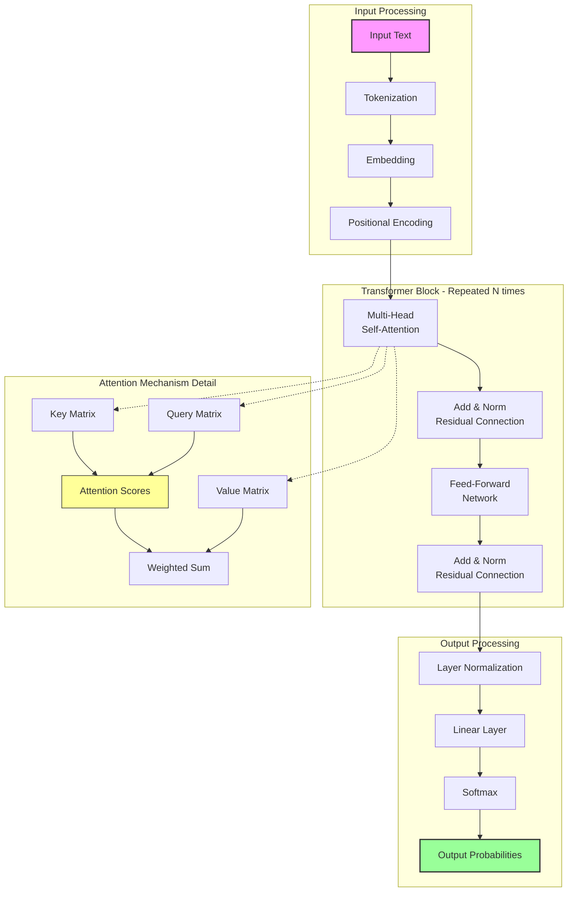

# Mermaid Diagram 3: Transformer Architecture Visualization

```mermaid
graph TD
    subgraph "Input Processing"
        A[Input Text] --> B[Tokenization]
        B --> C[Embedding]
        C --> D[Positional Encoding]
    end
    
    subgraph "Transformer Block - Repeated N times"
        D --> E[Multi-Head<br/>Self-Attention]
        E --> F[Add & Norm<br/>Residual Connection]
        F --> G[Feed-Forward<br/>Network]
        G --> H[Add & Norm<br/>Residual Connection]
    end
    
    subgraph "Output Processing"
        H --> I[Layer Normalization]
        I --> J[Linear Layer]
        J --> K[Softmax]
        K --> L[Output Probabilities]
    end
    
    subgraph "Attention Mechanism Detail"
        direction TB
        M[Query Matrix] --> N[Attention Scores]
        O[Key Matrix] --> N
        P[Value Matrix] --> Q[Weighted Sum]
        N --> Q
    end
    
    E -.-> M & O & P
    
    style A fill:#f9f,stroke:#333,stroke-width:2px
    style L fill:#9f9,stroke:#333,stroke-width:2px
    style N fill:#ff9,stroke:#333,stroke-width:1px
```
