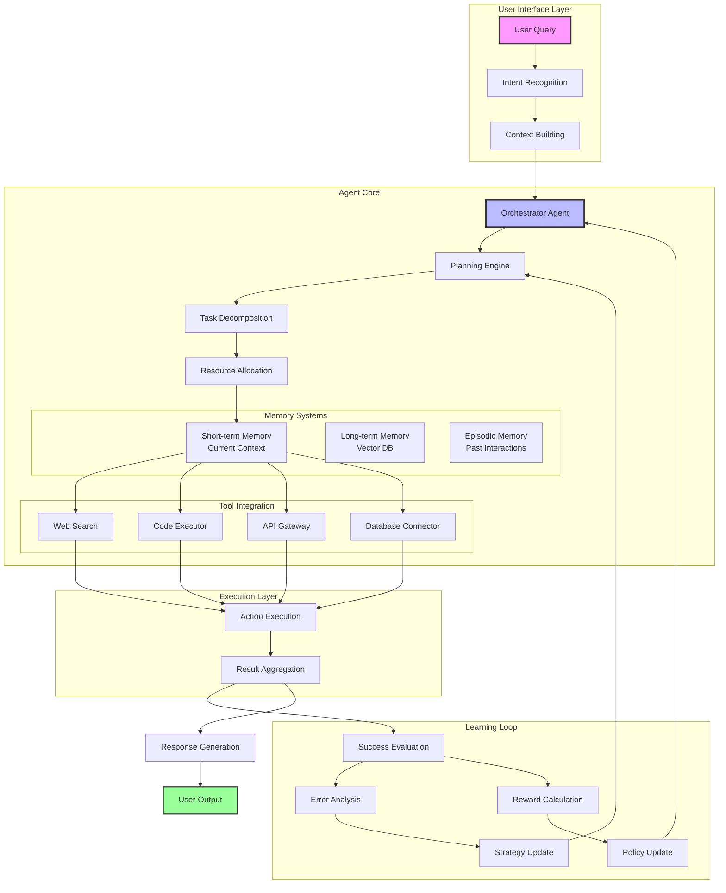

# Mermaid Diagram 4: Run the agent

```mermaid
graph TB
    subgraph "User Interface Layer"
        A[User Query] --> B[Intent Recognition]
        B --> C[Context Building]
    end
    
    subgraph "Agent Core"
        C --> D[Orchestrator Agent]
        
        D --> E[Planning Engine]
        E --> F[Task Decomposition]
        F --> G[Resource Allocation]
        
        subgraph "Memory Systems"
            direction LR
            H[Short-term Memory<br/>Current Context]
            I[Long-term Memory<br/>Vector DB]
            J[Episodic Memory<br/>Past Interactions]
        end
        
        subgraph "Tool Integration"
            direction LR
            K[Web Search]
            L[Code Executor]
            M[API Gateway]
            N[Database Connector]
        end
        
        G --> H
        H --> K & L & M & N
    end
    
    subgraph "Execution Layer"
        K & L & M & N --> O[Action Execution]
        O --> P[Result Aggregation]
    end
    
    subgraph "Learning Loop"
        P --> Q[Success Evaluation]
        Q --> R[Error Analysis]
        R --> S[Strategy Update]
        S --> E
        Q --> T[Reward Calculation]
        T --> U[Policy Update]
        U --> D
    end
    
    P --> V[Response Generation]
    V --> W[User Output]
    
    style A fill:#f9f,stroke:#333,stroke-width:2px
    style W fill:#9f9,stroke:#333,stroke-width:2px
    style D fill:#bbf,stroke:#333,stroke-width:3px
```
