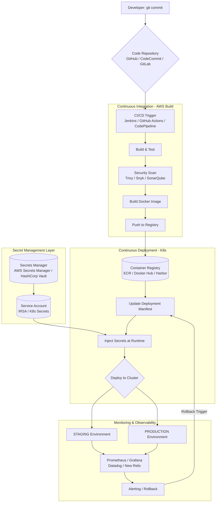

# Code to Cluster: Building a Bulletproof Kubernetes Deployment Pipeline on AWS

## Document Information
- **File Name:** Code to Cluster: Building a Bulletproof Kubernetes Deployment Pipeline on AWS.md
- **Total Words:** 4800
- **Estimated Reading Time:** 24 minutes

---

## Mermaid Diagram 1: And this is just the beginning.

## Table 1: Phase 2: The CI Pipeline (The Build)

| Tool | Type | Pros | Cons |
|------|------|------|------|
| **Jenkins** | Self-hosted (EC2/EKS) | Highly customizable, huge plugin ecosystem | Maintenance overhead, requires infrastructure management |
| **GitHub Actions** | SaaS + Self-hosted runners | Native Git integration, free for public repos, matrix builds | Limited customization for complex pipelines |
| **AWS CodePipeline + CodeBuild** | Fully managed AWS | Deep AWS integration, no servers to manage | AWS-specific, learning curve for non-AWS users |
| **GitLab CI** | SaaS or Self-hosted | Single application for SCM and CI/CD | Requires GitLab for full experience |
| **CircleCI** | SaaS | Fast, easy to configure, good Docker support | Can get expensive at scale |

## Table 2: Component: Container Registry Options

| Registry | Best For | Key Features |
|----------|----------|--------------|
| **Amazon ECR** | AWS-native workloads | IAM integration, image scanning, cross-region replication |
| **Docker Hub** | Public images, open source | Largest image repository, automated builds |
| **Harbor** | Enterprise self-hosted | Vulnerability scanning, identity integration, replication |
| **Google Container Registry** | GCP users, multi-cloud | Fast pulls from GKE, IAM integration |
| **Azure Container Registry** | Azure users, Windows containers | ACR Tasks, geo-replication, Helm chart support |
| **Quay.io** | Security-focused teams | Clair security scanner, robot accounts, build triggers |

## Table 3: Harbor (self-hosted)

| Tool | Scope | Integration |
|------|-------|-------------|
| **Trivy** | Filesystem, image, Git repo | CLI, GitHub Action, Jenkins plugin |
| **Snyk** | Code, dependencies, containers | IDE plugins, CI integration, GitHub app |
| **SonarQube** | Code quality, security hotspots | Self-hosted, cloud option, extensive rules |
| **Clair** | Container vulnerabilities | CoreOS, integrates with Quay and Harbor |
| **Amazon ECR Scanning** | Basic CVE scanning | Native ECR, Basic/Enhanced modes |
| **Docker Scout** | Docker images | Docker CLI, Docker Hub integration |

## Table 4: Database credentials

| Service | Best For | Key Features |
|---------|----------|--------------|
| **AWS Secrets Manager** | AWS-native apps | Automatic rotation, fine-grained IAM, cross-region replication |
| **AWS Systems Manager Parameter Store** | Simple config | Hierarchical storage, free tier, plaintext or encrypted |
| **HashiCorp Vault** | Multi-cloud, dynamic secrets | Unified secrets, encryption as a service, leasing |
| **Kubernetes Secrets + SOPS** | GitOps workflows | Encrypted secrets in Git, decrypted at deploy time |
| **External Secrets Operator** | Bridge between AWS and K8s | Syncs AWS Secrets Manager/Parameter Store to K8s Secrets |
| **Sealed Secrets** | GitOps with encryption | Encrypt secrets for safe storage in Git |

## Table 5: Phase 4: Deploy to Kubernetes (The CD)

| Platform | Description | Use Case |
|----------|-------------|----------|
| **Amazon EKS** | AWS managed Kubernetes | AWS-centric organizations, needs IAM integration |
| **Self-managed K8s on EC2** | You manage control plane | Complete control, specialized requirements |
| **k3s/k3d** | Lightweight K8s | Development, edge computing, CI environments |
| **Minikube** | Local single-node cluster | Local development, testing |
| **Kind** | K8s in Docker | CI testing, local clusters |

## Table 6: Amazon EKS

| Tool | Purpose | Key Feature |
|------|---------|-------------|
| **Helm** | Package management | Charts, templating, releases |
| **Kustomize** | Configuration management | Overlays, no templates, native kubectl |
| **ArgoCD** | GitOps continuous delivery | Auto-sync, multi-cluster, UI |
| **Flux** | GitOps operator | Automated reconciliation, multi-tenancy |
| **Skaffold** | Development workflow | Continuous development, file sync |

## Table 7: Phase 6: Monitoring & Rollback (The Safety Net)

| Category | AWS-Native | Open Source | Commercial |
|----------|------------|--------------|------------|
| **Metrics** | CloudWatch | Prometheus | Datadog |
| **Visualization** | Managed Grafana | Grafana OSS | New Relic |
| **Logs** | CloudWatch Logs | ELK Stack | Splunk |
| **Tracing** | X-Ray | Jaeger | Dynatrace |
| **Alerting** | CloudWatch Alarms | Alertmanager | PagerDuty |

## Table 8: Secret Management Comparison Table

| Feature | AWS Secrets Manager | Parameter Store | Vault | Sealed Secrets | External Secrets |
|---------|--------------------|-----------------|--------|----------------|------------------|
| **Secret rotation** | ✅ Automatic | ❌ Manual | ✅ Dynamic | ❌ Manual | ❌ Manual |
| **Audit logging** | ✅ CloudTrail | ✅ CloudTrail | ✅ Detailed | ❌ | ✅ CloudTrail |
| **IAM integration** | ✅ Native | ✅ Native | ⚠️ Via auth | ❌ | ✅ Native |
| **Multi-cloud** | ❌ AWS only | ❌ AWS only | ✅ Yes | ✅ Yes | ⚠️ AWS focused |
| **GitOps friendly** | ❌ | ❌ | ❌ | ✅ | ⚠️ Needs controller |
| **Cost** | 💰 $0.40/secret/month | 🆓 Free | 💰 Self-managed | 🆓 Free | 🆓 Free |
| **Complexity** | Low | Low | High | Medium | Medium |

## Table 9: Choose tools that fit your team

| Layer | AWS Option | Azure Option |
|-------|------------|--------------|
| **Container Registry** | Amazon ECR | Azure Container Registry (ACR) |
| **Kubernetes** | Amazon EKS | Azure Kubernetes Service (AKS) |
| **CI/CD** | CodePipeline/GitHub Actions | Azure DevOps Pipelines |
| **Secret Management** | AWS Secrets Manager | Azure Key Vault |
| **Service Identity** | IRSA | Azure AD Pod Identity / Workload Identity |
| **Monitoring** | Prometheus/CloudWatch | Azure Monitor |
| **GitOps** | ArgoCD on EKS | ArgoCD on AKS/Flux v2 |

---
*This story was automatically generated from Code to Cluster: Building a Bulletproof Kubernetes Deployment Pipeline on AWS.md on 2026-03-13 18:17:23.*