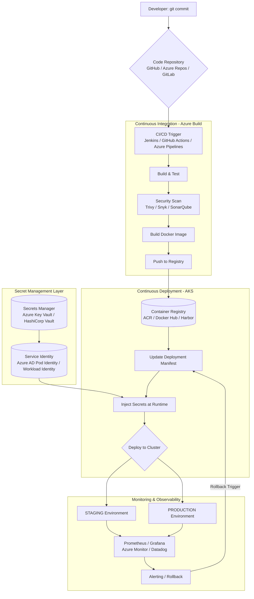

# Code to Cluster: Building a Bulletproof Kubernetes Deployment Pipeline on Azure

## Document Information
- **File Name:** Code to Cluster: Building a Bulletproof Kubernetes Deployment Pipeline on Azure.md
- **Total Words:** 5757
- **Estimated Reading Time:** 28 minutes

---

## Mermaid Diagram 1: Microsoft Azure

## Table 1: Phase 2: The CI Pipeline (The Build)

| Tool | Type | Pros | Cons |
|------|------|------|------|
| **Jenkins** | Self-hosted (Azure VMs/AKS) | Highly customizable, huge plugin ecosystem | Maintenance overhead, requires infrastructure management |
| **GitHub Actions** | SaaS + Self-hosted runners | Native Git integration, free for public repos, matrix builds | Limited customization for complex pipelines |
| **Azure Pipelines** | Fully managed Azure DevOps | Deep Azure integration, unlimited minutes for open source, YAML or GUI | Learning curve, can get expensive for private projects |
| **GitLab CI** | SaaS or Self-hosted | Single application for SCM and CI/CD | Requires GitLab for full experience |
| **CircleCI** | SaaS | Fast, easy to configure, good Docker support | Can get expensive at scale |

## Table 2: Component: Container Registry Options

| Registry | Best For | Key Features |
|----------|----------|--------------|
| **Azure Container Registry (ACR)** | Azure-native workloads | ACR Tasks, geo-replication, Helm chart support, AD authentication |
| **Docker Hub** | Public images, open source | Largest image repository, automated builds |
| **Harbor** | Enterprise self-hosted | Vulnerability scanning, identity integration, replication |
| **Amazon ECR** | AWS users, multi-cloud | IAM integration, image scanning |
| **Google Container Registry** | GCP users | Fast pulls from GKE |
| **Quay.io** | Security-focused teams | Clair security scanner, robot accounts |

## Table 3: Harbor (self-hosted)

| Tool | Scope | Integration |
|------|-------|-------------|
| **Trivy** | Filesystem, image, Git repo | CLI, GitHub Action, Jenkins plugin |
| **Snyk** | Code, dependencies, containers | IDE plugins, CI integration, GitHub app |
| **SonarQube** | Code quality, security hotspots | Self-hosted, cloud option, extensive rules |
| **Microsoft Defender for Cloud** | Container registry scanning | Native ACR integration, actionable recommendations |
| **Aqua Security** | Container security | Comprehensive security platform |
| **Docker Scout** | Docker images | Docker CLI, Docker Hub integration |

## Table 4: Database credentials

| Service | Best For | Key Features |
|---------|----------|--------------|
| **Azure Key Vault** | Azure-native apps | Automatic rotation, fine-grained access policies, HSM support |
| **HashiCorp Vault** | Multi-cloud, dynamic secrets | Unified secrets, encryption as a service, leasing |
| **Kubernetes Secrets + SOPS** | GitOps workflows | Encrypted secrets in Git, decrypted at deploy time |
| **External Secrets Operator** | Bridge between Azure and K8s | Syncs Azure Key Vault to K8s Secrets |
| **Sealed Secrets** | GitOps with encryption | Encrypt secrets for safe storage in Git |
| **Azure App Configuration** | Feature flags + config | Centralized configuration management |

## Table 5: Phase 4: Deploy to Kubernetes (The CD)

| Platform | Description | Use Case |
|----------|-------------|----------|
| **Azure Kubernetes Service (AKS)** | Azure managed Kubernetes | Azure-centric organizations, integrated with AD, monitoring |
| **Self-managed K8s on Azure VMs** | You manage control plane | Complete control, specialized requirements |
| **AKS on Azure Stack HCI** | On-premises Kubernetes | Hybrid deployments, edge computing |
| **k3s/k3d** | Lightweight K8s | Development, edge computing |
| **Minikube** | Local single-node cluster | Local development, testing |

## Table 6: Azure Kubernetes Service (AKS)

| Tool | Purpose | Key Feature |
|------|---------|-------------|
| **Helm** | Package management | Charts, templating, releases |
| **Kustomize** | Configuration management | Overlays, no templates, native kubectl |
| **ArgoCD** | GitOps continuous delivery | Auto-sync, multi-cluster, UI |
| **Flux** | GitOps operator | Automated reconciliation, multi-tenancy |
| **Skaffold** | Development workflow | Continuous development, file sync |

## Table 7: Phase 6: Monitoring & Rollback (The Safety Net)

| Category | Azure-Native | Open Source | Commercial |
|----------|--------------|--------------|------------|
| **Metrics** | Azure Monitor | Prometheus | Datadog |
| **Visualization** | Azure Dashboards | Grafana | New Relic |
| **Logs** | Azure Log Analytics | ELK Stack | Splunk |
| **Tracing** | Azure Application Insights | Jaeger | Dynatrace |
| **Alerting** | Azure Alerts | Alertmanager | PagerDuty |

## Table 8: Use Azure RBAC for Key Vault (preview)

| Feature | Azure Key Vault | Parameter Store (App Config) | Vault | Sealed Secrets | External Secrets |
|---------|-----------------|------------------------------|--------|----------------|------------------|
| **Secret rotation** | ⚠️ Manual/API | ❌ Manual | ✅ Dynamic | ❌ Manual | ❌ Manual |
| **Audit logging** | ✅ Log Analytics | ✅ Log Analytics | ✅ Detailed | ❌ | ✅ Log Analytics |
| **Azure AD integration** | ✅ Native | ✅ Native | ⚠️ Via auth | ❌ | ✅ Via AAD |
| **Multi-cloud** | ❌ Azure only | ❌ Azure only | ✅ Yes | ✅ Yes | ⚠️ Azure supported |
| **GitOps friendly** | ❌ | ❌ | ❌ | ✅ | ⚠️ Needs controller |
| **Cost** | 💰 Free tier available | 💰 Free tier | 💰 Self-managed | 🆓 Free | 🆓 Free |
| **Complexity** | Low | Low | High | Medium | Medium |

## Table 9: Complexity

| Layer | AWS Version | Azure Version |
|-------|-------------|---------------|
| **Container Registry** | Amazon ECR | Azure Container Registry (ACR) |
| **Kubernetes** | Amazon EKS | Azure Kubernetes Service (AKS) |
| **CI/CD** | CodeBuild/CodePipeline | Azure Pipelines / GitHub Actions |
| **Secret Management** | AWS Secrets Manager | Azure Key Vault |
| **Service Identity** | IRSA | Azure AD Workload Identity |
| **Monitoring** | CloudWatch/Prometheus | Azure Monitor / Prometheus |

---
*This story was automatically generated from Code to Cluster: Building a Bulletproof Kubernetes Deployment Pipeline on Azure.md on 2026-03-13 18:46:20.*