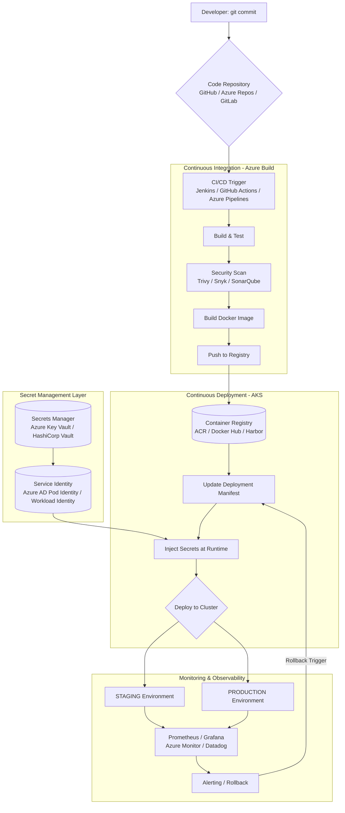

# Mermaid Diagram 1: Microsoft Azure

```mermaid
graph TD
    A[Developer: git commit] --> B{Code Repository<br/>GitHub / Azure Repos / GitLab};
    B --> C[CI/CD Trigger<br/>Jenkins / GitHub Actions / Azure Pipelines];

    subgraph CI Pipeline [Continuous Integration - Azure Build]
        direction LR
        C --> D[Build & Test];
        D --> E[Security Scan<br/>Trivy / Snyk / SonarQube];
        E --> F[Build Docker Image];
        F --> G[Push to Registry];
    end

    G --> H[(Container Registry<br/>ACR / Docker Hub / Harbor)];

    subgraph Secret Management [Secret Management Layer]
        I[(Secrets Manager<br/>Azure Key Vault / HashiCorp Vault)]
        J[(Service Identity<br/>Azure AD Pod Identity / Workload Identity)]
        I --> J
    end

    subgraph CD Pipeline [Continuous Deployment - AKS]
        H --> K[Update Deployment Manifest];
        J --> L[Inject Secrets at Runtime];
        K --> L;
        L --> M{Deploy to Cluster};
    end

    M --> N[STAGING Environment];
    M --> O[PRODUCTION Environment];

    subgraph Observability [Monitoring & Observability]
        N --> P[Prometheus / Grafana<br/>Azure Monitor / Datadog];
        O --> P;
        P --> Q[Alerting / Rollback];
    end

    Q -- "Rollback Trigger" --> K;
```
