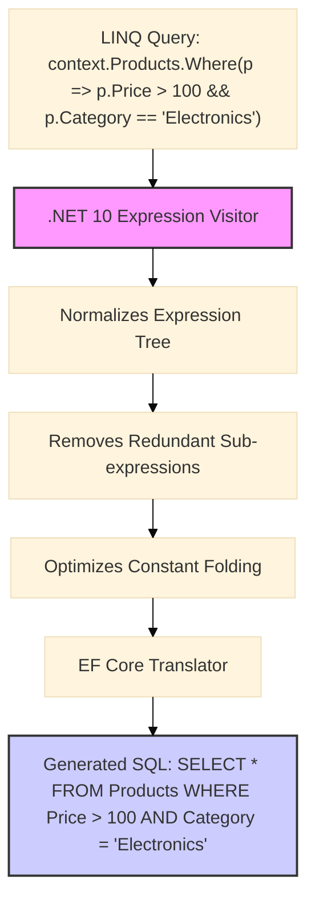

# Mermaid Diagram 1: What Changes in .NET 10:

```mermaid
---
config:
  theme: base
  layout: elk
---
flowchart TB
    A@{ label: "LINQ Query: context.Products.Where(p => p.Price > 100 && p.Category == 'Electronics')" } --> B[".NET 10 Expression Visitor"]
    B --> C["Normalizes Expression Tree"]
    C --> D["Removes Redundant Sub-expressions"]
    D --> E["Optimizes Constant Folding"]
    E --> F["EF Core Translator"]
    F --> G@{ label: "Generated SQL: SELECT * FROM Products WHERE Price > 100 AND Category = 'Electronics'" }

    A@{ shape: rect}
    G@{ shape: rect}
    style B fill:#f9f,stroke:#333,stroke-width:2px
    style G fill:#ccf,stroke:#333,stroke-width:2px
```
