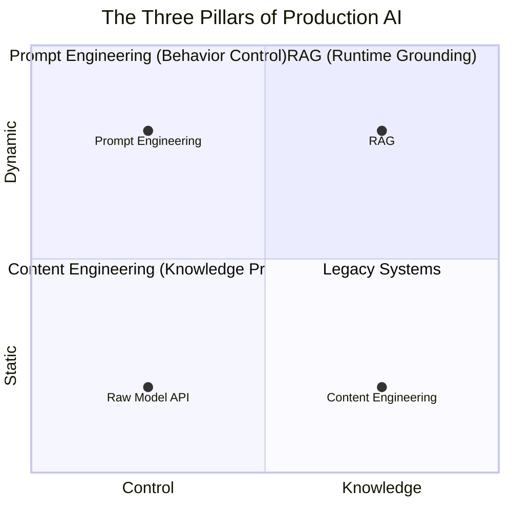

# Mermaid Diagram 1: Mermaid Diagram

```mermaid
quadrantChart
    title The Three Pillars of Production AI
    x-axis "Control" --> "Knowledge"
    y-axis "Static" --> "Dynamic"
    quadrant-1 "RAG (Runtime Grounding)"
    quadrant-2 "Prompt Engineering (Behavior Control)"
    quadrant-3 "Content Engineering (Knowledge Prep)"
    quadrant-4 "Legacy Systems"
    "Prompt Engineering": [0.25, 0.8]
    "Content Engineering": [0.75, 0.2]
    "RAG": [0.75, 0.8]
    "Raw Model API": [0.25, 0.2]
```
