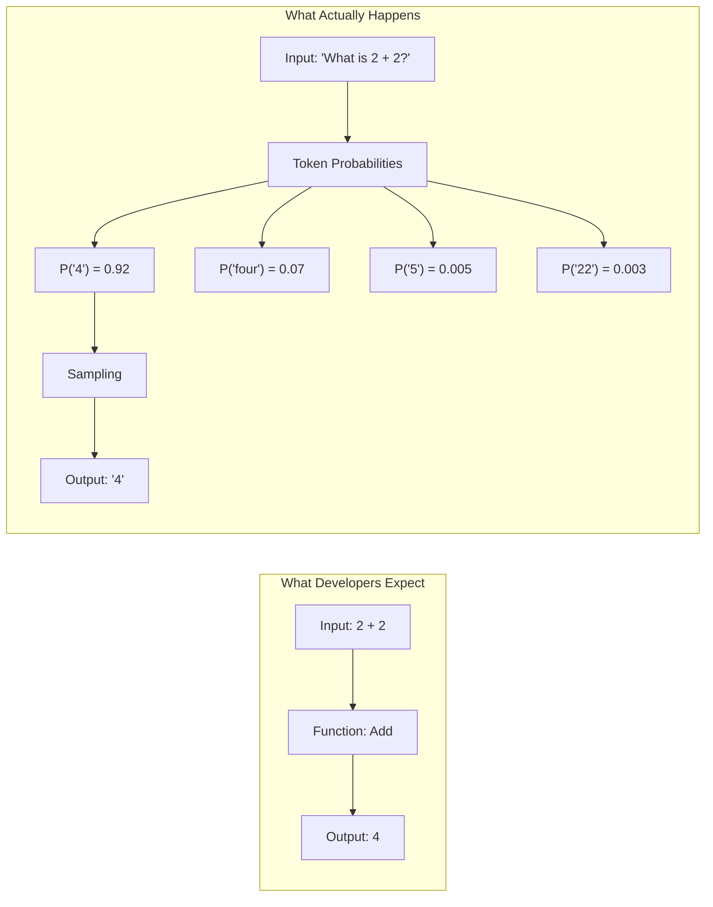

# Mermaid Diagram 2: 🎭 Deep Introduction: The Probability Shaper

```mermaid
flowchart LR
    subgraph "What Developers Expect"
        A[Input: 2 + 2] --> B[Function: Add] --> C[Output: 4]
    end
    
    subgraph "What Actually Happens"
        D[Input: 'What is 2 + 2?'] --> E[Token Probabilities]
        E --> F["P('4') = 0.92"]
        E --> G["P('four') = 0.07"]
        E --> H["P('5') = 0.005"]
        E --> I["P('22') = 0.003"]
        F --> J[Sampling] --> K[Output: '4']
    end
```
