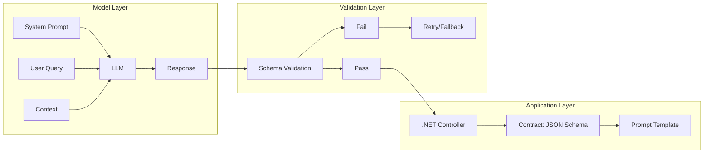

# Mermaid Diagram 3: In enterprise AI, prompt engineering is about *contracts*.

```mermaid
flowchart LR
    subgraph "Application Layer"
        A[.NET Controller] --> B[Contract: JSON Schema]
        B --> C[Prompt Template]
    end
    
    subgraph "Model Layer"
        D[System Prompt] --> E[LLM]
        F[User Query] --> E
        G[Context] --> E
        E --> H[Response]
    end
    
    subgraph "Validation Layer"
        H --> I[Schema Validation]
        I --> J[Pass] --> A
        I --> K[Fail] --> L[Retry/Fallback]
    end
```
