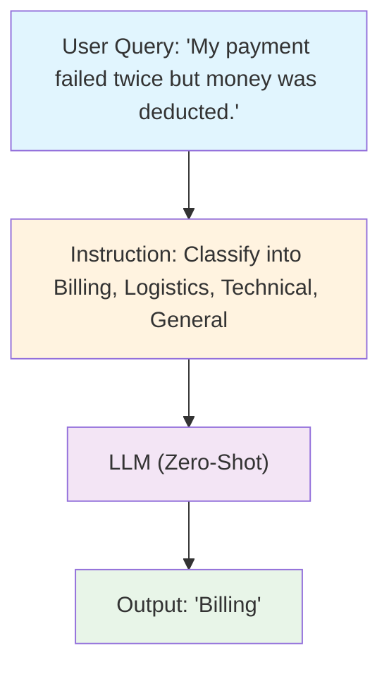

# Mermaid Diagram 4: 📚 Types of Prompting: From Zero to Complex

```mermaid
flowchart TD
    A["User Query: 'My payment failed twice but money was deducted.'"] --> 
    B["Instruction: Classify into Billing, Logistics, Technical, General"]
    B --> C["LLM (Zero-Shot)"]
    C --> D["Output: 'Billing'"]
    
    style A fill:#e1f5fe
    style B fill:#fff3e0
    style C fill:#f3e5f5
    style D fill:#e8f5e8
```
