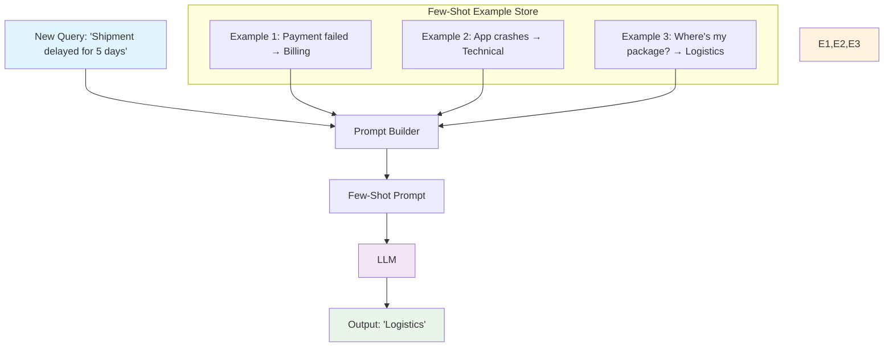

# Mermaid Diagram 5: ❌ Limitations:

```mermaid
flowchart TD
    subgraph "Few-Shot Example Store"
        E1["Example 1: Payment failed → Billing"]
        E2["Example 2: App crashes → Technical"]
        E3["Example 3: Where's my package? → Logistics"]
    end
    
    Q["New Query: 'Shipment delayed for 5 days'"] --> 
    P["Prompt Builder"]
    E1 --> P
    E2 --> P
    E3 --> P
    P --> F["Few-Shot Prompt"]
    F --> L["LLM"]
    L --> O["Output: 'Logistics'"]
    
    style Q fill:#e1f5fe
    style E1,E2,E3 fill:#fff3e0
    style L fill:#f3e5f5
    style O fill:#e8f5e8
```
