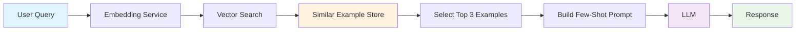

# Mermaid Diagram 6: Model Output:

```mermaid
flowchart LR
    Q[User Query] --> E[Embedding Service]
    E --> V[Vector Search]
    V --> FS[Similar Example Store]
    FS --> S[Select Top 3 Examples]
    S --> B[Build Few-Shot Prompt]
    B --> L[LLM]
    L --> R[Response]
    
    style Q fill:#e1f5fe
    style FS fill:#fff3e0
    style L fill:#f3e5f5
    style R fill:#e8f5e8
```
