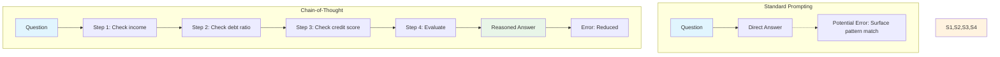

# Mermaid Diagram 7: prompt-time retrieval

```mermaid
flowchart TD
    subgraph "Standard Prompting"
        Q[Question] --> A[Direct Answer]
        A -.-> E1[Potential Error: Surface pattern match]
    end
    
    subgraph "Chain-of-Thought"
        Q2[Question] --> S1[Step 1: Check income]
        S1 --> S2[Step 2: Check debt ratio]
        S2 --> S3[Step 3: Check credit score]
        S3 --> S4[Step 4: Evaluate]
        S4 --> R[Reasoned Answer]
        R --> E2[Error: Reduced]
    end
    
    style Q fill:#e1f5fe
    style Q2 fill:#e1f5fe
    style S1,S2,S3,S4 fill:#fff3e0
    style R fill:#e8f5e8
```
