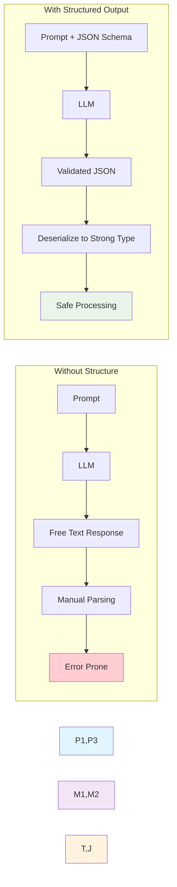

# Mermaid Diagram 8: The Cognitive Science:

```mermaid
flowchart LR
    subgraph "Without Structure"
        P1[Prompt] --> M1[LLM]
        M1 --> T[Free Text Response]
        T --> P2[Manual Parsing]
        P2 --> E[Error Prone]
    end
    
    subgraph "With Structured Output"
        P3[Prompt + JSON Schema] --> M2[LLM]
        M2 --> J[Validated JSON]
        J --> D[Deserialize to Strong Type]
        D --> S[Safe Processing]
    end
    
    style P1,P3 fill:#e1f5fe
    style M1,M2 fill:#f3e5f5
    style T,J fill:#fff3e0
    style E fill:#ffcdd2
    style S fill:#e8f5e8
```
