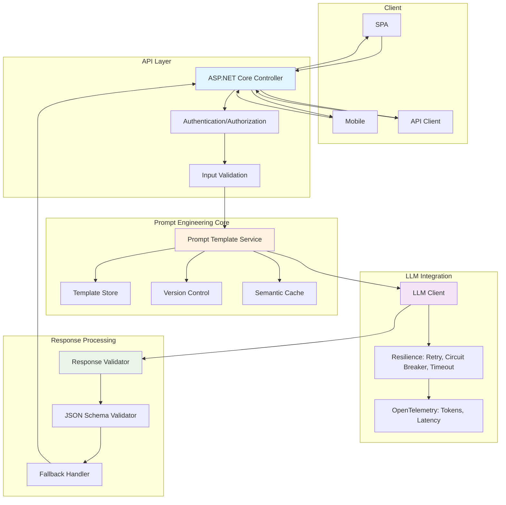

# Mermaid Diagram 9: Refusal enforcement

```mermaid
flowchart TD
    subgraph Client
        C1[SPA] 
        C2[Mobile]
        C3[API Client]
    end

    subgraph "API Layer"
        Ctrl[ASP.NET Core Controller]
        Auth[Authentication/Authorization]
        Val[Input Validation]
    end

    subgraph "Prompt Engineering Core"
        PTS[Prompt Template Service]
        TS[Template Store]
        V[Version Control]
        Cache[Semantic Cache]
    end

    subgraph "LLM Integration"
        LC[LLM Client]
        Polly[Resilience: Retry, Circuit Breaker, Timeout]
        Obs[OpenTelemetry: Tokens, Latency]
    end

    subgraph "Response Processing"
        RV[Response Validator]
        JV[JSON Schema Validator]
        Fallback[Fallback Handler]
    end

    C1 & C2 & C3 --> Ctrl
    Ctrl --> Auth
    Auth --> Val
    Val --> PTS
    
    PTS --> TS
    PTS --> V
    PTS --> Cache
    
    PTS --> LC
    LC --> Polly
    Polly --> Obs
    
    LC --> RV
    RV --> JV
    JV --> Fallback
    
    Fallback --> Ctrl
    Ctrl --> C1 & C2 & C3
    
    style Ctrl fill:#e1f5fe
    style PTS fill:#fff3e0
    style LC fill:#f3e5f5
    style RV fill:#e8f5e8
```
